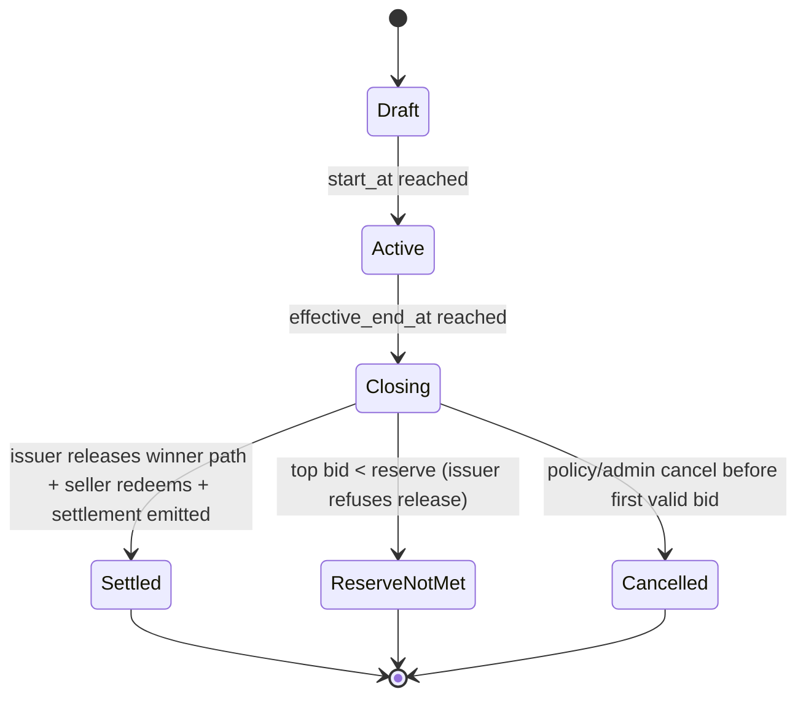
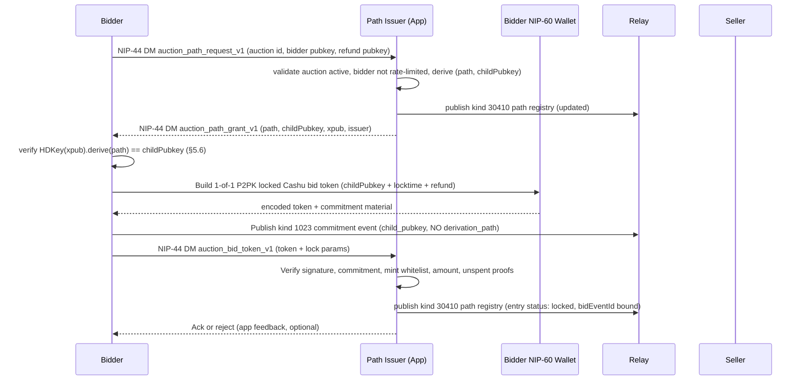
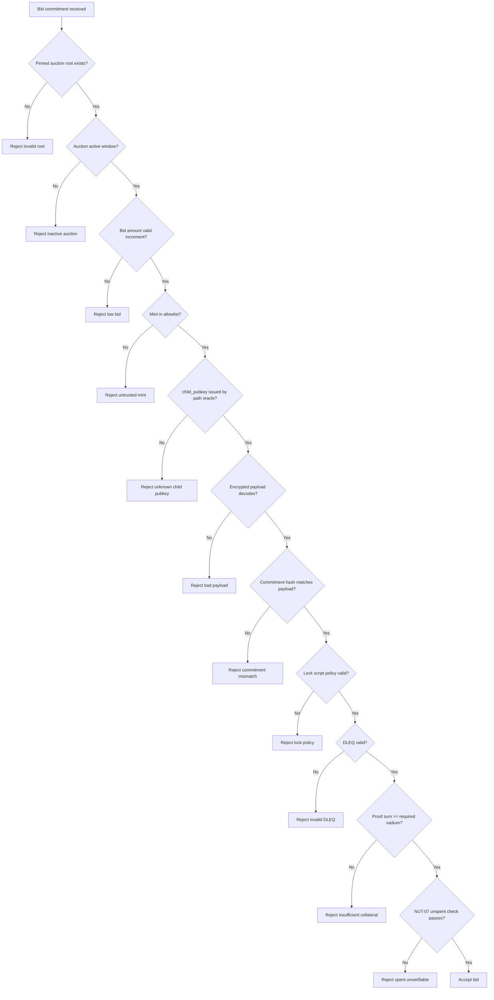

# AUCTIONS CODEX (Draft)

## 1. Purpose

This document proposes an auctions scheme for the market protocol using Nostr
events plus Cashu as an enforceable bearer-asset bid mechanism.

Goal for v1:

- Standard timed auction (English, ascending, highest bid wins).
- Bid is only valid if backed by actual locked Cashu value (vadium/deposit).
- Non-winning bidders can recover funds.
- Seller defines trusted mints.
- Seller cannot unilaterally redeem bids before settlement.
- App/service never holds Cashu key material — it gates settlement through
  information release, not signatures.
- Design remains extensible for additional auction types later.

---

## 2. Scope and Principles

### In scope (v1)

- Limited-time auctions.
- Open bidding.
- Full amount bid-backed deposit (100% vadium by default).
- Cashu **1-of-1 P2PK lock with refund timelock** (NUT-10/NUT-11) on an
  app-issued HD-derived seller child pubkey.
- **Path-oracle** pattern: a designated path issuer (the app) assigns the
  derivation path that produces each bid's lock pubkey, and only reveals
  that path to the seller at authorised settlement time.
- Relay-visible public bid commitment + private token envelope.

### Out of scope (v1)

- On-chain escrow.
- Cashu 2-of-2 / n-of-m multisig lock profiles.
- Complex dispute arbitration.
- Sealed-bid reveal rounds.
- Partial deposit modes (except as a forward-compatible field).

### Security principles

- No informal bids: every valid bid must include spendable value commitment.
- No cleartext token leakage on public relays.
- Mint trust is explicit and seller-controlled.
- Auction closing must be deterministic from immutable root data.
- **No single party controls bid funds.** The seller alone cannot derive the
  child private key for any specific locked bid because the derivation path
  is an app-held secret. The app alone cannot spend because it holds no
  xpriv-derived material. Together they must cooperate — or, after the
  locktime, the bidder unilaterally reclaims.
- **Safe failure mode.** If the path-oracle state is lost or the issuer goes
  offline, no funds can be stolen; all bids simply refund at locktime.

---

## 3. Source Inputs

- Existing marketplace draft spec conventions in `gamma_spec.md` and `SPEC.md`.
- Cashu primitives:
  - NUT-10 (well-known secrets).
  - NUT-11 (P2PK locks, locktime, refund).
  - NUT-14 (HTLC, future extension).
- Local app context:
  - Existing NIP-60 wallet support.
  - Existing ecash flow and trusted mint handling.
- Inspiration: ecash-with-derivation-paths pattern demonstrated at
  `https://github.com/gzuuus/cba`.

---

## 4. Auction Event Model

Kind values below are proposal values for discussion before final NIP/spec
assignment.

## 4.1 Kind `30408` Auction Listing (Addressable, updatable)

Signed by seller.

Auction listings are **self-describing**: they carry the same product-shaped
metadata as a kind `30402` product listing (see `gamma_spec.md` §3 for field
semantics), plus auction-specific bidding, timing, and settlement tags.
There is intentionally no product reference (`a` tag) in v1.

### Required tags

- `d`: auction identifier.
- `title`: display title.
- `auction_type`: `english` (v1 required).
- `start_at`: unix seconds.
- `end_at`: unix seconds.
- `currency`: `SAT` (v1 required).
- `reserve`: minimum acceptable final price (may be `0`, but tag required in
  v1 for explicitness).
- `bid_increment`: minimum step in sats.
- `mint`: trusted mint URL. MAY repeat.
- `settlement_policy`: `cashu_p2pk_path_oracle_v1`.
- `key_scheme`: `hd_p2pk`.
- `p2pk_xpub`: seller HD xpub used for per-bid seller child key derivation.

### Optional auction tags

- `extension_rule`: `none` (v1 default),
  `anti_sniping:<window_seconds>:<extension_seconds>`.
- `max_end_at`: hard upper bound for `effective_end_at`. REQUIRED if
  anti-sniping is enabled.
- `vadium_ratio_bps`: default `10000` (100%).
- `schema`: version marker, e.g. `auction_v1`.
- `path_issuer`: Nostr pubkey of the path oracle (defaults to the app's
  published oracle pubkey when omitted). OPTIONAL. When present, the bidder
  MUST route the pre-bid path request to this pubkey; when absent, the
  bidder uses the app default.

### Removed from prior drafts (v0 / `cashu_p2pk_2of2_v1`)

- `escrow_pubkey` — the path-oracle profile has no Cashu cosigner. Bid
  proofs lock to a single child pubkey (1-of-1). Implementations MUST NOT
  emit `escrow_pubkey` with `settlement_policy=cashu_p2pk_path_oracle_v1`.
- `escrow_identity` — replaced by `path_issuer`. Legacy readers SHOULD treat
  `escrow_identity` on a path-oracle auction as equivalent to `path_issuer`
  if the latter is absent.

### Optional product-shaped tags

These tags carry the same semantics as on kind `30402` product listings.
See `gamma_spec.md` §3 for full field definitions.

- `summary`, `image`, `spec`, `t`, `content-warning`, `shipping_option`,
  `weight`, `dim`, `location`, `g`.

### Immutable vs mutable tags

Immutable after first publish:

- `auction_type`
- `start_at`
- `end_at`
- `currency`
- `mint` set
- `p2pk_xpub`
- `path_issuer`
- `extension_rule`
- `max_end_at`
- `settlement_policy`
- `key_scheme`
- `reserve`
- `bid_increment`

Mutable:

- `title`
- `content` (description)
- media/display metadata

Important:

- Because this is addressable+updatable, clients and platform MUST pin and
  store the first event ID (`auction_root_event_id`).
- Bids MUST reference `auction_root_event_id`, not only `a` coordinate.
- Updates changing immutable fields MUST be rejected by clients/indexers.

### Example

```jsonc
{
	"kind": 30408,
	"content": "Vintage camera, tested, ships worldwide",
	"tags": [
		["d", "auction-7f0b9a"],
		["title", "Vintage Camera Auction"],
		["summary", "Leica M3 in collector-grade condition"],
		["auction_type", "english"],
		["start_at", "1766202000"],
		["end_at", "1766288400"],
		["currency", "SAT"],
		["reserve", "50000"],
		["bid_increment", "1000"],
		["mint", "https://mint.minibits.cash/Bitcoin"],
		["mint", "https://mint.coinos.io"],
		["settlement_policy", "cashu_p2pk_path_oracle_v1"],
		["key_scheme", "hd_p2pk"],
		["p2pk_xpub", "xpub6Bk...sellerAuctionXpub"],
		["path_issuer", "<app-path-oracle-nostr-pubkey>"],
		["schema", "auction_v1"],

		// Product-shaped fields
		["image", "https://cdn.example/m3-front.jpg", "1200x800", "0"],
		["spec", "Brand", "Leica"],
		["t", "cameras"],
		["shipping_option", "30406:<seller-pubkey>:standard-intl", "2500"],
	],
}
```

## 4.2 Kind `1023` Auction Bid Commitment (regular event)

Signed by bidder. Public event carries commitment and metadata, not raw
token, and — critically — **not the derivation path**.

### Required tags

- `e`: `<auction_root_event_id>`
- `a`: auction coordinate `30408:<seller_pubkey>:<d-tag>`
- `p`: `<seller_pubkey>`
- `amount`: bid amount in sats.
- `currency`: `SAT`
- `mint`: mint URL for locked token.
- `commitment`: hash commitment over private payload (including token).
- `locktime`: unix seconds used in lock script.
- `refund_pubkey`: bidder refund pubkey (compressed secp256k1 hex).
- `child_pubkey`: HD-derived child pubkey actually used in lock (compressed
  secp256k1 hex). REQUIRED under `key_scheme=hd_p2pk`.
- `created_for_end_at`: copied auction end timestamp to bind client intent.
- `bid_nonce`: random id per bid.
- `key_scheme`: MUST match the auction `key_scheme`.
- `status`: `locked` at publish time.

### Optional tags

- `prev_bid`: previous bid event id from same bidder (replacement chain).
- `path_issuer`: Nostr pubkey of the issuer that granted the path used for
  this bid. OPTIONAL. When present, MUST match the auction's `path_issuer`.
  Clients MAY omit this when the issuer is understood by context.
- `path_grant_id`: OPTIONAL opaque identifier echoing the
  `AuctionPathGrant` envelope id (see §7.5) for operational traceability.
- `note`: short human text.

### Forbidden tags

- `derivation_path`: MUST NOT appear on a path-oracle bid. The path is a
  secret held by the path issuer and MUST NOT be published. Bids tagged
  with `derivation_path` under `settlement_policy=cashu_p2pk_path_oracle_v1`
  MUST be rejected by clients.

### Private companion payload (MUST)

Bidder sends encrypted payload to the path issuer via NIP-17 DM (kind
`14`, NIP-44). Topic: `auction_bid_token_v1`.

- `auctionEventId` (root)
- `auctionCoordinates`
- `bidEventId`
- `bidderPubkey`
- `sellerPubkey`
- `pathIssuerPubkey`
- `lockPubkey` (the child pubkey used in the lock; MUST match `child_pubkey`
  tag on the public event)
- `refundPubkey`
- `locktime`
- `mintUrl`
- `amount`
- `totalBidAmount`
- `commitment`
- `bidNonce`
- `token` (encoded Cashu token)

Why split:

- Cashu token is bearer value and MUST NOT be posted in clear in public
  event content.

## 4.3 Kind `1024` Auction Settlement (regular event)

Signed by the seller after the path issuer releases the winning path.

### Required tags

- `e`: `<auction_root_event_id>`
- `a`: auction coordinate.
- `status`: `settled | reserve_not_met | cancelled`
- `close_at`: unix seconds when close was computed.
- `winning_bid`: `<bid_event_id>` or empty if no winner.
- `winner`: `<bidder_pubkey>` or empty.
- `final_amount`: sats (or `0`).

### Optional tags

- `refund`: repeating tags
  `["refund", "<bid_event_id>", "<bidder_pubkey>", "<status>"]`
- `payout`: `["payout", "<winning_bid_event_id>", "<amount>", "redeemed"]`
- `path_release_id`: OPTIONAL opaque identifier echoing the
  `AuctionPathRelease` envelope (see §7.5) so observers can correlate
  settlement with the issuer's approval record.
- `reason`: machine code for cancellation/failure.

## 4.4 Kind `30410` Auction Path Registry (Addressable, app-owned)

NEW — a parameterized replaceable event published by the path issuer
(`path_issuer`), encrypted to the issuer's own pubkey with NIP-44.
Acts as the canonical issuer-side record of which derivation paths have
been allocated to which bids for a given auction.

- `kind`: `30410`
- `d`: `path_oracle:<auction_root_event_id>`
- `content`: NIP-44 encrypted JSON `AuctionPathRegistry` (see below)
- Tags (plaintext):
  - `e`: `<auction_root_event_id>`
  - `a`: auction coordinate
  - `auction_root_event_id`: `<auction_root_event_id>`
  - `path_issuer`: `<issuer_pubkey>`
  - `schema`: `auction_path_registry_v1`

### AuctionPathRegistry (decrypted payload)

```ts
interface AuctionPathRegistry {
	type: 'auction_path_registry_v1'
	auctionEventId: string
	auctionCoordinates: string
	xpub: string
	entries: AuctionPathRegistryEntry[]
	updatedAt: number
}

interface AuctionPathRegistryEntry {
	bidderPubkey: string
	derivationPath: string
	childPubkey: string
	grantId: string
	grantedAt: number
	bidEventId?: string
	status: 'issued' | 'locked' | 'released' | 'refunded' | 'expired'
	releasedAt?: number
	releaseTargetPubkey?: string
}
```

- The registry is authoritative for the issuer. Loss of the registry cannot
  produce fund loss — it only prevents future path releases, in which case
  bids refund at locktime (see §8 / §14).
- Clients other than the issuer SHOULD NOT attempt to consume the
  registry. It is published to Nostr for issuer-side resilience (recovery
  across processes/instances) rather than for public consumption.

## 4.5 DM envelopes (kind `14`, NIP-44)

The path-oracle introduces three new encrypted DM topics in addition to the
existing bid-token/refund envelopes:

| Topic                     | Direction       | Purpose                                                   |
| ------------------------- | --------------- | --------------------------------------------------------- |
| `auction_path_request_v1` | Bidder → Issuer | Request a derivation path for an intended bid             |
| `auction_path_grant_v1`   | Issuer → Bidder | Grant a derivation path + matching child pubkey           |
| `auction_bid_token_v1`    | Bidder → Issuer | Deliver the locked Cashu token and lock parameters        |
| `auction_path_release_v1` | Issuer → Seller | Release the derivation path for an authorised winning bid |
| `auction_refund_v1`       | Issuer → Bidder | Deliver refund Cashu tokens to a non-winning bidder       |

See §7.5 for the full sequence.

---

## 5. Cashu Locking Profile (v1)

## 5.1 Why lock profile is required

A bid without enforceable value is spam. V1 requires a bid token that is
cryptographically locked with a refund path.

## 5.2 Proposed lock profile: `cashu_p2pk_path_oracle_v1`

Use NUT-11 P2PK secret with:

- **Single** lock pubkey: the HD-derived seller child pubkey assigned to
  this bid by the path issuer. No Cashu cosigner.
- `n_sigs`: omitted (default 1). The lock is 1-of-1.
- `locktime`: `max_end_at + settlement_grace_seconds` if anti-sniping is
  enabled, otherwise `end_at + settlement_grace_seconds`.
- `refund`: bidder refund pubkey.
- `n_sigs_refund=1`.
- `sigflag=SIG_INPUTS` (v1).

`settlement_grace_seconds` default: 3600 seconds.

This yields:

- Seller cannot spend alone **without the derivation path**, which only the
  path issuer holds. The seller may hold the account xpriv, but without the
  path for a specific bid they cannot derive the child privkey (the
  derivation path has approximately 2^155 bits of entropy across five
  non-hardened levels of 31-bit indices — see §5.5).
- App/service cannot spend because it holds no xpriv-derived material — it
  can withhold paths (DoS), but cannot seize funds.
- Reserve, anti-sniping, and immutability become **issuer-enforceable by
  path-release policy**: the issuer simply refuses to release the winning
  path unless the auction rules are satisfied. Every locked bid refunds at
  locktime.
- If the issuer fails/stalls, the bidder reclaims after locktime using the
  refund key.

### Differences from the historical `cashu_p2pk_2of2_v1` profile

- No `escrow_pubkey` in the lock — the NUT-11 `pubkeys` multisig slot is
  empty.
- No `n_sigs` tag — single-sig by default.
- Settlement requires the issuer to release a secret (path), not to
  co-sign a spend.
- Wider mint compatibility: mints that support minimal NUT-11 (P2PK +
  locktime + refund) suffice.

## 5.3 Exact NUT-11 tag layout

The recommended per-bid `Secret` shape is:

```json
[
	"P2PK",
	{
		"nonce": "<random>",
		"data": "<seller_child_pubkey>",
		"tags": [
			["sigflag", "SIG_INPUTS"],
			["locktime", "<locktime_unix_seconds>"],
			["refund", "<bidder_refund_pubkey>"],
			["n_sigs_refund", "1"]
		]
	}
]
```

Interpretation:

- Before `locktime`, only `seller_child_pubkey` can spend (1-of-1).
- After `locktime`, the bidder refund pubkey can additionally spend.
- `SIG_ALL` remains the long-term target (deferred until cashu-ts support
  lands).

## 5.4 cashu-ts shape

```ts
import { P2PKBuilder } from '@cashu/cashu-ts'

const p2pk = new P2PKBuilder()
	.addLockPubkey(sellerChildPubkey) // single pubkey, 1-of-1
	.lockUntil(locktime)
	.addRefundPubkey(bidderRefundPubkey)
	.requireRefundSignatures(1)
	.toOptions()

const { keep, send } = await wallet.ops.send(amount, proofs).asP2PK(p2pk).run()
```

`send` proofs are encoded and delivered only via encrypted channel.

## 5.5 Path oracle model (replaces prior "HD custody" mode)

Instead of the bidder generating a random derivation path and publishing
it, the **path issuer** allocates the path for each bid and keeps it
confidential until authorised release.

Path structure:

- Five non-hardened levels, each a uniformly random index in
  `[0, 0x7fffffff]` (31 bits).
- Total entropy ≈ 155 bits. Brute-forcing the path given only `xpub` and
  `child_pubkey` is computationally infeasible.

Roles:

- **Seller** publishes `p2pk_xpub` and optionally `path_issuer`. Never
  sees any path until release. Holds the xpriv used to derive child
  privkeys from released paths.
- **Path issuer** (the app or a federated oracle): generates paths,
  derives `child_pubkey = HDKey.derive(xpub, path)`, persists the
  mapping, releases paths to the seller only when auction policy is
  satisfied.
- **Bidder**: requests a path from the issuer (§7.5), verifies the
  issuer's claim that `child_pubkey == HDKey.derive(xpub, path)` locally
  (this step is non-negotiable — see §5.6), then locks proofs to that
  `child_pubkey`.

Constraints:

- Non-hardened path levels only — bidders derive from `xpub`.
- Never export child private keys.
- Do not reuse paths across bids (issuer enforces uniqueness per auction).
- Refund+locktime rules unchanged.

Seller UX impact:

- Same as before: enable HD auction keys, publish xpub.
- At settlement, seller receives one path per winning-chain bid from the
  issuer, derives child privkeys locally, redeems.

## 5.6 Bidder-side path verification (normative)

On receipt of an `auction_path_grant_v1` envelope, the bidder MUST verify:

1. `envelope.auctionEventId` matches the auction root event id the bidder
   requested.
2. `envelope.pathIssuerPubkey` matches the auction's `path_issuer` (or
   the resolved default).
3. `envelope.xpub` matches the auction's `p2pk_xpub`.
4. `HDKey.fromExtendedKey(envelope.xpub).derive(envelope.derivationPath).publicKey`
   serialises to exactly `envelope.childPubkey` (compressed secp256k1
   66-hex form).

If any check fails, the bidder MUST abort and MUST NOT lock funds.
Skipping this verification allows a malicious path issuer to substitute a
pubkey it controls, enabling theft. Implementations that fail to verify
are non-compliant.

---

## 6. Auction State Machine



Deterministic close input set:

- `auction_root_event_id`
- immutable root fields
- all valid bids accepted by the anti-sniping time algorithm
- tie-breaker policy

## 6.1 Effective end time (anti-sniping)

If `extension_rule=anti_sniping:<window_seconds>:<extension_seconds>` is
enabled, clients/indexers compute `effective_end_at` deterministically and
cap it at `max_end_at`:

```text
effective_end_at = end_at
for each valid bid ordered by (created_at, id):
  remaining = effective_end_at - bid.created_at
  if 0 < remaining < snipe_window_seconds:
    effective_end_at = min(effective_end_at + snipe_extension_seconds, max_end_at)
```

Critical policy:

- Settlement MUST use `effective_end_at`, not raw `end_at`.
- Anti-sniping is only acceptable with a hard upper bound (`max_end_at`).
- Bid locktime MUST be fixed up front to
  `max_end_at + settlement_grace_seconds`, so existing bidders never need
  to re-sign bids when the auction is extended.
- Without a hard upper bound, anti-sniping is not acceptable.

---

## 7. Bid Acceptance Flow



Validation rules (MUST):

- Bid event signature valid.
- Bid references known `auction_root_event_id`.
- Bid time is in active window: `start_at <= created_at <= effective_end_at`.
- Amount satisfies reserve/increment rules.
- Mint is in seller trusted list.
- `child_pubkey` tag equals the child pubkey the issuer granted and matches
  the pubkey embedded in the private token envelope's lock parameters.
- `derivation_path` tag MUST NOT be present.
- Encrypted token decodes and commitment matches.
- Locktime policy matches auction rule
  (`max_end_at + settlement_grace_seconds`, or `end_at +
settlement_grace_seconds` when anti-sniping is off).
- Refund key is present and correctly bound to bidder (compressed
  secp256k1).
- DLEQ proofs are valid for declared mint keyset.
- Proofs are unspent at validation time.
- Lock script is exactly 1-of-1 P2PK to `child_pubkey` with the declared
  locktime and refund pubkey.

## 7.1 Validation pipeline (normative)



Operational notes:

- NUT-07 check SHOULD be retried with bounded timeout.
- If mint is unreachable and policy is strict, bid is rejected.
- If policy is soft-degraded, bid can be marked `tentative` but MUST NOT
  win until verified.

## 7.5 Path Oracle Protocol (normative)

This section defines the DM exchanges that constitute the path oracle. All
envelopes are JSON-encoded and delivered over kind `14` NIP-44 DMs.

### 7.5.1 `auction_path_request_v1` (Bidder → Issuer)

```ts
interface AuctionPathRequestEnvelope {
	type: 'auction_path_request_v1'
	requestId: string // client-chosen nonce
	auctionEventId: string
	auctionCoordinates: string
	bidderPubkey: string
	bidderRefundPubkey: string // compressed secp256k1
	createdAt: number
}
```

Issuer MUST:

- Verify the auction exists and is in `Active` state.
- Verify `bidderPubkey` matches the signer of the wrapping kind `14` DM.
- Deduplicate by `(auctionEventId, bidderPubkey, requestId)`.
- Apply rate limiting per bidder per auction.

Issuer MAY:

- Issue a fresh path per request (RECOMMENDED).
- Reuse an existing un-locked grant if one exists for the same
  `(auction, bidder)` within a short reissue window.

### 7.5.2 `auction_path_grant_v1` (Issuer → Bidder)

```ts
interface AuctionPathGrantEnvelope {
	type: 'auction_path_grant_v1'
	grantId: string
	requestId: string
	auctionEventId: string
	auctionCoordinates: string
	bidderPubkey: string
	pathIssuerPubkey: string
	xpub: string
	derivationPath: string
	childPubkey: string
	issuedAt: number
	expiresAt: number // after this, grant is stale
}
```

Bidder MUST verify per §5.6 before locking. The grant is single-use; once
the matching `auction_bid_token_v1` is received by the issuer, the grant
is considered consumed.

### 7.5.3 `auction_path_release_v1` (Issuer → Seller)

```ts
interface AuctionPathReleaseEnvelope {
	type: 'auction_path_release_v1'
	releaseId: string
	auctionEventId: string
	auctionCoordinates: string
	sellerPubkey: string
	winningBidEventId: string
	winnerPubkey: string
	releases: Array<{
		bidEventId: string
		derivationPath: string
		childPubkey: string
	}>
	finalAmount: number
	releasedAt: number
}
```

Issuer emits this only after confirming:

- `effective_end_at` has passed.
- The claimed winning bid chain is the highest valid chain by
  §8 tie-break rules.
- `finalAmount >= reserve`.
- The seller requesting the release is the auction author.

The seller derives child privkeys from its xpriv using the enclosed paths
and redeems each locked proof (1-of-1 P2PK). Multiple paths may appear
because the winning bid chain may span several rebid events (each a
separate locked token).

---

## 8. Auction Close + Settlement + Refund Flow

```mermaid
sequenceDiagram
    participant S as Seller
    participant I as Path Issuer (App)
    participant M as Cashu Mint
    participant W as Winner
    participant L as Losing Bidder
    participant R as Relay

    Note over I: Waits for effective_end_at
    S->>I: Request settlement (via DM or client UI trigger)
    I->>I: Compute winner; verify reserve & timing
    alt Reserve met & valid winner
        I->>S: auction_path_release_v1 (winner path(s))
        S->>M: Redeem winner locked token(s) with child privkey (1-of-1)
        I->>L: auction_refund_v1 DMs with refund tokens
        S->>R: Publish kind 1024 settlement (status: settled)
    else Reserve not met / no valid bids
        I->>S: Refuse release, status=reserve_not_met
        S->>R: Publish kind 1024 settlement (status: reserve_not_met)
        Note over L,M: Losers self-refund via locktime path
    end

    R-->>W: Winner observes settlement
    R-->>L: Refund observable
```

Tie-break rule (v1):

- Highest `amount` wins.
- If equal amount, earliest `created_at` wins.
- If same `created_at`, lexical smallest bid event ID wins.

## 8.1 Settlement edge cases

- `no_bids`: publish settlement with empty winner fields; no paths released.
- `reserve_not_met`: publish settlement; all bids follow locktime refund
  path (or issuer-sent `auction_refund_v1` DMs).
- `cancelled` before first valid bid: allowed.
- `cancelled` after first valid bid: SHOULD be forbidden in v1 policy.
- `seller_offline`: bidders recover via refund key after locktime. Issuer
  MAY still publish `auction_refund_v1` envelopes pro-actively.
- `issuer_offline`: no paths can be released → all bids unredeemable pre
  locktime → locktime refund for everyone. **Safe fail.**
- `mint_outage`: settlement should pause/retry; after timeout, emit
  machine-readable failure reason.

---

## 9. Anti-Abuse and Anti-Scam Guards

## 9.1 Fake bids / spam

- No token => bid invalid.
- Token in public content => reject (security hazard).
- Per-auction bidder rate limits (applied at the issuer during path
  requests).
- Optional minimum bid floor.
- Optional per-bidder active bid cap (v1 suggestion: 1 active bid per
  auction).
- `child_pubkey` in a bid that was never granted by the issuer MUST be
  rejected — prevents self-generated paths that re-open the premature
  redemption hole.

## 9.2 Fake cashu / invalid proofs

- Validate token format and mint URL.
- Verify mint is trusted by seller.
- Check proof states against mint.
- Reject already-spent or pending-spent proofs.

## 9.3 End-time manipulation

- Immutable `end_at`, `max_end_at`, `extension_rule` from root event.
- Root event ID pinned by platform/indexer.
- Bids reference root event ID directly.

## 9.4 Relay race conditions / replay

- Deduplicate by `bid_event_id`.
- Use `commitment` + `bid_nonce`.
- Reject bids arriving after `effective_end_at` even if relay timestamp
  ordering is odd.

## 9.5 Issuer non-cooperation fallback

- Refund key + locktime path lets every bidder recover after timeout
  without any issuer involvement.
- Path issuer has no Cashu key material, so cannot steal funds under any
  failure mode — only cause liveness failure (DoS).

## 9.6 Malicious issuer substituting a pubkey (§5.6)

- Bidder MUST locally verify `child_pubkey` was derived from the auction's
  `p2pk_xpub` + granted `derivation_path`.
- Bidders SHOULD persist (locally) the `derivationPath` they were granted
  so they can independently audit the registry after settlement.

## 9.7 Critical exclusions (intentionally not adopted)

- Public `proof` tags in bid events.
- Public `derivation_path` tags in bid events.
- Seller-direct lock as mandatory default (unilateral early-spend risk).
- Deriving auction spending keys from Nostr identity `nsec`.
- 2-of-2 Cashu multisig on the bid proofs (superseded by path-oracle).

---

## 10. Extensibility for Other Auction Schemes

Keep these generic fields from day 1:

- `auction_type`: `english | dutch | sealed_first_price | sealed_second_price`
- `bid_visibility`: `open | commit_reveal`
- `price_rule`: `highest_wins | lowest_wins`
- `extension_rule`: `none | anti_sniping:<window_seconds>:<extension_seconds>`
- `max_end_at`: hard upper bound for any auction with anti-sniping
- `vadium_ratio_bps`: deposit ratio
- `settlement_policy`: lock/payout strategy identifier

V1 MUST enforce:

- `auction_type=english`
- `bid_visibility=open`
- `price_rule=highest_wins`
- `vadium_ratio_bps=10000`
- `settlement_policy=cashu_p2pk_path_oracle_v1`

---

## 11. Implementation Notes for This Repo

- Integrate bid lock generation with existing NIP-60 wallet path; the
  `lockAuctionBidFunds` function accepts a pre-resolved `lockPubkey`
  (child pubkey from an `AuctionPathGrantEnvelope`) rather than an xpub
  - generated path.
- Add auction schema validators similar to existing `src/lib/schemas/*`.
- Keep a local index keyed by `auction_root_event_id`.
- Persist immutable root snapshot and enforce on updates.
- Store bidder-side grant receipts in `localStorage` so the bidder can
  audit after the fact.
- Path issuer runs a long-lived listener (a scripted process with the
  issuer's Nostr key) that:
  - subscribes to kind `14` DMs with the issuer as `p`;
  - decrypts and dispatches by envelope `type`;
  - writes registry updates to kind `30410`;
  - emits `auction_path_grant_v1` / `auction_refund_v1` /
    `auction_path_release_v1` envelopes in response to legitimate
    requests.
- Local caches (issuer-side and bidder-side) are secondary; Nostr is the
  source of truth. The cache is rebuilt from kind `30410` events on
  restart.

## 11.1 Platform / issuer responsibilities

- Maintain pinned canonical root event ID for each auction.
- Enforce immutable auction mechanics after first valid bid.
- Compute `effective_end_at` deterministically and expose it in UI.
- Re-verify candidate winning bid proofs shortly before release.
- Refuse to release paths unless reserve, timing, and bid-validity rules
  are satisfied.
- Track settlement deadlines and alert seller on pending close.

## 11.2 Gamma spec integration

Unchanged from prior drafts:

- Auction events reuse product-shaped tags from `gamma_spec.md` §3.
- Post-auction communication uses the existing encrypted order flow (kind
  `16` types `1/2/3/4`; kind `17` for payment receipts).
- Physical delivery uses the shipping-option model (kind `30406`),
  referenced directly from the auction.

---

## 12. Open Decisions Before Spec Merge

1. Confirm kind mapping (`30408` listing, `1023` bid, `1024` settlement,
   `30410` path registry) for initial implementation.
2. Canonical default `settlement_grace_seconds` value (v1 default: 3600).
3. Grant expiry window (how long an `auction_path_grant_v1` is valid
   before the bidder must re-request).
4. Exact refund transport UX:
   - direct token push to loser (issuer-side)
   - loser pull/claim endpoint
   - locktime self-redeem only
5. Whether v1 allows seller cancel after first valid bid (recommended: no).
6. Mint outage policy:
   - strict reject vs tentative accept for unverified bids.
7. Cross-mint bids:
   - single mint per bid (simpler) vs multi-mint per bid (complex).
8. Minimum auction duration and anti-spam defaults.
9. Federated issuers: whether `path_issuer` may be a non-app pubkey and
   how audit guarantees change in that case.

---

## 13. Minimal Compliance Checklist (v1)

- Supports kind `30408`, `1023`, `1024`, `30410` as defined.
- Rejects bids without valid locked value.
- Rejects bids whose `child_pubkey` was not granted by the auction's
  `path_issuer`.
- Rejects bids that publish a `derivation_path` tag.
- Never publishes raw Cashu tokens publicly.
- Enforces mint whitelist.
- Pins immutable root auction event ID and immutable fields.
- Deterministic close and tie-break behavior.
- Bidder performs §5.6 child pubkey verification before locking.
- Emits settlement result and refund status.

## 14. Security model summary

| Threat                         | Mitigation                                                                        | Residual risk                                 |
| ------------------------------ | --------------------------------------------------------------------------------- | --------------------------------------------- |
| Fake bids                      | Commitment+payload verification, DLEQ, NUT-07, issuer allowlist of `child_pubkey` | Mint downtime can delay verification          |
| End-time tampering             | Root ID pinning + immutable fields                                                | Seller can publish confusing shadow updates   |
| Sniping                        | Deterministic anti-sniping extension with `max_end_at`                            | None if enabled and implemented consistently  |
| Double-spend                   | Unspent checks before accept and before release                                   | Race window between check and mint spend      |
| Seller fraud (early redeem)    | Seller cannot derive child privkey without path; path is issuer secret            | Collusion with issuer — see below             |
| Issuer fraud (substituted key) | Bidder-side path verification (§5.6)                                              | Bidder skipping verification is non-compliant |
| Issuer rug-pull / offline      | No Cashu key held by issuer → no funds can be stolen; all bids refund at locktime | Liveness only (capital lockup until timeout)  |
| Issuer + seller collusion      | —                                                                                 | Equivalent to any 2-party escrow collusion    |
| Bidder self-generating paths   | Issuer-side allowlist rejects ungranted `child_pubkey`                            | Client-layer enforcement only on Nostr        |

Compared to `cashu_p2pk_2of2_v1`, the path-oracle profile:

- closes the "seller prematurely redeems losing bid" hole present in
  plain `hd_p2pk`;
- keeps the "no single party can spend" property of 2-of-2;
- removes the Cashu-level cosig requirement (wider mint compatibility,
  no `appCashuPublicKey` on-chain);
- reduces app attack surface — compromised issuer cannot steal, only
  delay settlement.

---

## 15. Implementation Appendix (Cashu Examples)

These examples keep bearer tokens out of public bid events. Public bid
carries commitment only; token is sent via encrypted NIP-17 payload.

### 15.1 Create bid lock + commitment (bidder, 1-of-1)

```ts
import { CashuMint, CashuWallet, getEncodedToken, type Proof } from '@cashu/cashu-ts'
import { sha256 } from '@noble/hashes/sha256'
import { bytesToHex } from '@noble/hashes/utils'

type CreateBidInput = {
	mintUrl: string
	bidAmount: number
	auctionRootEventId: string
	sellerPubkey: string
	lockPubkey: string // child pubkey granted by path issuer
	refundPubkey: string
	locktime: number
	existingProofs: Proof[]
}

export async function createLockedBid(input: CreateBidInput) {
	const mint = new CashuMint(input.mintUrl)
	const wallet = new CashuWallet(mint)
	await wallet.loadMint()

	const { send: lockedProofs, keep: changeProofs } = await wallet.send(input.bidAmount, input.existingProofs, {
		includeDleq: true,
		p2pk: {
			pubkey: input.lockPubkey,
			locktime: input.locktime,
			refundKeys: [input.refundPubkey],
		},
	})

	const cashuToken = getEncodedToken({ mint: input.mintUrl, proofs: lockedProofs })
	const bidNonce = crypto.randomUUID()

	const privatePayload = {
		auction_root_event_id: input.auctionRootEventId,
		amount: input.bidAmount,
		mint: input.mintUrl,
		cashu_token: cashuToken,
		refund_pubkey: input.refundPubkey,
		lock_script_descriptor: {
			pubkey: input.lockPubkey,
			locktime: input.locktime,
		},
		nonce: bidNonce,
	}

	const commitment = bytesToHex(sha256(new TextEncoder().encode(JSON.stringify(privatePayload))))

	const publicBidTags = [
		['e', input.auctionRootEventId],
		['p', input.sellerPubkey],
		['amount', String(input.bidAmount)],
		['currency', 'SAT'],
		['mint', input.mintUrl],
		['commitment', commitment],
		['locktime', String(input.locktime)],
		['refund_pubkey', input.refundPubkey],
		['child_pubkey', input.lockPubkey],
		['bid_nonce', bidNonce],
	]

	return { publicBidTags, privatePayload, changeProofs }
}
```

### 15.2 Verify an `auction_path_grant_v1` before locking (bidder)

```ts
import { HDKey } from '@scure/bip32'

export function verifyAuctionPathGrant(params: {
	grant: { xpub: string; derivationPath: string; childPubkey: string }
	expectedXpub: string
	expectedIssuer: string
	grantIssuer: string
}): void {
	if (params.grantIssuer !== params.expectedIssuer) {
		throw new Error('Path grant issuer mismatch')
	}
	if (params.grant.xpub !== params.expectedXpub) {
		throw new Error('Path grant xpub mismatch')
	}
	const derived = HDKey.fromExtendedKey(params.grant.xpub).derive(params.grant.derivationPath).publicKey
	if (!derived) {
		throw new Error('Failed to derive child pubkey')
	}
	const hex = Array.from(derived)
		.map((byte) => byte.toString(16).padStart(2, '0'))
		.join('')
	if (hex !== params.grant.childPubkey.toLowerCase()) {
		throw new Error('Path grant child pubkey does not match xpub+path derivation')
	}
}
```

### 15.3 Claim winning bid (seller, 1-of-1)

```ts
import { CashuMint, CashuWallet, type Proof } from '@cashu/cashu-ts'

export async function claimWinningBid(
	mintUrl: string,
	lockedProofs: Proof[],
	spendingPrivkey: string, // seller-derived child privkey from released path
) {
	const mint = new CashuMint(mintUrl)
	const wallet = new CashuWallet(mint)
	await wallet.loadMint()

	return wallet.receive({ mint: mintUrl, proofs: lockedProofs }, { privkey: spendingPrivkey })
}
```

### 15.4 Reclaim losing bid after locktime (bidder)

```ts
import { CashuMint, CashuWallet, type Proof } from '@cashu/cashu-ts'

export async function reclaimExpiredBid(
	mintUrl: string,
	lockedProofs: Proof[],
	refundPrivkey: string, // key matching refund_pubkey
) {
	const mint = new CashuMint(mintUrl)
	const wallet = new CashuWallet(mint)
	await wallet.loadMint()

	return wallet.receive({ mint: mintUrl, proofs: lockedProofs }, { privkey: refundPrivkey })
}
```

### 15.5 Non-negotiable safety rules

- NEVER publish `cashu_token` or raw proofs in kind `1023` public
  tags/content.
- NEVER publish `derivation_path` in kind `1023` public tags/content.
- ALWAYS verify `HDKey(xpub).derive(path).publicKey == childPubkey` on
  the bidder side before locking funds (§5.6).
- ALWAYS reject bids whose `child_pubkey` was not granted by the
  auction's `path_issuer` on the issuer / settlement side.
