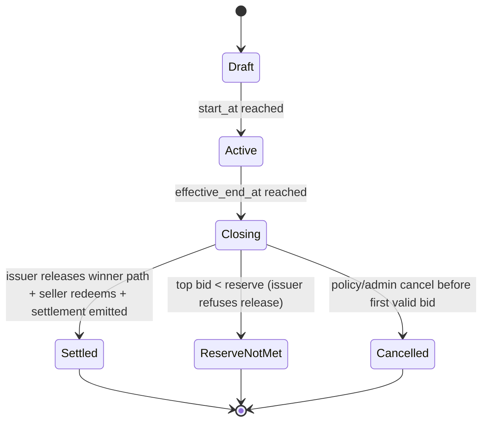
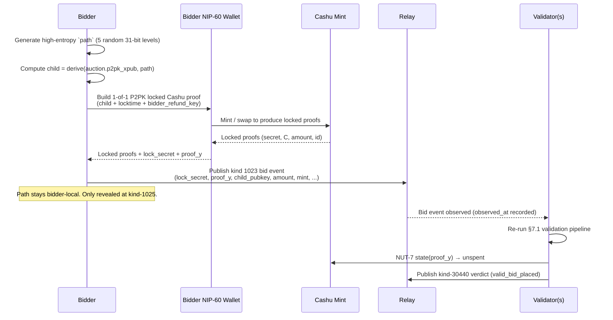

# AUCTIONS CODEX

> **Status (this branch).** This document specifies the
> `cashu_p2pk_bidder_path_v1` scheme — the **bidder-held-path** design.
> Earlier drafts on `master` described a path-oracle scheme
> (`cashu_p2pk_path_oracle_v1`) where a CVM coordinator held the
> derivation path; that scheme is **superseded** by what's below. The
> overarching pivot: no third party ever holds key material or
> spending-relevant secrets. Settlement is now a pure two-party
> cryptographic dance between bidder and seller. The "validator"
> demotes to a Nostr-native reputation auditor.

## 1. Purpose

This document specifies an auctions scheme for the market protocol using
Nostr events plus Cashu as an enforceable bearer-asset bid mechanism.

Goal for v1:

- Standard timed auction (English, ascending, highest bid wins).
- Every valid bid is backed by actually locked Cashu value (full vadium
  by default).
- Non-winning bidders can recover their funds promptly.
- Seller defines trusted mints.
- **No third party ever holds a secret that gates funds.** The
  bidder holds the derivation path; the seller holds the xpriv; the
  validator/auditor holds neither. Settlement requires both bidder
  and seller cooperatively, or it falls through to the bidder's
  timelock refund.
- **Validators are auditors, not coordinators.** They watch relays,
  re-check rules and on-mint state, and publish signed reputation
  events. They have no cryptographic power.
- Design remains extensible for additional auction types later.

---

## 2. Scope and Principles

### In scope (v1)

- Limited-time English auctions (ascending, highest bid wins).
- Open bidding visible on relays.
- Full-amount Cashu-backed deposit (100% vadium by default).
- Cashu **1-of-1 P2PK lock with refund timelock** (NUT-10/NUT-11) to a
  child key derived from the seller's published `p2pk_xpub` at a
  bidder-chosen high-entropy derivation path.
- **Bidder-held path.** The bidder generates and locally holds the path
  through the entire auction window. At settlement the bidder reveals
  the path to the seller (or publicly), enabling the seller — and only
  the seller — to derive the child privkey and redeem.
- **Validator-as-auditor.** One or more validators listed in the
  auction's `auditors` tag re-verify every bid against the auction's
  rules and against on-mint state (NUT-7), and publish signed
  reputation events. Each validator runs its own policy (Sybil
  filters, blacklists, KYC requirements, jurisdictional limits, etc.)
  on top of the protocol rules.
- Public lock-secret commitment in the bid event (so validators can
  NUT-7 the proof state without holding the proof itself).
- Seller-configurable settlement window and griefing handling
  (fallback to second-highest, post-locktime voluntary settlement).

### Out of scope (v1)

- On-chain escrow.
- Cashu n-of-m multisig profiles. (Explicitly rejected — see §14: any
  multisig lock that includes a third party introduces a collusion
  edge.)
- Sealed-bid / reveal-round auctions.
- Partial-deposit modes (except as a forward-compatible field).
- A canonical global reputation system. v1 ships the _event schema_
  for reputation; aggregation, weighting, and bootstrap policies are
  deferred to a follow-up.

### Security principles

- **No informal bids.** Every valid bid must include a publicly
  verifiable lock-secret commitment that resolves to an unspent Cashu
  proof at one of the auction's trusted mints. Validators NUT-7 the
  state continuously.
- **Cryptographic two-party safety.** Pre-locktime, the locked ecash
  can only be spent by `derive(seller_xpriv, path)`. The seller alone
  cannot produce that key (no path). The bidder alone cannot produce
  it (no xpriv). Brute-forcing either is ECDLP-hard. **Neither side,
  nor any third party, can spend a live bid unilaterally.**
- **No third-party collusion edge.** Validators hold no path, no
  xpriv, no key in any lock, and no co-signing role. A compromised or
  malicious validator cannot move funds alone, with the seller, or
  with the bidder. The strongest action a validator can take is to
  publish dishonest reputation claims — which other validators
  refute, and which cost the dishonest validator its own reputation.
- **Mint trust is explicit and seller-controlled.** Same as before.
- **Auction closing is deterministic from immutable root data.** The
  three-timestamp invariant (§6.0) still holds; `locktime =
max_end_at + settlement_grace` is computable from auction tags
  alone.
- **Bidder griefing is the new failure surface, not unilateral
  theft.** A winning bidder who refuses to release the path cannot
  _take_ anything they're not entitled to — they walk away with their
  refunded ecash (at locktime) but no goods. The seller's recourse is
  (a) fallback to the second-highest valid bid and (b) a permanent
  griefing mark on the bidder's reputation. See §9 and §14.
- **Safe failure modes.**
  - Validator(s) offline or compromised → auction continues; bid
    validity is determinable by anyone re-running the rules; funds
    remain safe.
  - Seller offline at settlement → no party can settle the winning
    bid; it refunds at locktime; no funds are lost.
  - Bidder offline at settlement → seller cannot derive the privkey;
    bid refunds at locktime; bidder reputation marked as griefed.
  - Path lost (bidder wallet destruction) → seller can never settle;
    bid refunds at locktime. Bidder bears the failure.

---

## 3. Source Inputs

- Existing marketplace draft spec conventions in `gamma_spec.md` and `SPEC.md`.
- Cashu primitives:
  - NUT-10 (well-known secrets).
  - NUT-11 (P2PK locks, locktime, refund).
  - NUT-14 (HTLC, future extension).
- Local app context:
  - Existing NIP-60 wallet support.
  - Existing ecash flow and trusted mint handling.
- Inspiration: ecash-with-derivation-paths pattern demonstrated at
  `https://github.com/gzuuus/cba`.

---

## 4. Auction Event Model

Kind values below are proposal values for discussion before final NIP/spec
assignment.

## 4.1 Kind `30408` Auction Listing (Addressable, updatable)

Signed by seller.

Auction listings are **self-describing**: they carry the same product-shaped
metadata as a kind `30402` product listing (see `gamma_spec.md` §3 for field
semantics), plus auction-specific bidding, timing, and settlement tags.
There is intentionally no product reference (`a` tag) in v1.

### Required tags

- `d`: auction identifier.
- `title`: display title.
- `auction_type`: `english` (v1 required).
- `start_at`: unix seconds.
- `end_at`: unix seconds.
- `currency`: `SAT` (v1 required).
- `reserve`: minimum acceptable final price (may be `0`, but tag required in
  v1 for explicitness).
- `bid_increment`: minimum step in sats.
- `mint`: trusted mint URL. MAY repeat.
- `settlement_policy`: `cashu_p2pk_bidder_path_v1`.
- `key_scheme`: `hd_p2pk`.
- `p2pk_xpub`: seller HD xpub used for per-bid seller child key derivation.
  Bidders compute `seller_child = derive(p2pk_xpub, path)` where `path`
  is a bidder-chosen high-entropy derivation path (§5.5).
- `max_end_at`: **hard bidding cutoff** in unix seconds. The second of the
  three protocol timestamps (see §6.0). Either equals `end_at` (no
  anti-snipe window) or sits later — `max_end_at = end_at + window` where
  `window` is the seller-chosen anti-snipe window (typically minutes).
  Bids submitted in `[start_at, end_at]` pay the flat floor; bids in
  `(end_at, max_end_at]` pay the curve floor (see `min_bid_curve` below).
  Always required so the Cashu locktime is computable from auction tags
  alone.
- `settlement_grace`: seconds between `max_end_at` and the bid's Cashu
  locktime — i.e. the window in which the bidder is expected to release
  the path and the seller to redeem. Together with `max_end_at` this
  fully determines `T_unlock` (see §6.0):
  `locktime = max_end_at + settlement_grace`. Seller-configurable per
  auction. v1 form presets: `300` (5 min), `3600` (1 h), `10800` (3 h),
  `86400` (24 h), `604800` (7 d). Auctions MAY use shorter values
  (e.g. `30` for dev quick-settle test fixtures); production deployments
  SHOULD pick values comfortably above the worst-case time required for
  (a) the bidder to come back online and publish the settlement event,
  (b) the seller to derive the child privkey + swap each leg at the
  mint + publish the kind-1024 event, and (c) any fallback workflow to
  the second-highest bidder if the winner griefs.
- `auditors`: Nostr pubkey of an auction validator the seller trusts to
  audit bids and publish reputation. MAY repeat — sellers SHOULD list
  multiple auditors for redundancy and to resist a single auditor's
  bias or outage. Compliant clients filter bids by these auditors'
  reputation events (kind 30440); they MUST NOT use the opinions of
  unlisted validators when deciding whether bids count for _this_
  auction. At least one `auditors` tag is REQUIRED.
- `min_bid_curve`: anti-snipe floor curve applied in `(end_at, max_end_at]`.
  Format `<shape>:<peak_multiplier>` where `shape ∈ {none, linear,
exponential}` and `peak_multiplier` is a decimal in `[1.0, 100.0]`.
  Floor computed as `baseline × multiplier(t)`:
  - `baseline = top_bid === 0 ? starting_bid : top_bid + bid_increment`
  - `multiplier(t) = 1` when `t ≤ end_at` or `shape = none`
  - `multiplier(t) = peak_multiplier` when `t ≥ max_end_at`
  - In `(end_at, max_end_at)` with `t_norm = (t - end_at) / (max_end_at - end_at)`:
    - `shape = linear` → `1 + (peak_multiplier - 1) × t_norm`
    - `shape = exponential` → `peak_multiplier ^ t_norm`
      v1 form presets for `peak_multiplier`: `2.0` / `5.0` / `10.0`. Default
      when tag is missing: `none:1.0` (no curve, flat floor through the
      whole bidding window). Validators enforce this floor when emitting
      kind-30440 verdicts (a bid below the curve floor is marked
      `bid_invalid` with `reason=under_curve`); compliant bidder clients
      apply the same computation locally to warn before publishing.

### Optional auction tags

- `vadium_ratio_bps`: default `10000` (100%).
- `schema`: version marker, e.g. `auction_v1`.
- `auditor_quorum`: integer N. When present and ≥2, a bid is considered
  "valid" by a compliant client only if at least N of the listed
  `auditors` have emitted a `valid_bid_placed` reputation event for it.
  Default (tag absent): `1` (any single listed auditor's `valid_bid_placed`
  is sufficient). MAY equal the count of `auditors` tags to require
  unanimity. Sellers running high-value auctions SHOULD raise this above
  `1` to dilute reliance on any one validator.
- `max_skew_sec`: integer, default `120`. Maximum acceptable difference
  between a bid event's claimed `created_at` and the validator's own
  `observed_at`. Bids exceeding this are flagged `timestamp_skew`.
- `fallback_delay_sec`: integer, default `settlement_grace / 2`. How long
  after `max_end_at` the seller's UI may begin offering settlement to the
  second-highest bidder if the winner has not published a settlement
  event. Validators emit a `griefed_pending_fallback` reputation event
  when this elapses.

### Removed from prior drafts (v0 / `cashu_p2pk_2of2_v1` and historical

`cashu_p2pk_path_oracle_v1`)

- `escrow_pubkey` — the bidder-path profile has no Cashu cosigner. Bid
  proofs lock to a single child pubkey (1-of-1). Implementations MUST NOT
  emit `escrow_pubkey` with
  `settlement_policy=cashu_p2pk_bidder_path_v1`.
- `escrow_identity` — replaced by `auditors`. Legacy readers SHOULD
  ignore.
- `path_issuer` — replaced by `auditors`. The path-oracle role is gone;
  there is no party that issues paths. `path_issuer` MUST NOT be emitted
  on `cashu_p2pk_bidder_path_v1` auctions.

### Optional product-shaped tags

These tags carry the same semantics as on kind `30402` product listings.
See `gamma_spec.md` §3 for full field definitions.

- `summary`, `image`, `spec`, `t`, `content-warning`, `shipping_option`,
  `weight`, `dim`, `location`, `g`.

### Immutable vs mutable tags

Immutable after first publish:

- `auction_type`
- `start_at`
- `end_at`
- `currency`
- `mint` set
- `p2pk_xpub`
- `auditors` set
- `auditor_quorum`
- `max_end_at`
- `settlement_grace`
- `min_bid_curve`
- `settlement_policy`
- `key_scheme`
- `reserve`
- `bid_increment`
- `max_skew_sec`

`extension_rule` was used in earlier drafts (v0) to describe a dynamic
`end_at`-shifting anti-snipe scheme. v1 retires it: the curve in
`min_bid_curve` replaces it, and `max_end_at` is now fixed at publish
time. Implementations MAY emit `['extension_rule', 'none']` for
backwards compatibility, but any non-`none` value MUST be ignored.

Mutable:

- `title`
- `content` (description)
- media/display metadata

Important:

- Because this is addressable+updatable, clients and platform MUST pin and
  store the first event ID (`auction_root_event_id`).
- Bids MUST reference `auction_root_event_id`, not only `a` coordinate.
- Updates changing immutable fields MUST be rejected by clients/indexers.

### Example

```jsonc
{
	"kind": 30408,
	"content": "Vintage camera, tested, ships worldwide",
	"tags": [
		["d", "auction-7f0b9a"],
		["title", "Vintage Camera Auction"],
		["summary", "Leica M3 in collector-grade condition"],
		["auction_type", "english"],
		["start_at", "1766202000"],
		["end_at", "1766288400"],
		["max_end_at", "1766289000"], // end_at + 600s anti-snipe window
		["settlement_grace", "3600"], // 1 h seller-settlement window
		["min_bid_curve", "exponential:5.0"], // 5× floor at max_end_at
		["currency", "SAT"],
		["reserve", "50000"],
		["bid_increment", "1000"],
		["mint", "https://mint.minibits.cash/Bitcoin"],
		["mint", "https://mint.coinos.io"],
		["settlement_policy", "cashu_p2pk_bidder_path_v1"],
		["key_scheme", "hd_p2pk"],
		["p2pk_xpub", "xpub6Bk...sellerAuctionXpub"],
		["auditors", "<validator-A-nostr-pubkey>"],
		["auditors", "<validator-B-nostr-pubkey>"],
		["auditor_quorum", "1"],
		["max_skew_sec", "120"],
		["schema", "auction_v1"],

		// Product-shaped fields
		["image", "https://cdn.example/m3-front.jpg", "1200x800", "0"],
		["spec", "Brand", "Leica"],
		["t", "cameras"],
		["shipping_option", "30406:<seller-pubkey>:standard-intl", "2500"],
	],
}
```

## 4.2 Kind `1023` Auction Bid Commitment (regular event)

Signed by bidder. The public event carries everything a validator needs to
**fully audit** the bid — including the lock secret itself — but **not**
the derivation path, which the bidder retains until settlement.

The previous draft separated a public commitment from a private DM to a
path-oracle. That split is gone: there is no oracle to DM, and validators
cannot do NUT-7 state checks against a commitment they can't open. The
public bid event now embeds the full P2PK lock secret. The Cashu proof's
`secret` field is publishable in cleartext — it contains the lock script
(pubkey, locktime, refund), not bearer authority. Bearer authority lives
in the signature, which only `derive(seller_xpriv, path)` can produce.

### Required tags

- `e`: `<auction_root_event_id>`
- `a`: auction coordinate `30408:<seller_pubkey>:<d-tag>`
- `p`: `<seller_pubkey>`
- `amount`: bid amount in sats. **Under the additive rebid chain** (see
  §4.2.1) this is the bidder's _cumulative_ commitment after this leg —
  not the delta locked by this leg alone. Validators use this value
  for min-increment checks against the auction's current top bid.
- `currency`: `SAT`
- `mint`: mint URL for locked token.
- `locktime`: unix seconds used in lock script (MUST equal
  `auction.max_end_at + auction.settlement_grace`).
- `refund_pubkey`: bidder refund pubkey (compressed secp256k1 hex).
- `child_pubkey`: HD-derived child pubkey used in the lock (compressed
  secp256k1 hex). Equals `derive(auction.p2pk_xpub, path)`. The path
  remains private to the bidder; only `child_pubkey` is published.
- `lock_secret`: **repeated tag** — one entry per Cashu proof making up
  **this leg's** lock. Each value is the full NUT-10 well-known P2PK
  secret string as it appears in that proof's `secret` field.
  Validators parse each entry to verify lock structure (pubkey,
  locktime, refund) and use the paired `proof_y` to query mint state
  via NUT-7. Cashu wallets typically produce 1–8 locked proofs per
  send (preserving the wallet's power-of-2 denomination structure
  across the swap), so multi-proof legs are the norm. All proofs
  within one leg share the same lock pubkey, locktime, and refund
  key — only the per-proof `nonce` differs. REQUIRED at least once
  under `settlement_policy=cashu_p2pk_bidder_path_v1`. **In a rebid
  chain each leg has its own `lock_secret`/`proof_y` set,
  `child_pubkey`, `refund_pubkey`, and lock pubkey — see §4.2.1.**
- `proof_y`: **repeated tag** — `Y = hash_to_curve(secret)` for each
  proof, in compressed secp256k1 hex. MUST be 1-to-1 parallel with the
  `lock_secret` tags (same count, same order). Cashu mints accept Ys
  as a batched lookup key (NUT-7 `CheckStatePayload.Ys: string[]`).
- `created_for_end_at`: copied auction end timestamp to bind client intent.
- `bid_nonce`: random id per bid.
- `key_scheme`: MUST match the auction `key_scheme`.
- `status`: `locked` at publish time.

### Optional tags

- `prev_bid`: previous bid event id from the same bidder on this
  auction. Drives the additive rebid chain (§4.2.1) — REQUIRED on every
  rebid leg, absent on the chain's first leg. Compliant validators
  refuse a bid whose `amount` is at or below its `prev_bid`'s `amount`
  (`replacement_chain_invalid`).
- `note`: short human text.

### Forbidden tags

- `derivation_path`: MUST NOT appear on a bid event. The path is the
  bidder's secret until settlement. Bids that publish the path
  pre-settlement effectively grant the seller immediate settlement
  authority (the auction terminates as if already won by that bidder),
  which compliant clients SHOULD treat as a malformed/early-settlement
  bid and ignore.
- `path_issuer`, `path_grant_id` — relics of the path-oracle scheme;
  MUST NOT be emitted.
- `commitment` — the previous opaque hash commitment is replaced by
  the explicit `lock_secret` + `proof_y` tags above so validators can
  audit without an out-of-band reveal.

### Bidder local state (not published)

The bidder MUST persist locally, for each bid they place:

- `derivation_path` — the bidder-chosen high-entropy path (see §5.5).
- The full Cashu proof (`amount`, `secret`, `C`, `id`) for the locked
  token. The bidder needs this to (a) refund via timelock if they
  lose or grief and (b) reconstruct settlement if anything goes wrong.

Loss of either makes the bid effectively unsettleable from the
bidder's side and locks the funds until `locktime`. Clients SHOULD
back up this state (encrypted) the same way they back up wallet
proofs.

### Why the lock secret is now public

- Validators can NUT-7-query the mint to confirm the proof is unspent
  at any moment — catching "fake bid" attacks where the bidder
  controlled the pubkey and quietly spent behind the lock.
- Anyone — not just a single trusted oracle — can independently
  re-audit any bid.
- The lock secret reveals only the spending condition (who must
  sign), not how to sign. Pre-locktime, only `derive(seller_xpriv,
path)` can produce a valid signature, and neither the seller alone
  nor the bidder alone can compute that key (§5).

### 4.2.1 The additive rebid chain

When a bidder raises their own bid on the same auction, the new
kind-1023 event chains to its predecessor via `prev_bid`. The chain
is **additive**, not replacement:

- The new leg locks **only the delta**: `amount - prev_leg.amount`
  sats. The previous leg's lock stays at the mint until either the
  seller redeems it on settlement (§8.1) or the bidder refunds it at
  `locktime` (§8.4).
- The new leg's `amount` tag is the bidder's **cumulative**
  commitment after this leg. So a 24,118 → 25,742 rebid emits a
  second kind-1023 whose `amount` is 25,742 and whose `lock_secret`
  proofs sum to 1,624 (the delta).
- Each leg has its own fresh `derivation_path`, `child_pubkey`,
  refund keypair, and lock secret(s). Privacy: refund branches don't
  cluster across legs. Isolation: a leaked refund key only
  compromises one leg's collateral.
- All legs in a chain share the same `locktime` (the auction's
  `max_end_at + settlement_grace`). Compliant publishers refuse a
  rebid that would emit a non-uniform locktime, since downstream
  flows (validator NUT-7 cadence, seller settlement, bidder refund
  sweep) assume per-chain uniformity.

**Capital efficiency.** Pre-additive-chain implementations made each
rebid re-lock the full new amount, leaving the bidder's wallet
temporarily encumbered by the sum of every leg's lock until
`locktime`. Under the additive chain the live encumbrance equals the
bidder's current bid — the natural invariant.

**Settlement implications.** On a chain win, the seller's kind-1024
references the _latest_ leg's kind-1025 via `path_release` but must
redeem every leg in the chain (one `payout` tag each) to recover the
full bid amount. See §8.1.

**Compliant validator invariants.** A validator MAY emit
`replacement_chain_invalid` when any of these break:

- `new_leg.amount > prev_leg.amount` (strict, no equality)
- `new_leg.bidder == prev_leg.bidder` (same author)
- `new_leg.locktime == prev_leg.locktime` (uniform locktime)
- `new_leg.auction == prev_leg.auction` (same auction)
- No cycle: walking `prev_bid` terminates at a leg with no
  `prev_bid` tag.

### Bidder local state per leg (extended)

Each leg's record (see §4.2 "Bidder local state") MUST also include:

- `prev_bid_event_id` — the leg's parent in the chain, or `null` on
  the chain root. Lets settle / refund flows walk the chain offline
  without re-fetching from the relay.
- `leg_locked_amount` — sats actually locked at the mint by THIS leg.
  Equals `sum(proofs[].amount)` for this leg. Distinct from
  `amount`, which is the cumulative bid value.
- `refund_private_key` — per-leg refund privkey (hex). Required at
  locktime to spend the refund branch. NOT added to the wallet's
  general signing-key map: refund keys are throwaway per-bid material
  and would bloat the wallet's privkey set across many bids.

## 4.3 Auction Settlement Events

The settlement story is now a two-event sequence, both regular events:

1. **Kind `1025` Path Release** — signed by the **bidder**. Reveals the
   derivation path so the seller can derive `seller_child_privkey` and
   redeem. This is the bidder's "settle" action.
2. **Kind `1024` Auction Settlement** — signed by the **seller** after
   they have actually redeemed. Records the on-mint outcome and triggers
   client refund/reputation flows.

The previous draft used a single seller-signed kind-1024 with an oracle's
path release recorded out-of-band. With no oracle, the path release
becomes a first-class on-relay event the bidder authors. The seller's
kind-1024 follows only when redemption actually succeeded at the mint.

### 4.3.1 Kind `1025` Path Release (bidder → seller)

Signed by the bidder. Publishes the derivation path for one of their
bids so the seller (or anyone else who can derive `seller_xpriv`-rooted
keys — only the seller) can spend the locked ecash.

Required tags:

- `e`: `<bid_event_id>` — the specific bid being released.
- `a`: auction coordinate.
- `p`: `<seller_pubkey>` — the redeeming party.
- `derivation_path`: the path used to derive `seller_child` from the
  auction's `p2pk_xpub`. Format: BIP-32 style, e.g. `m/123/456/789/...`.
- `child_pubkey`: MUST equal the `child_pubkey` tag on the referenced
  bid event. Lets observers verify
  `derive(p2pk_xpub, derivation_path) == child_pubkey` without
  fetching the bid event.
- `release_reason`: one of:
  - `settlement` — bidder won and is paying the seller.
  - `fallback_settlement` — bidder lost but is honoring the seller's
    fallback offer after a higher bidder griefed.
  - `voluntary_late` — bidder griefed past `settlement_grace` but is
    making good now (paths may still be valid if the proof hasn't
    been refunded yet; see §8).

Optional tags:

- `auditor_ref`: kind-30440 reputation event id(s) the bidder is
  responding to (e.g. the validator's `won_pending_settlement` event).
- `fallback_offer`: kind-1026 event id this release is accepting (set
  on `release_reason=fallback_settlement`).
- `cashu_token`: serialized Cashu token (`cashuA…` / `cashuB…`) wrapping
  the bid leg's full locked proofs (`{amount, secret, C, id}` per proof).
  REQUIRED in practice for the seller to redeem: the kind-1023 bid event
  publishes only `lock_secret` + `proof_y`, so the seller has no way to
  recover the proofs' `C` value otherwise. Proofs are P2PK-locked to
  `derive(p2pk_xpub, derivation_path)` — only the seller (who holds
  `seller_xpriv`) can spend them, so publishing the token publicly is
  safe. Omit only on synthetic / non-redeemable releases (e.g. seed
  fixtures); compliant settlers will refuse to redeem without it.
- `content` (event body): MAY contain a short human note.

### Chain releases

For a multi-leg rebid chain (§4.2.1), the bidder MUST publish **one
kind-1025 per leg**, each carrying that leg's `derivation_path`,
`child_pubkey`, and `cashu_token`. The seller's settlement walks the
chain via the kind-1023 `prev_bid` tags and looks up the corresponding
kind-1025 for each leg by the leg's bid event id. A chain whose release
events are partial (some legs unreleased) cannot be redeemed — the
seller will refuse to publish kind-1024 until every leg has a release.

Compliant bidder clients publish the chain's releases as a single batch
when the user clicks "settle" so a partial publish doesn't leave the
seller stuck with a half-redeemable chain.

Verifiability:

- Anyone can compute `derive(auction.p2pk_xpub, derivation_path)` and
  check it equals `child_pubkey`. If it doesn't, the release event is
  malformed and the bid was fraudulent (lock pubkey wasn't a real child
  of the auction xpub) — validators emit `fraudulent_bid` in that case
  rather than the expected `settled_promptly`.
- Once published, the path is public. Only the seller can use it
  (needs `seller_xpriv`), so publication is safe.
- The cashu_token is similarly safe to publish: the proofs are
  P2PK-locked, so possession of `C` without `derive(seller_xpriv,
path)` confers no spending authority.

### 4.3.2 Kind `1024` Auction Settlement (seller-signed)

Published by the seller after they have actually spent the locked ecash
at the mint (or determined the auction is closed without a sale). This
is the canonical "this auction is done" record.

Required tags:

- `e`: `<auction_root_event_id>`
- `a`: auction coordinate.
- `status`: one of
  - `settled` — winning bid paid, seller redeemed.
  - `reserve_not_met` — highest valid bid below `reserve`.
  - `cancelled` — seller cancelled the auction before close.
  - `griefed_no_fallback` — winner griefed and no second-highest
    bidder accepted fallback before grace expired. No on-mint
    redemption took place; all bids refund at locktime.
- `close_at`: unix seconds when close was computed.
- `winning_bid`: `<bid_event_id>` of the bid actually redeemed (when
  `status=settled`), or empty.
- `winner`: `<bidder_pubkey>` of the bid actually redeemed, or empty.
- `final_amount`: sats paid to the seller (or `0`).

Optional tags:

- `payout`: `["payout", "<bid_event_id>", "<amount>", "redeemed"]` —
  **repeated tag** when the winning bid is a rebid chain (§4.2.1): one
  `payout` per leg, with each leg's individual locked amount (not the
  cumulative bid). The sum of `payout` amounts MUST equal
  `final_amount`. Observers can audit the chain by verifying each
  `payout`'s `bid_event_id` walks back to the kind-1023 chain root via
  `prev_bid` tags.
- `path_release`: id of the **latest** leg's kind-1025 event the seller
  acted on. REQUIRED when `status=settled`. Older legs in a chain also
  have their own kind-1025s; those are discoverable via the bid event
  chain and don't need explicit references here.
- `fallback_chain`: repeating tags listing the bids the seller tried
  in order before settling (e.g. winner griefed, second-highest
  settled). Format:
  `["fallback_chain", "<bid_event_id>", "<status>"]` where status ∈
  `griefed | declined | accepted | refunded_at_locktime`.
- `reason`: machine code for cancellation/failure.

Note: A `status=settled` kind-1024 SHOULD only appear after the seller
has actually swapped the redeemed proofs at the mint. Until then the
bidder's release event exists but there's no guarantee the seller acted
on it. Validators consult mint state (NUT-7: proof should be SPENT)
before emitting `settled_promptly` reputation events.

## 4.4 Validator Reputation Events

There is no canonical auction-state registry in the bidder-held-path
scheme. The bidder holds the path. The seller holds the xpriv. The
auction's truth is the set of public events (auction listing, bids,
path releases, settlements) and the on-mint state (NUT-7 proof states).
What validators add is **opinions** about those public artefacts —
signed, replaceable, and structured so compliant clients can filter and
aggregate.

Two kinds:

- **Kind `30440` — Validator Bid Verdict** (parameterized replaceable):
  per-(validator, bidder, auction) opinion that evolves through the bid
  lifecycle.
- **Kind `30441` — Validator Policy Declaration** (parameterized
  replaceable): a validator's published policy, so bidders can predict
  whether their bid will clear before they post it.

### 4.4.1 Kind `30440` Validator Bid Verdict

Authored by a validator. Updated as the bid's state changes
(placed → won → settled / griefed / fraudulent / etc.). Because it's
parameterized replaceable, only the latest verdict per (validator,
bidder, auction) is canonical.

Required tags:

- `d`: `<bidder_pubkey>:<auction_root_event_id>` — per-bidder,
  per-auction, replaceable.
- `p`: `<bidder_pubkey>` — for `#p` indexing.
- `a`: auction coordinate.
- `e`: `<auction_root_event_id>` — for `#e` queries.
- `bid`: `<bid_event_id>` — the most recent kind-1023 bid event from
  this bidder for this auction (replacement chains: the highest /
  latest bid).
- `claim`: one of the values in §4.4.3.
- `observed_at`: unix seconds when the validator first observed the
  bid event on its subscribed relays. **This is the validator's own
  timestamp, not the bidder's `created_at`.** Compliant clients use
  this for in-window determination.

Conditional tags (depending on `claim`):

- `reason`: machine code clarifying a negative `claim` (e.g.
  `pre_start`, `under_increment`, `bad_lock`, `timestamp_skew`,
  `relatr_below_threshold`, `on_blacklist`, `fraudulent_bid`,
  `griefed`, etc.). REQUIRED for any `bid_invalid` / negative claim.
- `nut7_state`: most recent NUT-7 result the validator observed for
  this bid's proof: `unspent | pending | spent`. REQUIRED when the
  validator includes mint-state in its judgement.
- `nut7_observed_at`: unix seconds of the most recent NUT-7 query.

Content: free-form JSON the validator may use for human-readable notes
or extra structured data (e.g. specific threshold values, list of
ancestors the bid replaces in the bid chain). MUST NOT be relied on by
machine consumers for canonical fields.

Example:

```jsonc
{
	"kind": 30440,
	"pubkey": "<validator_pk>",
	"tags": [
		["d", "<bidder_pk>:<auction_root_event_id>"],
		["p", "<bidder_pk>"],
		["a", "30408:<seller_pk>:<auction_d>"],
		["e", "<auction_root_event_id>"],
		["bid", "<latest_bid_event_id>"],
		["claim", "valid_bid_placed"],
		["observed_at", "1716210045"],
		["nut7_state", "unspent"],
		["nut7_observed_at", "1716210050"],
	],
	"content": "{\"bid_amount\":12000,\"claim_skew_sec\":4}",
}
```

### 4.4.2 Kind `30441` Validator Policy Declaration

Authored by a validator. Replaceable per validator. Lets bidders and
sellers see in advance what a validator will and won't accept.

Required tags:

- `d`: `policy:auction:v1` (or `policy:auction:<scope>` for
  category/jurisdiction-scoped policies).
- `name`: human-readable validator label.

Content: JSON describing the policy. Suggested fields:

```ts
interface ValidatorPolicy {
	type: 'auction_validator_policy_v1'
	relatrMinScore?: number // e.g. 0.1
	requireNip05?: boolean
	minAccountAgeDays?: number
	blacklist?: string[] // pubkeys
	blacklistRefs?: string[] // event ids of blacklist events
	requiredAttestors?: string[] // e.g. KYC issuer pubkeys
	categoryAllowlist?: string[] // category tags this validator covers
	categoryDenylist?: string[]
	maxAcceptableSkewSec?: number // overrides auction.max_skew_sec ceiling
	griefingDecayDays?: number // how long grief reputation persists
	notes?: string
}
```

Compliant clients SHOULD fetch this policy before submitting a bid
and warn the user if their bid will likely be rejected (e.g. low
relatr score against a strict validator).

### 4.4.3 `claim` taxonomy

Validators emit one of the following `claim` values per verdict
event. Ordered roughly by bid lifecycle.

Bid-time (transient — replaced as the bid progresses):

- `valid_bid_placed` — passes all rule and policy checks; NUT-7
  state is `unspent`.
- `bid_invalid` — fails a rule or policy. MUST be accompanied by a
  `reason` tag (see below).
- `bid_pending_review` — validator has seen the bid but is still
  waiting on a check to complete (e.g. NUT-7 in flight). Transient.

Post-close (terminal):

- `won_pending_settlement` — bid was the highest valid bid at
  `max_end_at`; awaiting kind-1025 path release.
- `lost_pending_refund` — bid was not the winner; awaiting locktime
  refund or earlier voluntary refund.
- `settled_promptly` — bidder published a valid kind-1025 within
  `settlement_grace`, mint state confirms proof is now `spent` by the
  seller.
- `settled_late` — kind-1025 came after `settlement_grace` but
  before the bidder refunded; seller still able to redeem.
- `griefed` — winning bidder never published a valid kind-1025
  within `settlement_grace`. Terminal negative.
- `griefed_pending_fallback` — `fallback_delay_sec` elapsed since
  `max_end_at` without settlement; seller's UI may now offer
  fallback to second-highest.
- `fraudulent_bid` — at settlement (or via NUT-7 observation),
  detected that the bid's lock pubkey was not actually
  `derive(p2pk_xpub, revealed_path)` or the proof was spent before
  the legitimate settlement. Strongest negative.
- `cancelled` — auction was cancelled by the seller; bid refunds at
  locktime.

Common `reason` values for `bid_invalid`:

- `pre_start` — `bid.created_at < auction.start_at`
- `post_end` — `bid.created_at > auction.end_at + extension`
- `late_arrival` — `validator.observed_at` outside the auction's
  in-window range (the validator simply didn't see the bid in time,
  regardless of what the bidder claimed)
- `timestamp_skew` — `|created_at - observed_at| > max_skew_sec`
- `under_increment` — `bid.amount < current_high + bid_increment`
- `under_curve` — bid in `(end_at, max_end_at]` below the
  `min_bid_curve` floor
- `bad_lock` — lock secret structure doesn't match auction rules
  (wrong locktime, wrong refund key, malformed P2PK condition)
- `unsupported_mint` — `bid.mint` not in the auction's `mint` set
- `proof_spent` — NUT-7 reports the proof as `spent` despite the
  bid being live (clear fake-bid signal)
- `proof_missing` — mint returns no record of the proof
- `signature_invalid` — bid event signature doesn't verify
- `replacement_chain_invalid` — `prev_bid` chain inconsistent
- Policy-driven (subjective):
  - `relatr_below_threshold` — bidder relatr score below this
    validator's threshold (with a `score` tag for the actual value)
  - `on_blacklist`
  - `account_too_young`
  - `nip05_unverified`
  - `kyc_not_attested`
  - `outside_validator_jurisdiction` — bid in a category this
    validator doesn't cover

Validators MAY emit additional implementation-specific reasons.
Compliant clients SHOULD show unknown reasons verbatim in UI rather
than ignoring the verdict.

### 4.4.4 Aggregate validator output (optional)

Validators MAY also publish a kind-30442 _aggregate reputation_
event keyed on `d=<bidder_pubkey>` (per-bidder, not per-auction) with
running counts:

```ts
interface BidderAggregateReputation {
	type: 'auction_bidder_aggregate_v1'
	windowDays: number // e.g. 90
	bids_valid: number
	bids_invalid: number
	wins_settled: number
	wins_griefed: number
	wins_fraudulent: number
	updatedAt: number
}
```

This is purely advisory; compliant clients MAY use it to gate
high-stakes bidding, or ignore it entirely. v1 ships the schema; the
specific weighting/aggregation policy is up to each validator.

---

## 5. Cashu Locking Profile (v1)

## 5.1 Why lock profile is required

A bid without enforceable value is spam. V1 requires a bid token that is
cryptographically locked with a refund timelock and that no party can
spend unilaterally before the auction settles.

## 5.2 Lock profile: `cashu_p2pk_bidder_path_v1`

Use NUT-11 P2PK secret with:

- **Single** lock pubkey: a fresh HD-derived seller child pubkey
  computed by the **bidder** as `derive(auction.p2pk_xpub, path)`
  where `path` is a bidder-chosen high-entropy derivation path
  (§5.5). No Cashu cosigner.
- `n_sigs`: omitted (default 1). The lock is 1-of-1.
- `locktime`: `auction.max_end_at + auction.settlement_grace` (see §4.1).
- `refund`: bidder refund pubkey (the bidder's own secp256k1 key —
  any fresh key per bid, RECOMMENDED).
- `n_sigs_refund=1`.
- `sigflag=SIG_INPUTS` (v1).

This yields the central security property of the scheme:

- **Neither party can spend pre-locktime alone.** Spending requires a
  signature from `seller_child_privkey = derive(seller_xpriv, path)`.
  The seller has `seller_xpriv` but no `path`. The bidder has the
  `path` but no `seller_xpriv`. Brute-forcing either from public
  information is ECDLP-hard. Settlement is a genuine two-party
  cooperative spend.
- **The validator is structurally absent from the lock.** No
  validator pubkey appears in the NUT-11 secret. No validator
  signature is ever required. A compromised or malicious validator
  has zero power over the locked funds.
- **Locktime is the unconditional bidder backstop.** If the bidder
  never reveals the path (lost wallet, change of mind, malice), the
  funds refund to the bidder via the refund branch at `locktime`.
  No one is robbed, the sale just fails.
- **Wider mint compatibility.** Mints that support minimal NUT-11
  (single-key P2PK + locktime + refund) suffice — no multi-key
  support required.

### Differences from prior drafts

vs. `cashu_p2pk_2of2_v1` (v0):

- No `escrow_pubkey`. The NUT-11 `pubkeys` multisig slot is empty.
- Settlement requires path reveal + sole seller signature, not a
  co-signed 2-of-2 spend.

vs. `cashu_p2pk_path_oracle_v1` (superseded):

- **The bidder chooses and holds the path**, not a path-oracle.
  There is no oracle anywhere in the protocol.
- The lock structure itself is byte-for-byte identical between the
  oracle scheme and this one — only who-holds-what changes. The
  on-mint redemption code paths are reusable.

## 5.3 Exact NUT-11 tag layout

The recommended per-bid `Secret` shape is:

```json
[
	"P2PK",
	{
		"nonce": "<random>",
		"data": "<seller_child_pubkey>",
		"tags": [
			["sigflag", "SIG_INPUTS"],
			["locktime", "<locktime_unix_seconds>"],
			["refund", "<bidder_refund_pubkey>"],
			["n_sigs_refund", "1"]
		]
	}
]
```

Interpretation:

- Before `locktime`, only a signature from `seller_child_pubkey`'s
  privkey can spend (1-of-1). That privkey is only producible by
  combining `seller_xpriv` (seller-held) with `path` (bidder-held).
- After `locktime`, the bidder refund pubkey can additionally spend.
- `SIG_ALL` remains a long-term consideration; v1 uses `SIG_INPUTS`
  for cashu-ts compatibility.

## 5.4 cashu-ts shape

```ts
import { P2PKBuilder } from '@cashu/cashu-ts'

const p2pk = new P2PKBuilder()
	.addLockPubkey(sellerChildPubkey) // single pubkey, 1-of-1
	.lockUntil(locktime)
	.addRefundPubkey(bidderRefundPubkey)
	.requireRefundSignatures(1)
	.toOptions()

const { keep, send } = await wallet.ops.send(amount, proofs).asP2PK(p2pk).run()
```

The locked proofs (`send`) stay in the bidder's wallet until either
the seller redeems them (after kind-1025 path reveal) or the bidder
refunds via locktime. The `lock_secret` and `proof_y` fields (§4.2)
of each proof are published in the kind-1023 bid event so validators
can audit; the bidder MUST persist the full proofs (including `C`)
locally so they can refund if the auction griefs.

## 5.5 Bidder-held HD path model

The bidder generates a fresh derivation path per bid and never
shares it until settlement (kind-1025).

Path structure:

- Five non-hardened levels, each a uniformly random index in
  `[0, 0x7fffffff]` (31 bits).
- Total entropy ≈ 155 bits. Brute-forcing the path given only the
  auction's `p2pk_xpub` and the bid's `child_pubkey` is
  computationally infeasible. **This entropy requirement is
  non-negotiable** — lower-entropy paths let the seller iterate
  candidates and settle without the bidder's cooperation, defeating
  the bidder's hold. Reference: `generateAuctionDerivationPath()` in
  `src/lib/auctionPathOracle.ts`.

Roles:

- **Seller** publishes `auction.p2pk_xpub`. Holds the matching
  `seller_xpriv`. Never sees any path until the bidder publishes a
  kind-1025. At settlement, derives `seller_child_privkey =
derive(seller_xpriv, path)`, signs the locked proof, redeems.
- **Bidder** generates a fresh high-entropy `path` locally,
  computes `seller_child = derive(auction.p2pk_xpub, path)`, locks
  ecash to that child key + their own refund key, publishes the
  kind-1023 bid event (with the lock secret embedded), and persists
  `path` + the full Cashu proof locally. At settlement, publishes a
  kind-1025 path release.
- **Validator(s)** listed in the auction's `auditors` tag observe
  bid events, verify rules and on-mint state, and publish kind-30440
  verdicts. They never see the path until the bidder publishes the
  kind-1025 — and even then, the path alone is useless (no
  `seller_xpriv`).

Constraints:

- Non-hardened path levels only (the bidder must be able to derive
  the child pubkey from the public xpub at lock time).
- One path per bid; never reuse across bids — every bid is a fresh
  155-bit path.
- Refund + locktime rules unchanged from the oracle scheme.

Bidder UX:

- Wallet generates a path silently as part of the bid flow.
- Wallet MUST back up `(path, fullProof)` pairs per active bid; loss
  bricks that bidder's ability to settle or refund early (locktime
  refund still works because the refund key is independent).

Seller UX:

- Same `p2pk_xpub` publication step as before.
- At settlement: receive the kind-1025 from the winning bidder,
  derive child privkey, sign, swap at mint, publish kind-1024.

## 5.6 Verification (normative)

### Bidder, before locking

The bidder generates `path` locally and computes `seller_child` from
the auction's `p2pk_xpub`. Because the bidder both generates the
path and computes the child key themselves, there is no
oracle-supplied claim to verify — the derivation is the bidder's own
computation. The bidder MUST:

1. Read `auction.p2pk_xpub` from the kind-30408 event the seller
   signed. The auction event's signature proves the xpub is the
   seller's.
2. Generate `path` with the §5.5 entropy requirement (5 non-hardened
   levels of cryptographically random 31-bit indices). Lower-entropy
   paths are non-compliant.
3. Compute `seller_child = HDKey.fromExtendedKey(p2pk_xpub)
.derive(path).publicKey`.
4. Lock proofs to `seller_child` with the §5.3 NUT-11 layout.
5. Publish the kind-1023 bid event including `lock_secret` and
   `proof_y` (§4.2) so validators can audit.
6. Persist `(path, fullProof)` locally — encrypted backup
   RECOMMENDED.

### Validator, while the bid is live

Validators cannot verify the derivation without the path (and the
bidder doesn't reveal the path until settlement). What they CAN do:

1. Parse the published `lock_secret` and verify it has the correct
   NUT-11 structure (single pubkey, correct locktime, correct refund
   key matching the bidder's signing identity).
2. Query the bid's mint via NUT-7 using `proof_y`; require state
   `unspent` for `valid_bid_placed`. If the state is `spent` before
   settlement, the bid was fake (the bidder controlled the pubkey
   and spent behind the lock) — emit `bid_invalid` with
   `reason=proof_spent` or `fraudulent_bid`.
3. Re-query NUT-7 periodically (RECOMMENDED ≤ 60s interval) for the
   duration of the auction.

### Validator, at settlement

When the bidder publishes a kind-1025, validators verify:

1. The kind-1025 references a kind-1023 bid event the validator has
   already marked `won_pending_settlement` (or a lower-ranked bid in
   the fallback chain).
2. `derive(auction.p2pk_xpub, kind_1025.derivation_path).pubkey`
   serialises to exactly `kind_1023.child_pubkey`. If this fails the
   bid was fraudulent (lock pubkey was not actually a child of the
   auction xpub); emit `fraudulent_bid`.
3. Subsequently the proof's NUT-7 state becomes `spent` (seller
   redeemed). On observing this transition the validator emits
   `settled_promptly` (or `settled_late` if `settlement_grace` had
   elapsed).

### Seller, at settlement

The seller receives (or observes on relays) the bidder's kind-1025.
The seller MUST:

1. Verify the kind-1025 is signed by the bidder's pubkey (matching
   the kind-1023 author).
2. Verify
   `derive(auction.p2pk_xpub, derivation_path).pubkey == kind_1023.child_pubkey`.
   If this fails the lock was bogus — the seller cannot redeem; the
   bid effectively becomes a fake_bid record and the seller falls
   back to the next bid in the chain.
3. Derive `seller_child_privkey = derive(seller_xpriv, derivation_path)`.
4. Spend the locked proof at the mint (1-of-1 P2PK signature).
5. Publish the kind-1024 settlement event referencing both the bid
   and the kind-1025.

Skipping verification step 2 lets a malicious bidder publish a
kind-1025 with a garbage path, watch the seller fail to redeem, and
claim the seller refused settlement. Always verify the derivation
before attempting on-mint redemption.

---

## 6. Auction State Machine



Deterministic close input set:

- `auction_root_event_id`
- immutable root fields
- all valid bids accepted by the anti-sniping time algorithm
- tie-breaker policy

## 6.0 The three timestamps (structural invariant)

Every path-oracle auction is parameterised by three monotonically ordered
timestamps. Implementations MUST treat each as a separate concern; collapsing
any two of them into one is unsafe.

| Tag / value          | Symbol     | Meaning                                                                                                                                                                          |
| -------------------- | ---------- | -------------------------------------------------------------------------------------------------------------------------------------------------------------------------------- |
| `end_at`             | `T_end`    | Nominal close. Floor stays flat in `[start_at, end_at]`. After this point the curve in `min_bid_curve` ramps the floor up.                                                       |
| `max_end_at`         | `T_cutoff` | **Hard bidding cutoff.** No new bids accepted past this. Equals `T_end` when the seller chose no anti-snipe window; otherwise sits `(max_end_at − end_at)` seconds later by tag. |
| `locktime` (per bid) | `T_unlock` | Unix-seconds value embedded in every Cashu P2PK secret. The mint opens the refund path at this moment.                                                                           |

The invariants:

```
T_end  ≤  T_cutoff  ≤  T_unlock
T_unlock = T_cutoff + settlement_grace
```

**The gap `T_unlock − T_cutoff` is the seller's settlement window.** It must be wide enough to absorb worst-case settlement work — receive a path
release from the issuer, derive every child privkey in the winner's chain,
swap each leg at the mint, sign and publish the kind-1024 event, and absorb
retries from transient mint 429s or relay failures.

If you collapse any two:

- `T_end == T_unlock` (no grace): bidders reclaim the moment bidding closes.
  Seller never has a window. Auction never completes.
- `T_cutoff == T_unlock` (zero grace, anti-sniping pushes effective end to
  `T_cutoff` = `T_unlock`): same problem, just delayed.
- `T_end == T_cutoff` with no anti-sniping: fine — this is just "auction has
  a fixed close". With anti-sniping enabled, the distinction is required —
  `T_end` is what gets extended; `T_cutoff` is what caps the extension.

`max_end_at` MUST therefore be present on every auction event:

- No anti-snipe window → `max_end_at = end_at`.
- Anti-snipe window of `window` seconds (seller-chosen at publish time) →
  `max_end_at = end_at + window`. The window is fixed at publish, not
  dynamically extended.

`settlement_grace` is per-auction (see §4.1). v1 form presets:
`300` (5 min), `3600` (1 h), `10800` (3 h). Sub-minute values are unsafe
on shared infrastructure; sub-10-minute values are questionable in
production. Dev environments use a shorter value (≈ 30 s) for test
velocity, not as a design example.

## 6.1 Bid floor and the anti-snipe curve

v1 retires the dynamic `extension_rule` model. There is no
`effective_end_at` that shifts as bids land — `max_end_at` is fixed at
publish time. Instead, the **bid floor rises** in `(end_at, max_end_at]`
per the `min_bid_curve` tag (see §4.1). Validators enforce the floor
when they assess each kind-1023 bid (rejecting `under_curve`); compliant
bidder clients run the same formula locally to warn the user before
publishing.

```text
baseline(top_bid)      = top_bid === 0 ? starting_bid : top_bid + bid_increment
multiplier(t):
  if t ≤ end_at OR shape = none:   return 1
  if t ≥ max_end_at:                return peak_multiplier
  t_norm = (t - end_at) / (max_end_at - end_at)
  if shape = linear:                return 1 + (peak_multiplier - 1) × t_norm
  if shape = exponential:           return peak_multiplier ^ t_norm
floor(top_bid, t)      = baseline(top_bid) × multiplier(t)
```

**Lag tolerance.** A protocol constant `BID_FLOOR_TIME_GRACE_SECONDS = 5`
applies in the validator's floor computation:

- The validator computes the floor at
  `effective_t = clamp(bid.observed_at - GRACE, end_at, max_end_at)`.
  This gives bidders ~5 s of relay-propagation latency budget between
  clicking "Bid" and the validator receiving the event. A bidder who
  delays publishing for > 5 s pays the curve at the actual `observed_at`.
- Validators MAY also clamp `effective_t` to `min(bid.created_at,
observed_at) - GRACE` if the two are within `max_skew_sec` of each
  other, so honest bidders don't get penalised by their own slightly-
  slow clock.

The bidder client displays the floor at `client_now` (no inflation) —
the server is more lenient than the displayed value, so a click at
the displayed price is always accepted within the GRACE window.

Critical policy:

- Settlement MUST use `max_end_at`, not raw `end_at`, when deciding
  whether the auction can be settled.
- `max_end_at` is always present (see §6.0). With no anti-snipe window
  it equals `end_at` and the curve has zero duration (effectively
  disabled regardless of `min_bid_curve` shape).
- Bid locktime MUST be fixed up front to
  `max_end_at + settlement_grace`, so existing bidders never need
  to re-sign bids when the auction is extended.
- Bids submitted at or after `max_end_at` MUST be rejected by both client
  and issuer. Late bids would need a longer locktime than the chain's
  existing legs and break the uniform-locktime invariant — see the design
  caveats note for the full reasoning.

---

## 7. Bid Acceptance Flow



Validation rules (MUST — applied by validators and by all
compliant clients re-running the rules):

- Bid event signature valid; `pubkey` is a non-zero secp256k1
  identity.
- Bid references a pinned `auction_root_event_id` via `e`.
- `bid.created_at` is in the active window
  `[start_at, max_end_at]` (with extension if applicable).
- `validator.observed_at` is in the active window — i.e. the
  validator actually saw the bid arrive in time. Bidder-claimed
  `created_at` is advisory; `observed_at` is authoritative for the
  validator's verdict.
- `|created_at - observed_at| ≤ auction.max_skew_sec` (default
  120s).
- Amount satisfies reserve/increment rules and the `min_bid_curve`
  floor for the bid's effective timestamp.
- `mint` tag is in the auction's allowlist.
- `child_pubkey` tag is a compressed secp256k1 pubkey. (Note: the
  derivation `child_pubkey == derive(p2pk_xpub, path)` cannot be
  verified pre-settlement because the path is bidder-private; the
  on-mint NUT-7 state check catches bidders who locked to a
  self-controlled pubkey instead.)
- `lock_secret` parses as a NUT-10 P2PK well-known secret. Its
  inner structure MUST list `child_pubkey` as the sole spending
  pubkey, declare `locktime` equal to
  `auction.max_end_at + auction.settlement_grace`, and declare a
  `refund` matching the bid event's `refund_pubkey` tag.
- `proof_y` is a valid `hash_to_curve(secret)` for the
  `lock_secret`'s `secret` field.
- NUT-7 query against the bid's mint with `proof_y` returns
  `unspent`. (`pending` is transient → retry with bounded backoff;
  `spent` → `bid_invalid: proof_spent`.)
- `derivation_path` tag MUST NOT be present on a kind-1023 bid
  event. Bids that publish the path early are treated as
  malformed.

## 7.1 Validation pipeline (normative)

```mermaid
flowchart TD
    A[Bid event observed] --> B{Pinned auction root exists?}
    B -->|No| R1[Reject: invalid root]
    B -->|Yes| C{validator.observed_at in window?}
    C -->|No| R2[Reject: late_arrival]
    C -->|Yes| C2{bidder.created_at in window?}
    C2 -->|No| R2a[Reject: pre_start / post_end]
    C2 -->|Yes| C3{|created_at - observed_at| ≤ max_skew?}
    C3 -->|No| R2b[Reject: timestamp_skew]
    C3 -->|Yes| D{Bid amount ≥ floor + increment?}
    D -->|No| R3[Reject: under_increment / under_curve]
    D -->|Yes| E{Mint in allowlist?}
    E -->|No| R4[Reject: unsupported_mint]
    E -->|Yes| F{lock_secret well-formed?<br/>locktime + refund + n_sigs correct?}
    F -->|No| R5[Reject: bad_lock]
    F -->|Yes| G{proof_y == hash_to_curve(secret)?}
    G -->|No| R6[Reject: bad_proof_y]
    G -->|Yes| H{NUT-7 state == unspent?}
    H -->|spent| R7[Reject: proof_spent /<br/>fraudulent_bid]
    H -->|pending| H1[Defer: bid_pending_review]
    H -->|missing| R8[Reject: proof_missing]
    H -->|unspent| I{Validator policy<br/>(relatr, blacklist, KYC, ...)}
    I -->|fail| R9[Reject: policy reason]
    I -->|pass| OK[Emit valid_bid_placed]
```

Operational notes:

- NUT-7 check SHOULD be retried with bounded timeout (RECOMMENDED
  ≤ 60s polling for the duration of the auction so that a
  bidder-spends-behind-the-lock attack is caught quickly).
- If the mint is unreachable, the validator MAY emit
  `bid_pending_review` with `nut7_state=unknown` and retry; it MUST
  NOT emit `valid_bid_placed` until at least one successful
  `unspent` reading.
- Each listed validator runs this pipeline independently. Compliant
  clients consult the `auditor_quorum` count of agreeing
  `valid_bid_placed` verdicts before treating the bid as a real
  bid for tie-breaking and floor computation.

## 7.5 Validator audit protocol (normative)

There is no oracle protocol in this scheme. Validators are passive
relay subscribers — they discover bids, auctions, and settlements by
ordinary Nostr REQ filters, and they publish opinions as kind 30440 /
30441 events (§4.4). Bidders and sellers do not call validators; they
just publish events and read validators' verdicts.

What a validator MUST do for every bid event it observes for an
auction whose `auditors` list includes its pubkey:

1. **Verify cryptographic well-formedness** — signature, references,
   tag completeness, lock secret structure (§4.2 required tags).
2. **Verify auction rules** — `created_at` within auction window
   _AND_ `observed_at` within auction window _AND_
   `|created_at - observed_at| ≤ max_skew_sec`; amount ≥ current
   high + `bid_increment` (and ≥ `min_bid_curve` floor in the
   anti-snipe window); `mint` in the auction's allowlist; `locktime`
   equals `max_end_at + settlement_grace`.
3. **Verify on-mint state** — query the bid's mint via NUT-7 with
   `proof_y`. Result `unspent` is required for `valid_bid_placed`.
   `pending` is transient and SHOULD be retried with bounded
   backoff. `spent` (before settlement) means the bid was fake; emit
   `bid_invalid` with `reason=proof_spent` or `fraudulent_bid` as
   appropriate.
4. **Apply policy** — the validator's own published kind-30441
   policy (relatr threshold, blacklist, KYC, jurisdiction, etc.).
5. **Publish verdict** — replaceable kind-30440 event (§4.4.1) with
   the current `claim`, `observed_at`, and any `reason`.

What a validator MUST do at auction close (`max_end_at` elapsed):

1. **Identify the winner** — highest-amount bid the validator has
   marked `valid_bid_placed`, with the tie-break rule from §8.
2. **Update verdicts** — winner → `won_pending_settlement`; all
   other valid bids → `lost_pending_refund`.
3. **Watch for settlement** — observe kind-1025 path releases and
   kind-1024 settlement events. On a valid kind-1025 within
   `settlement_grace` whose path derives to the bid's `child_pubkey`
   AND whose proof's NUT-7 state subsequently becomes `spent` (by
   the seller), update the winner's verdict to `settled_promptly`.
4. **Handle grief / fraud** — if `settlement_grace` elapses without
   a valid kind-1025, emit `griefed`. If a kind-1025 is published
   but the path does NOT derive to the lock pubkey, emit
   `fraudulent_bid`.
5. **Surface fallback opportunity** — if `fallback_delay_sec`
   elapses without settlement, emit `griefed_pending_fallback` so
   the seller's UI can offer fallback to the second-highest valid
   bid.

What a validator MAY do:

- Publish the aggregate kind-30442 reputation summary for each
  bidder (§4.4.4).
- Publish a kind-30441 policy declaration so bidders can predict
  whether their bids will clear (§4.4.2).
- Subscribe to other validators' verdicts and cross-check them
  (validators policing validators).

What a validator MUST NOT do:

- Hold any derivation path before the bidder publishes a kind-1025.
- Hold any Cashu proof.
- Sign anything other than its own reputation events.
- Co-sign mint spends.
- Mediate any communication that requires a secret to flow through
  it. (If a bidder wants to share the path privately with the
  seller before publishing kind-1025, that's a direct NIP-44 DM
  between the two — no validator involvement.)

---

## 8. Auction Close + Settlement + Refund Flow

```mermaid
sequenceDiagram
    participant S as Seller
    participant V as Validator(s)
    participant W as Winning Bidder
    participant L as Losing Bidder
    participant M as Cashu Mint
    participant R as Relay

    Note over V: Watches relay continuously
    Note over W,L: max_end_at elapses
    V->>R: kind-30440 winner: won_pending_settlement
    V->>R: kind-30440 losers: lost_pending_refund

    alt Winner settles (happy path)
        W->>R: kind-1025 path_release (derivation_path)
        S->>S: derive(seller_xpriv, path) → seller_child_privkey
        S->>M: Redeem locked proof (1-of-1 P2PK)
        V->>M: NUT-7 check → spent
        V->>R: kind-30440 winner: settled_promptly
        S->>R: kind-1024 settlement (status: settled, path_release ref)
        Note over L,M: Losers self-refund at locktime via refund key
    else Winner griefs (no path_release within settlement_grace)
        Note over V: fallback_delay_sec elapses
        V->>R: kind-30440 winner: griefed_pending_fallback
        S->>S: Identify second-highest valid bid
        S->>R: NIP-44 DM: "fallback offer" to bidder #2
        alt Bidder #2 accepts
            L->>R: kind-1025 path_release (release_reason: fallback_settlement)
            S->>M: Redeem #2's locked proof
            V->>R: kind-30440 #2: settled_promptly
            S->>R: kind-1024 (status: settled, fallback_chain includes #1 griefed)
            V->>R: kind-30440 winner: griefed (terminal)
        else Bidder #2 declines / no second highest
            S->>R: kind-1024 (status: griefed_no_fallback)
            V->>R: kind-30440 winner: griefed (terminal)
            Note over W,M: All bids refund at locktime
        end
    else Reserve not met
        S->>R: kind-1024 (status: reserve_not_met)
        Note over W,L,M: All bids refund at locktime
    end
```

Tie-break rule (v1, unchanged from prior drafts):

- Highest `amount` wins.
- If equal amount, earliest `created_at` wins (subject to the
  validator's `observed_at` cross-check; bids with significant
  `timestamp_skew` are excluded before tie-breaking).
- If same `created_at`, lexical smallest bid event ID wins.

### 8.0 Who computes "the winner"?

Unlike the oracle scheme there is no privileged party with a
canonical view of the bid set. Every participant — sellers,
bidders, validators, and onlookers — independently runs the same
winner-selection rule against:

- The bids that the auction's `auditors` (per the `auditor_quorum`
  policy) have marked `valid_bid_placed`, and
- The auction's tie-break rules.

The _seller_'s computation is the one that determines who they
attempt to settle with. Bidders should reach the same answer.
Validators publish their answer as a `won_pending_settlement` /
`lost_pending_refund` verdict, so passive observers can corroborate.

### 8.1 Settlement flow (happy path)

1. `max_end_at` elapses (closing window may extend it; see §6).
2. Listed validators publish kind-30440 with `won_pending_settlement`
   for the winning bid and `lost_pending_refund` for the rest.
3. The winning bidder's client surfaces a "settle now" prompt. The
   bidder publishes a kind-1025 path release. (Auto-settle is
   RECOMMENDED — see §11.)
4. The seller's client observes the kind-1025, derives
   `seller_child_privkey`, swaps the locked proof at the mint, and
   publishes a kind-1024 settlement event referencing the path
   release.
5. Validators observe the proof's NUT-7 state flip to `spent` and
   update the winner's verdict to `settled_promptly`.
6. Losing bidders' clients refund their locked proofs at `locktime`
   via the proof's refund-pubkey condition. (Self-service; no
   third-party action required.)

### 8.2 Settlement edge cases

- **`no_bids`**: seller publishes kind-1024 with empty winner
  fields. All proof locks expire at locktime; nothing to refund
  because nothing was locked. Validators emit nothing per-bidder.
- **`reserve_not_met`**: seller publishes kind-1024 with
  `status=reserve_not_met`. All bids follow the locktime refund
  path. Validators update all bids to `lost_pending_refund`.
- **`cancelled` before first valid bid**: allowed. Seller publishes
  kind-1024 with `status=cancelled`. No locks exist.
- **`cancelled` after first valid bid**: SHOULD be forbidden in v1
  policy; if seller does publish such a kind-1024, validators
  SHOULD continue marking bids `lost_pending_refund` and treat the
  cancellation as a seller reputation event. Losers still refund at
  locktime regardless.
- **`bidder_griefed`**: winner did not publish a valid kind-1025
  within `settlement_grace`. See §8.3 for the fallback workflow.
- **`fraudulent_bid`** detected at settlement (path doesn't derive
  to the lock pubkey): the seller cannot redeem. Validators emit
  `fraudulent_bid`. Seller falls back to the next-best bid; the
  fraudulent bidder eventually self-refunds at locktime (the lock
  was a pubkey they controlled, so they can refund whenever).
- **`seller_offline_at_settlement`**: even with the path revealed,
  no on-mint redemption happens. Winning bidder eventually refunds
  at locktime. Validator emits `griefed_seller` (NEW: optional
  inverse-side reputation for unresponsive sellers).
- **`validator_offline`**: missing one validator's verdict is fine
  as long as the auction's `auditor_quorum` can still be met by
  other listed validators. If quorum cannot be met the seller may
  still settle on their own (their client runs the same rules) but
  observers without a quorum cannot mechanically verify the
  outcome.
- **`mint_outage`**: redemption fails. Seller retries with backoff.
  If locktime elapses while the mint is unavailable, the locked
  proofs remain bound by the on-chain locktime; once the mint comes
  back, both seller and bidder could spend (race), so the seller
  SHOULD attempt redemption as soon as the mint recovers.

### 8.3 Fallback to second-highest bid

Triggered when `fallback_delay_sec` elapses past `max_end_at`
without a valid kind-1025 from the current top bidder. Validators
emit `griefed_pending_fallback` to signal the seller's UI.

Workflow:

1. Seller's UI shows: "Top bidder hasn't settled. Fall back to next
   bidder at X sats?" with the second-highest valid bid surfaced.
2. Seller initiates a fallback offer. Implementation choice (any
   of):
   - Direct NIP-44 DM from seller to bidder #2: "you can settle
     now if you want; here's the relevant kind-1023 bid id."
   - A kind-1026 _fallback offer_ event signed by the seller, `p`-
     tagged to bidder #2, referencing the auction and bid event.
     (RECOMMENDED — auditable, doesn't require a private channel.)
3. Bidder #2 has time `settlement_grace - fallback_delay_sec`
   remaining to accept by publishing kind-1025 with
   `release_reason=fallback_settlement`. Their kind-1025 also bears
   an `auditor_ref` tag pointing to the fallback offer if applicable.
4. If bidder #2 accepts: seller redeems and publishes kind-1024
   with `status=settled` and a `fallback_chain` tag recording the
   griefed top bidder. Validators mark the original winner
   `griefed` (terminal) and bidder #2 `settled_promptly`.
5. If bidder #2 declines (explicit decline event) or doesn't act
   before `locktime − safety_margin`, seller MAY cascade to bidder
   #3, and so on. Compliant clients SHOULD cascade automatically
   only down to a seller-configured floor (e.g. ≥ `reserve`).
6. If the cascade exhausts without a settlement, seller publishes
   kind-1024 with `status=griefed_no_fallback`. All locked bids
   refund at locktime.

Declining a fallback offer is a legitimate action and MUST NOT
incur a `griefed` reputation event — bidder #2 lost honestly and
owes the seller nothing.

### 8.4 Voluntary settlement past `settlement_grace` and past locktime

Two sub-cases:

**Late path release before refund (locktime not yet elapsed, or
elapsed but bidder hasn't refunded):**

- The bidder publishes a kind-1025 with
  `release_reason=voluntary_late`.
- If the proof is still `unspent` at the mint (bidder hasn't called
  the refund branch), the seller can derive the privkey and redeem.
  Pre-locktime the redemption uses the lock branch; post-locktime
  the lock branch is still valid (NUT-11 keeps it valid; the
  refund branch is _added_, not substituted), so the seller can
  still spend.
- Validators emit `settled_late`. The winner's reputation reflects
  late settlement: better than `griefed`, worse than
  `settled_promptly`.

**Lockless voluntary settlement (after the bidder has refunded):**

- The original lock is dead (proofs already spent by the bidder's
  refund). The bidder can simply send the seller a fresh Cashu
  payment outside the auction protocol entirely.
- Compliant clients MAY surface this as a "make good" affordance.
- Validators MAY emit a `settled_lockless` event (NEW, optional)
  acknowledging the off-protocol resolution; this requires the
  seller to publish an attestation of receipt, since the on-mint
  state can't distinguish a lockless payment to the seller from
  any other transfer.

Both cases are pure goodwill — no protocol enforcement, no path
release ever obligates the bidder to settle. The seller's prior
fallback-chain action may have already locked in a different
outcome; in that case the late kind-1025 is informational only.

### 8.5 Bidder griefing — refund mechanics

A griefing bidder doesn't lose their locked funds — they reclaim
them via the refund branch at `locktime` exactly like any honest
loser. The cost of griefing is:

- **Reputation** — `griefed` is terminal and aggregates into the
  bidder's kind-30442 summary across auctions.
- **Capital cost** — funds were locked from bid time through
  `locktime`. Opportunity cost only.
- **Social** — sellers configuring strict `auditors` policies will
  refuse to accept the bidder in future auctions.

The bidder gets nothing material from griefing — they pay capital
opportunity cost and reputation for the spoiler value alone. The
seller bears the upside loss (sold at second-highest, or didn't
sell). See §14 for the full threat analysis.

---

## 9. Anti-Abuse and Anti-Scam Guards

## 9.1 Fake bids / spam

- No locked token at the mint → bid invalid. Validators NUT-7 the
  proof every observation cycle.
- Token published as cleartext bearer in event content → ignored.
  Only the `lock_secret` and `proof_y` (lookup metadata) appear in
  the bid event; the redeemable proof `(C, secret, amount, id)` is
  held by the bidder.
- Per-auction rate limits and policy gates are enforced by
  validators via kind-30441 policy declarations (relatr score,
  account age, blacklist, NIP-05). The seller picks validators
  whose policies match their desired floor.
- Optional per-bidder active bid cap (v1 SUGGESTION: 1 active bid
  per auction; enforced via validator policy, not protocol).
- Lock pubkey not actually derived from `auction.p2pk_xpub`: cannot
  be verified at bid time (path is bidder-private), but the NUT-7
  state check catches the bidder-spends-behind-the-lock variant in
  real time, and the kind-1025 verification (§5.6) catches the
  silent-grief variant retrospectively. Either path produces a
  `fraudulent_bid` reputation event.

## 9.2 Fake cashu / invalid proofs

- Validators parse `lock_secret` and confirm the NUT-11 structure
  matches the auction's required shape (correct locktime, correct
  refund key, single lock pubkey, etc.).
- Validators verify the mint is in the auction's `mint` allowlist.
- Validators query the mint via NUT-7 using `proof_y` and require
  `unspent` for any `valid_bid_placed` verdict.
- A proof reported `pending` is transient and SHOULD be retried; if
  it remains `pending` past a sanity window (validator policy), emit
  `bid_pending_review` with a notice.
- A proof reported `spent` before legitimate settlement → emit
  `bid_invalid` with `reason=proof_spent` (or `fraudulent_bid` if
  the bidder still claims a live bid).

## 9.3 End-time manipulation

- Immutable `end_at`, `max_end_at`, `settlement_grace` from the root
  event (immutable tag list per §4.1).
- Root event ID pinned by clients and validators.
- Bids reference root event ID directly via `e`.
- The bidder-claimed `created_at` is treated as advisory; validators
  use their own `observed_at` for in-window determination (§4.4.3,
  `late_arrival` / `timestamp_skew` reasons).

## 9.4 Relay race conditions / replay

- Deduplicate by `bid_event_id`.
- `bid_nonce` ties together the lock proof and the bid event.
- Validators reject bids whose `observed_at` is past
  `auction.end_at + extension` regardless of bidder-claimed
  `created_at`.

## 9.5 Validator non-cooperation / outage fallback

- All listed `auditors` offline → bids exist on relays but no kind-30440
  verdicts exist. Compliant clients SHOULD warn the user and refuse to
  treat any bid as `valid_bid_placed` until quorum is achievable. The
  seller MAY still settle by independently running the rules (anyone can
  re-run them); validator absence is a UX problem, not a safety problem.
- A single dishonest validator listed in `auditors` cannot single-handedly
  poison the auction unless the seller set `auditor_quorum=1` and chose
  only that validator. Sellers running high-value auctions SHOULD list
  multiple independent validators.
- Validators have no key material in any lock — they cannot steal under
  any failure mode. The strongest dishonest action they can take is
  publishing false verdicts, which other validators refute and which
  costs the dishonest validator its own reputation.

## 9.6 Bidder griefing (NEW failure mode)

The new primary failure mode of the scheme: a winning bidder withholds
the kind-1025 path release.

- The bidder gains nothing material — they refund at locktime and
  don't receive the goods (seller withholds delivery without payment).
- The seller's recourse is the §8.3 fallback workflow, plus the
  bidder's reputation hit (`griefed`, terminal; aggregated in
  kind-30442).
- The hostile variant is **shill griefing**: a bidder bids
  artificially high to push the price bar, then withholds to force the
  seller down to a colluder's lower bid. Reputation deters repeat
  offenders. Sellers running high-value auctions MAY require validators
  whose policy requires a reputation-bond (e.g. N successful prior
  settlements before allowing new bids). A future extension could
  layer a separate slashable deposit; out of scope for v1.

## 9.7 Fraudulent lock pubkey

- A bidder may try to lock to a pubkey they themselves control
  (instead of `derive(p2pk_xpub, path)`), then either (a) spend behind
  the lock during the auction or (b) silently grief, hoping the seller
  can't tell whether it was malice or laziness.
- (a) is caught in real time by NUT-7: as soon as the proof transitions
  to `spent`, validators emit `bid_invalid` / `fraudulent_bid`.
- (b) is caught at settlement: when the bidder publishes a kind-1025,
  validators verify `derive(p2pk_xpub, revealed_path) == lock_pubkey`.
  Mismatch → `fraudulent_bid`. If the bidder never publishes a
  kind-1025, they're indistinguishable from an honest griefer and
  receive `griefed` — the bidder pays the same reputation cost
  either way.

## 9.8 Critical exclusions (intentionally not adopted)

- **CVM path oracle / coordinator-issued paths** (the previous v1
  scheme). Holding paths centrally creates a Carol+seller collusion
  edge (drain losers' refunds pre-locktime) that the bidder-held-path
  design closes.
- **Multi-key (2-of-2 / 2-of-3) Cashu P2PK locks with a coordinator
  signer.** Putting the coordinator's key in the lock creates two
  collusion edges (coordinator+seller, coordinator+bidder) — see
  §14. Plain 1-of-1 with a bidder-held path is strictly safer.
- **1-of-2 P2PK with symmetric oracle paths** (SatsAndSports'
  original proposal). The bidder cannot verify their own lock branch
  without learning the path, but learning the path means they can
  spend their own live bid — the verification-vs-binding paradox.
  Rejected at design review.
- **Publishing `derivation_path` in the kind-1023 bid event.** Early
  publication grants the seller settlement authority before the
  auction ends, breaking the bidder's commit-without-pre-settlement
  guarantee.
- **Deriving auction spending keys from Nostr identity `nsec`.**
  Mixing identity keys with spending keys is an anti-pattern.
- **Token bearer payload in cleartext bid event content.** The
  bearer-redeemable proof stays in the bidder's wallet; only
  `lock_secret` and `proof_y` (audit metadata) are public.

---

## 10. Extensibility for Other Auction Schemes

Keep these generic fields from day 1:

- `auction_type`: `english | dutch | sealed_first_price | sealed_second_price`
- `bid_visibility`: `open | commit_reveal`
- `price_rule`: `highest_wins | lowest_wins`
- `extension_rule`: `none | anti_sniping:<window_seconds>:<extension_seconds>`
- `max_end_at`: hard upper bound for any auction with anti-sniping
- `vadium_ratio_bps`: deposit ratio
- `settlement_policy`: lock/payout strategy identifier

V1 MUST enforce:

- `auction_type=english`
- `bid_visibility=open`
- `price_rule=highest_wins`
- `vadium_ratio_bps=10000`
- `settlement_policy=cashu_p2pk_bidder_path_v1`

---

## 11. Implementation Notes for This Repo

> **Note.** This section still reflects the superseded
> `cashu_p2pk_path_oracle_v1` implementation. It will be rewritten in
> place as the bidder-held-path implementation lands (issue/branch:
> `auctions/p2pk-buyer-path-custody-v1`). Until then, treat any
> reference to `request_path`, `submit_bid_token`,
> `request_settlement`, `get_auction_state`, kind 30410, or
> `path_issuer` below as historical context for the migration, not as
> normative implementation guidance.

- Integrate bid lock generation with existing NIP-60 wallet path; the
  `lockAuctionBidFunds` function accepts a pre-resolved `lockPubkey`
  (child pubkey from a `request_path` response) rather than an xpub-
  generated path.
- Add auction schema validators similar to existing `src/lib/schemas/*`.
- Keep a local index keyed by `auction_root_event_id`.
- Persist immutable root snapshot and enforce on updates.
- Store bidder-side grant receipts in `localStorage` so the bidder can
  audit after the fact.
- The path issuer runs as a **ContextVM server** (`contextvm/server.ts`)
  that:
  - announces itself via CEP-6 (kinds 11316–11320) with CEP-15 schema
    hashes for the four `english_auction_path_oracle_v1` tools;
  - registers the four MCP tools (`request_path`, `submit_bid_token`,
    `request_settlement`, `get_auction_state`) on the same MCP server
    process as any other ContextVM tools the deployment exposes;
  - sets `injectClientPubkey: true` so each tool handler receives the
    authenticated caller pubkey from the wrapping kind-25910 / 1059
    signer;
  - persists registry state as kind 30410 events (encrypted to the
    issuer's own pubkey via NIP-44).
- Tool handlers re-use the transport-agnostic domain modules in
  `src/server/auction/{registry,loadAuction,grants,settlement}.ts`,
  parameterized through an `AuctionContext` (NDK + signer + issuer
  pubkey + state store).
- **Issuer-private durable state** lives in a `bun:sqlite` database at
  `AUCTION_STATE_PATH` (default: `./contextvm/data/auction-state.sqlite`),
  encapsulated by `src/server/auction/state-store.ts`. Today it carries
  the §7.5.1 rate-limit window and the path-request dedup table —
  state that doesn't belong on a relay but must survive process
  restarts so a misbehaving bidder can't reset their counters by
  triggering a reload.
- The kind `30410` registry on Nostr remains the canonical store for
  granted paths. SQLite is for issuer-private observations. On restart,
  the registry rebuilds from relay replay; the SQLite tables persist
  unchanged.
- Bidder-side typed clients are generated via [ctxcn](https://github.com/ContextVM/ctxcn)
  pointed at the deployed facilitator's pubkey. Generated artefacts live
  under `src/lib/ctxcn-clients/`. The dev seed (`bun dev:seed`) spawns
  the CVM server first, waits for the ready signal, then runs
  `scripts/seed.ts` — every seeded bid calls `request_path` against the
  live server so the registry on the dev relay has real entries.
- **Seller-side oracle discovery** lives in
  `src/queries/auctionOracles.ts` and the
  `<AuctionOracleSelector>` component in
  `src/components/sheet-contents/auctions/`. The query subscribes to
  `kind 11317` (`TOOLS_LIST_KIND`) filtered on
  `#k = io.contextvm/common-schema`, then accepts any author whose
  `i` tags cover one of the four `english_auction_path_oracle_v1`
  tool names (`request_path`, `submit_bid_token`, `request_settlement`,
  `get_auction_state`). Authors are enriched with their kind-11316
  server-info announcement (name / about / website / picture). The
  app's configured default oracle is always included as a fallback so
  the form has something to pre-select before discovery resolves —
  it's marked `source: 'configured'` until a matching announcement
  is observed, at which point the discovered record (with fresher
  metadata) takes over.
- The CVM server announces in every environment
  (`isAnnouncedServer: true`), but **what relays the announcements
  reach is stage-gated** in `contextvm/server.ts` via
  `getOperationalRelays()` + `getBootstrapRelayUrls()`. The matrix:

  | Stage (`APP_STAGE`)                               | Operational relays                                                                                                                        | Announcement bootstrap relays                                                                                                    |
  | ------------------------------------------------- | ----------------------------------------------------------------------------------------------------------------------------------------- | -------------------------------------------------------------------------------------------------------------------------------- |
  | `production`                                      | `APP_RELAY_URL` (`wss://relay.plebeian.market`) + `wss://relay.contextvm.org` + `wss://relay2.contextvm.org`                              | SDK default (`damus.io` / `primal.net` / `nos.lol` / `snort.social` / `nostr.mom` / `nostr.oxtr.dev`)                            |
  | `staging` (covers both `auctionsdev` + `staging`) | `APP_RELAY_URL` only (`wss://relay.staging.plebeian.market`). **No** public CEP-15 relays. Throws at startup if `APP_RELAY_URL` is unset. | `[]` — announcements confined to the staging relay                                                                               |
  | `development`                                     | `APP_RELAY_URL` only (default `ws://localhost:10547`)                                                                                     | `[]` — confined to localhost (the SDK's local-relay auto-skip would also cover this; explicit `[]` defends against config drift) |

  `bootstrapRelayUrls: []` (vs. `undefined`) sets the SDK's
  `hasExplicitBootstrapRelayUrls=true`, which disables the
  `DEFAULT_BOOTSTRAP_RELAY_URLS` fallback inside
  `getDiscoverabilityPublishRelayUrls`. Without that, staging
  announcements would silently land on the public Nostr discovery
  relays even though the operational pool is staging-only.

- Announcements (kinds 11316/11317/11318/11319/11320 + relay-list 10002) are published exactly once per server start — `start()` calls
  `publishPublicAnnouncements()` on connect, then never again unless
  the process restarts. The PM2 staging deploy restarts the
  `market-contextvm-staging` process on each release, so each deploy
  re-emits a fresh announcement set; the relay's addressable-event
  semantics (replaceable by `(pubkey, kind, d-tag)`) collapse them
  to a single live record per kind. There is no auto-deletion on
  shutdown — the SDK's `deleteAnnouncement(reason)` exists but is
  not wired to `close()`.
- **Auctionsdev runs its own parallel CVM server.** The
  `auctions/**` feature lives independently of `master` for weeks at a
  time, so `deploy-auctionsdev.yml` deploys **two** PM2 apps onto the
  staging host: `market-auctionsdev` (the web app) and
  `market-contextvm-auctionsdev` (a dedicated CVM server). The
  auctionsdev CVM uses a separate `CVM_SERVER_KEY` (GitHub secret
  `AUCTIONSDEV_CVM_SERVER_KEY`, falling back to
  `STAGING_CVM_SERVER_KEY` if unset) — so it has its own pubkey and
  publishes its own kind-11316/11317 announcements on
  `wss://relay.staging.plebeian.market` alongside whatever
  `market-contextvm-staging` (deployed from `master`) is broadcasting.
  The auctionsdev oracle picker shows both; the auctionsdev oracle is
  pre-selected because that's what the auctionsdev web app's
  `/api/config.cvmServerPubkey` resolves to.

  Required GitHub secret to give auctionsdev a distinct identity:

  ```
  AUCTIONSDEV_CVM_SERVER_KEY=<new 32-byte hex private key>
  ```

  Both PM2 apps share the same `cwd`
  (`/home/deployer/market-auctionsdev`) and `.env`, so changes to
  `contextvm/server.ts`, the auction-domain modules, or the
  `auction-state.sqlite` schema take effect on auctionsdev as soon as
  the `auctions/*` branch is pushed — no master merge required.

### 11.0.1 Browser-side relay matrix

The browser's relay choices follow the same stage gating as the CVM
server. The build inlines `process.env.NODE_ENV='production'` for both
staging and prod deploys, so we read the canonical stage from
`/api/config` (`configStore.state.config.stage`) at runtime.

| Stage         | Currency client (`getCurrencyClient` in `src/queries/external.tsx`)                                                                                          | Auction-oracle picker (`fetchAuctionOracleDirectory` in `src/queries/auctionOracles.ts`)  |
| ------------- | ------------------------------------------------------------------------------------------------------------------------------------------------------------ | ----------------------------------------------------------------------------------------- |
| `production`  | App relay (`wss://relay.plebeian.market`) + `PUBLIC_CVM_RELAYS` (`relay.contextvm.org` / `relay2.contextvm.org`) — global discoverability of the BTC oracle. | App relay only (via `relayUrls` + `exclusiveRelay`). The prod CVM server announces there. |
| `staging`     | App relay only (`wss://relay.staging.plebeian.market`). `getCurrencyServerRelays('staging') === []`.                                                         | App relay only.                                                                           |
| `development` | App relay only (`ws://localhost:10547`). `getCurrencyServerRelays('development') === []`.                                                                    | App relay only.                                                                           |

`fetchAuctionOracleDirectory` passes `exclusiveRelay: true` to NDK
so the discovery query ignores any kind-11317 events arriving from
relays that NDK happens to be connected to for general traffic
(`DEFAULT_PUBLIC_RELAYS` like `damus.io` / `nos.lol` are in NDK's pool
but never speak for auction oracles). Without this, a stray
prod-CVM announcement on `damus.io` would show up in the staging
picker.

## 11.1 Platform / issuer responsibilities

- Maintain pinned canonical root event ID for each auction.
- Enforce immutable auction mechanics after first valid bid.
- Compute `effective_end_at` deterministically and expose it in UI.
- Re-verify candidate winning bid proofs shortly before release.
- Refuse to release paths unless reserve, timing, and bid-validity rules
  are satisfied.
- Track settlement deadlines and alert seller on pending close.

## 11.2 Gamma spec integration

Unchanged from prior drafts:

- Auction events reuse product-shaped tags from `gamma_spec.md` §3.
- Post-auction communication uses the existing encrypted order flow (kind
  `16` types `1/2/3/4`; kind `17` for payment receipts).
- Physical delivery uses the shipping-option model (kind `30406`),
  referenced directly from the auction.

---

## 12. Open Decisions Before Spec Merge

1. Confirm kind mapping (`30408` listing, `1023` bid, `1024` settlement,
   `30410` path registry) for initial implementation.
2. Canonical default `settlement_grace` value (v1 default: 3600).
3. Grant expiry window (how long an `auction_path_grant_v1` is valid
   before the bidder must re-request).
4. Exact refund transport UX:
   - direct token push to loser (issuer-side)
   - loser pull/claim endpoint
   - locktime self-redeem only
5. Whether v1 allows seller cancel after first valid bid (recommended: no).
6. Mint outage policy:
   - strict reject vs tentative accept for unverified bids.
7. Cross-mint bids:
   - single mint per bid (simpler) vs multi-mint per bid (complex).
8. Minimum auction duration and anti-spam defaults.
9. Federated issuers: whether `path_issuer` may be a non-app pubkey and
   how audit guarantees change in that case.

---

## 13. Minimal Compliance Checklist (v1)

A client/service is compliant with `cashu_p2pk_bidder_path_v1` iff it:

**Auction event (seller-side):**

- Publishes kind `30408` with the required tag set in §4.1 including
  `settlement_policy=cashu_p2pk_bidder_path_v1`, at least one
  `auditors` entry, immutable `p2pk_xpub`, `max_end_at`, and
  `settlement_grace`.
- Pins and stores the first event ID (`auction_root_event_id`).
- Rejects local updates that change any immutable tag.

**Bid event (bidder-side):**

- Generates a fresh derivation path with ≥155 bits of entropy
  (§5.5) per bid.
- Computes `child_pubkey = derive(auction.p2pk_xpub, path)` locally.
- Locks bid funds as 1-of-1 P2PK to `child_pubkey` with locktime
  `max_end_at + settlement_grace` and bidder refund key.
- Publishes kind `1023` with the required tag set in §4.2, including
  `lock_secret`, `proof_y`, and `child_pubkey`. Path stays
  bidder-private.
- MUST NOT include a `derivation_path` tag pre-settlement.
- MUST NOT publish raw Cashu proofs (`C` + bearer authority) in event
  content.
- Persists `(path, fullProof)` locally for the bid's lifetime.

**Validator (auditor-side):**

- Subscribes to relays for auction, bid, and settlement events
  involving auctions where its pubkey appears in `auditors`.
- Runs the §7.1 validation pipeline for every observed bid,
  including NUT-7 state checks against the bid's mint.
- Publishes kind `30440` verdicts with `observed_at`, `claim`, and
  `reason` per §4.4.
- (Optional) Publishes kind `30441` policy declaration.
- Holds NO derivation path, NO Cashu proof, NO Cashu spending key.

**Settlement (bidder + seller):**

- Bidder publishes kind `1025` (path release) only after the auction
  has closed (`max_end_at` elapsed). The kind-1025 includes a
  `derivation_path` that, when applied to the auction's
  `p2pk_xpub`, yields exactly the bid's `child_pubkey`.
- Seller verifies the derivation, derives `seller_child_privkey`
  from `seller_xpriv + path`, redeems the locked proofs at the
  mint, and publishes kind `1024` with the actual on-mint outcome.
- Losing bidders self-refund at locktime via the refund branch — no
  third-party action required.

**General:**

- Never publishes raw Cashu tokens (full proofs) publicly.
- Enforces the auction's `mint` whitelist when locking and when
  validating.
- Deterministic close + tie-break (§8).
- Uses `validator.observed_at` (not bidder-claimed `created_at`)
  for in-window determination when emitting verdicts.

## 14. Security model summary

| Threat                                                   | Mitigation                                                                                                        | Residual risk                                                                                                                                                         |
| -------------------------------------------------------- | ----------------------------------------------------------------------------------------------------------------- | --------------------------------------------------------------------------------------------------------------------------------------------------------------------- |
| Fake bid (unbacked)                                      | Public `lock_secret` + `proof_y` in bid event; validators NUT-7 the proof every observation cycle                 | Mint downtime delays detection (bid marked `bid_pending_review`)                                                                                                      |
| Fake lock (bidder-controlled pubkey, spends behind lock) | NUT-7 catches the spend in real time → `fraudulent_bid` reputation event                                          | Detection window equals validator polling interval (RECOMMENDED ≤60s)                                                                                                 |
| Fake lock (bidder-controlled pubkey, silent grief)       | Settlement-time kind-1025 verification: `derive(p2pk_xpub, path) ≠ lock_pubkey` → `fraudulent_bid`                | If bidder never publishes kind-1025, indistinguishable from honest grief — both produce `griefed` / `fraudulent_bid` records, bidder pays the same reputation cost    |
| End-time tampering                                       | Root ID pinning + immutable tag list (§4.1); validators use their own `observed_at` not the bidder's `created_at` | Single dishonest validator's clock — mitigated by `auditor_quorum > 1`                                                                                                |
| Sniping                                                  | Deterministic anti-snipe via `min_bid_curve` over `(end_at, max_end_at]`                                          | None if curve enforced by all listed validators                                                                                                                       |
| Double-spend (lock vs refund)                            | Cashu mint is single-source-of-truth on proof state; first-to-mint wins after path reveal                         | Tiny race window when path is revealed near `locktime`; bidder SHOULD wait until well past `locktime` before triggering refund                                        |
| Seller fraud (early redeem)                              | Seller cannot derive child privkey without path; path is bidder-held secret                                       | Bidder leaks path before auction close → seller can settle early. Compliant clients MUST NOT publish kind-1025 before `max_end_at`.                                   |
| Validator fraud (false verdicts)                         | Multiple validators per auction (`auditor_quorum`); other validators contradict; reputation lost                  | A single-validator auction with a dishonest validator is at the seller's risk by choice                                                                               |
| Validator rug-pull / offline                             | Validator holds no keys, no path, no proofs. Cannot steal under any failure mode.                                 | Liveness only: missing kind-30440 verdicts force the seller to make their own determination                                                                           |
| Bidder griefing (winner withholds path)                  | Reputation system (`griefed`), seller fallback to 2nd-highest, locktime refund prevents fund loss                 | Auction sale price reduced or auction fails; griefer loses reputation + opportunity cost. Shill-griefing requires reputation-bond policy or future slashable deposit. |
| Seller offline at settlement                             | Bidder eventually refunds at locktime; no funds lost; sale fails                                                  | Bidder reputation may show `won_pending_settlement` indefinitely → optional `griefed_seller` mark on the seller                                                       |
| Mint outage                                              | Settlement retries with backoff; both seller and bidder may race once mint recovers                               | Race favors whoever acts first post-recovery; aligned with timing of locktime                                                                                         |
| Bidder loses path (wallet destruction)                   | Bidder still has refund key → refunds at locktime                                                                 | Cannot settle even if they want to; bid effectively becomes a refund-only outcome. UX MUST emphasise backup.                                                          |

### What this scheme guarantees, cryptographically

1. **No single party can spend pre-locktime alone.** Pre-locktime
   spending requires `derive(seller_xpriv, path)`. The seller has
   the xpriv but no path. The bidder has the path but no xpriv.
   Brute-forcing either from public information is ECDLP-hard with
   ~155 bits of path entropy.
2. **No third party — including listed validators — can ever spend
   any bid's locked funds.** Validators hold no key material that
   appears in any lock and no path. Even a fully compromised
   validator cannot move funds, alone or in collusion with either
   real party.
3. **The locktime refund branch is unconditional bidder-side
   safety.** No matter what the seller or validators do, at
   `locktime` the bidder can reclaim their funds with their refund
   key.
4. **Settlement is a strictly two-party affair.** Bidder reveals
   the path (kind-1025); seller produces the privkey and redeems.
   Both must cooperate, in this order. There is no third party to
   collude with.

### What this scheme does NOT guarantee

1. **That a bidder will settle when they win.** The bidder can
   always grief; the scheme's response is reputation, not
   cryptographic enforcement.
2. **That the seller will accept a fallback bid.** That's a seller
   choice.
3. **That validators will be honest or available.** That's why
   sellers pick multiple validators and configure `auditor_quorum`.
4. **A canonical global view of "who won".** Each compliant
   participant re-runs the rules; with quorum agreement among
   listed validators the answer is unambiguous, but absent quorum
   the seller's local decision is what actually settles.

### Comparison to prior drafts

vs. `cashu_p2pk_2of2_v1` (v0):

- Closes the seller-pre-redeems-loser hole.
- Avoids Cashu-level cosig (wider mint compatibility).
- Trust model is simpler (no app Cashu key material anywhere).

vs. `cashu_p2pk_path_oracle_v1` (superseded):

- **Closes the coordinator+seller collusion edge.** In the oracle
  scheme, a colluding coordinator could reveal a losing bid's path
  to the seller, who would drain the loser pre-locktime. In this
  scheme the coordinator holds no path; only the bidder can release
  it; revealing it to anyone but the seller is harmless (no xpriv).
- **Adds bidder-griefing as a new failure mode.** This is a
  _fund-safety improvement_ (no theft possible) traded for a
  _liveness/UX cost_ (winning bidder must come back to settle).
  Reputation + fallback mechanics manage the UX cost.
- **Removes the entire oracle protocol surface.** No CVM tools, no
  registry encrypted-to-self, no per-auction issuer state. Validators
  are passive relay subscribers emitting opinions.
- **Validators become a market.** Multiple independent validators per
  auction; sellers pick policies; bad validators lose adoption. No
  central coordinator to compromise.

---

## 15. Implementation Appendix (Cashu Examples)

> **Note.** Code samples below were written for the superseded
> `cashu_p2pk_path_oracle_v1` scheme — they show the bidder receiving
> a `lockPubkey` from an oracle and sending the token to the oracle via
> NIP-17. The bidder-held-path scheme replaces that flow entirely:
> the bidder generates the path locally, computes `lockPubkey =
derive(auction.p2pk_xpub, path)`, and publishes `lock_secret` +
> `proof_y` on the public kind-1023 bid event (no NIP-17, no oracle).
> The lock construction in §5.3/5.4 is otherwise unchanged. This
> appendix will be rewritten alongside the implementation; treat it as
> migration reference until then.

### 15.1 Create bid lock + commitment (bidder, 1-of-1)

```ts
import { CashuMint, CashuWallet, getEncodedToken, type Proof } from '@cashu/cashu-ts'
import { sha256 } from '@noble/hashes/sha256.js'
import { bytesToHex } from '@noble/hashes/utils.js'

type CreateBidInput = {
	mintUrl: string
	bidAmount: number
	auctionRootEventId: string
	sellerPubkey: string
	lockPubkey: string // child pubkey granted by path issuer
	refundPubkey: string
	locktime: number
	existingProofs: Proof[]
}

export async function createLockedBid(input: CreateBidInput) {
	const mint = new CashuMint(input.mintUrl)
	const wallet = new CashuWallet(mint)
	await wallet.loadMint()

	const { send: lockedProofs, keep: changeProofs } = await wallet.send(input.bidAmount, input.existingProofs, {
		includeDleq: true,
		p2pk: {
			pubkey: input.lockPubkey,
			locktime: input.locktime,
			refundKeys: [input.refundPubkey],
		},
	})

	const cashuToken = getEncodedToken({ mint: input.mintUrl, proofs: lockedProofs })
	const bidNonce = crypto.randomUUID()

	const privatePayload = {
		auction_root_event_id: input.auctionRootEventId,
		amount: input.bidAmount,
		mint: input.mintUrl,
		cashu_token: cashuToken,
		refund_pubkey: input.refundPubkey,
		lock_script_descriptor: {
			pubkey: input.lockPubkey,
			locktime: input.locktime,
		},
		nonce: bidNonce,
	}

	const commitment = bytesToHex(sha256(new TextEncoder().encode(JSON.stringify(privatePayload))))

	const publicBidTags = [
		['e', input.auctionRootEventId],
		['p', input.sellerPubkey],
		['amount', String(input.bidAmount)],
		['currency', 'SAT'],
		['mint', input.mintUrl],
		['commitment', commitment],
		['locktime', String(input.locktime)],
		['refund_pubkey', input.refundPubkey],
		['child_pubkey', input.lockPubkey],
		['bid_nonce', bidNonce],
	]

	return { publicBidTags, privatePayload, changeProofs }
}
```

### 15.2 Verify an `auction_path_grant_v1` before locking (bidder)

```ts
import { HDKey } from '@scure/bip32'

export function verifyAuctionPathGrant(params: {
	grant: { xpub: string; derivationPath: string; childPubkey: string }
	expectedXpub: string
	expectedIssuer: string
	grantIssuer: string
}): void {
	if (params.grantIssuer !== params.expectedIssuer) {
		throw new Error('Path grant issuer mismatch')
	}
	if (params.grant.xpub !== params.expectedXpub) {
		throw new Error('Path grant xpub mismatch')
	}
	const derived = HDKey.fromExtendedKey(params.grant.xpub).derive(params.grant.derivationPath).publicKey
	if (!derived) {
		throw new Error('Failed to derive child pubkey')
	}
	const hex = Array.from(derived)
		.map((byte) => byte.toString(16).padStart(2, '0'))
		.join('')
	if (hex !== params.grant.childPubkey.toLowerCase()) {
		throw new Error('Path grant child pubkey does not match xpub+path derivation')
	}
}
```

### 15.3 Claim winning bid (seller, 1-of-1)

```ts
import { CashuMint, CashuWallet, type Proof } from '@cashu/cashu-ts'

export async function claimWinningBid(
	mintUrl: string,
	lockedProofs: Proof[],
	spendingPrivkey: string, // seller-derived child privkey from released path
) {
	const mint = new CashuMint(mintUrl)
	const wallet = new CashuWallet(mint)
	await wallet.loadMint()

	return wallet.receive({ mint: mintUrl, proofs: lockedProofs }, { privkey: spendingPrivkey })
}
```

### 15.4 Reclaim losing bid after locktime (bidder)

```ts
import { CashuMint, CashuWallet, type Proof } from '@cashu/cashu-ts'

export async function reclaimExpiredBid(
	mintUrl: string,
	lockedProofs: Proof[],
	refundPrivkey: string, // key matching refund_pubkey
) {
	const mint = new CashuMint(mintUrl)
	const wallet = new CashuWallet(mint)
	await wallet.loadMint()

	return wallet.receive({ mint: mintUrl, proofs: lockedProofs }, { privkey: refundPrivkey })
}
```

### 15.5 Non-negotiable safety rules

- NEVER publish `cashu_token` or raw proofs in kind `1023` public
  tags/content.
- NEVER publish `derivation_path` in kind `1023` public tags/content.
- ALWAYS verify `HDKey(xpub).derive(path).publicKey == childPubkey` on
  the bidder side before locking funds (§5.6).
- ALWAYS reject bids whose `child_pubkey` was not granted by the
  auction's `path_issuer` on the issuer / settlement side.
