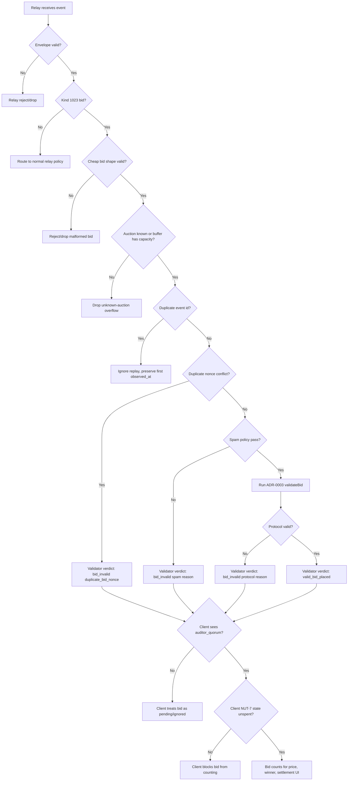

# ADR-017: Auction Relay Bid Validation and Spam Protection

## Status

Proposed

## Date

2026-09-07

## Context

Nostr auctions accept bid events from relays. A relay can verify that an
event is signed and can decide whether to store or forward it, but no
single relay can define global auction truth. A bidder can always publish
to a different relay, and validators or clients may observe different
relay subsets.

Each relay is a bulletin board. We can keep our own
board clean, but we cannot stop someone from posting junk on another
board. The auction therefore needs two layers:

- Relay-side protection answers: should this relay spend storage, CPU,
  bandwidth, and subscriber attention on this event?
- Auction validation answers: should this bid count toward price,
  winner selection, settlement, and UI state?

Previously, ADR-0003 focused on comprehensive validation of auction,
bid, release, and settlement events. That is necessary but not
sufficient for relay abuse.

If a malformed bid can consume validator memory, if a long replacement chain can force repeated
walks, if duplicate nonces can pollute the bid graph, or if many relays
can replay the same junk at different times, then production traffic will
eventually find that path.

This ADR adds a prophylactic relay-side and validator-admission layer for
auction bid spam. It does not replace ADR-0003's protocol validation;
it narrows what enters expensive state and makes spam fail closed before
it can influence auction outcomes.

## Decision

We adopt a layered Auction Relay Bid Validation and Spam Protection
Protocol for kind `1023` bid events.

This protocol defines:

- Relay Admission Gates: cheap checks a relay or relay-facing subscriber
  can run before storing, forwarding, buffering, or publishing verdicts.
- Validator Admission Gates: checks that prevent spam from growing
  validator state or producing repeated expensive verdict derivations.
- Deterministic Bid Validation: ADR-0003 validation remains the source of
  bid correctness once a bid passes admission.
- Quorum-Based Auction Truth: clients MUST continue to count only bids
  confirmed by the auction's listed validators through kind `30440`
  verdict quorum.
- Explicit Spam Reasons: spam rejection is represented with stable reason
  codes, not hidden behind generic invalidity.

The design principle is: any relay may carry a bid, but only
validator-quorum-backed bids affect auction price, winner selection,
settlement, and UI prominence.

## Consequences

- Infrastructure Protection: relays and validator subscribers shed junk
  before allocating unbounded memory or doing expensive bid-chain work.
- Deterministic Outcomes: spam filtering does not make one relay
  authoritative. Auction truth still comes from listed validator quorum.
- Clear Failure Modes: rate limits, duplicate nonces, oversized payloads,
  and policy rejects surface as explicit validator reasons.
- Better UX: bidders and sellers can distinguish pending validator
  coverage from spam rejection, malformed bids, and valid bids.
- Partial Visibility Remains: a relay cannot know whether another relay
  accepted a bid. Validators must deduplicate by event id and published
  bid identity across all subscribed relays.
- Operational Tuning: validators may tune limits through kind `30441`
  policy declarations without changing the core auction protocol.

## Appendix A: Top-Level Protection Gates

### 1. Relay Event Envelope Admission

Goal: Reject events that are not worth storing or forwarding before any
auction-specific work is performed.

Input: Raw Nostr event.
Output: Accept, reject, or drop-without-verdict.

Critical Checks:

- Event id matches the NIP-01 event hash.
- Schnorr signature verifies against the event pubkey.
- Event kind is an auction-relevant kind when handled by the auction
  relay path.
- Serialized event size is below the configured relay maximum.
- Tag count is below the configured relay maximum.
- Required indexable tags for bids are present (`e`, `a`, `p`).

### 2. Bid Shape Admission (Kind 1023)

Goal: Reject bid-shaped spam before it grows auction state.

Input: Raw kind `1023` event.
Output: ParsedBidEvent or admission failure.

Critical Checks:

- Required bid tags are present and parseable.
- `lock_secret` and `proof_y` arrays are non-empty, parallel, and below
  the configured maximum proof count.
- `bid_nonce` is present and below the configured length limit.
- Forbidden early-reveal or legacy tags are absent.
- Optional text fields are below configured length limits.

### 3. Relay Replay and Duplicate Control

Goal: Prevent multiple relays from making the same bid look like new work.

Input: Parsed bid, auction root, first-observed relay metadata.
Output: First observation, duplicate observation, or duplicate-identity
failure.

Critical Checks:

- Deduplicate by event id across every subscribed relay.
- Record the earliest local `observed_at` for a bid event and never
  replace it with a later relay replay.
- Reject duplicate `bid_nonce` values from the same bidder for the same
  auction unless they reference the exact same event id.
- Bound pending bids buffered before their auction root is known.

### 4. Validator Spam Policy Gate

Goal: Apply validator-specific abuse policy before deterministic auction
validation.

Input: ParsedBidEvent, AuctionContext, validator state, observed_at.
Output: Pass or `bid_invalid` with a policy/spam reason.

Critical Checks:

- Per-bidder rolling-window bid rate for the auction.
- Per-bidder invalid-bid strike count.
- Maximum active replacement-chain depth.
- Maximum active bid count per bidder per auction.
- Optional reputation, blacklist, account-age, NIP-05, KYC, or
  jurisdiction policy from the validator's kind `30441` declaration.

### 5. Client Quorum Gate

Goal: Stop spam from affecting user-facing auction state even when some
relays accepted it.

Input: Bids, validator verdicts, auction auditor list, NUT-7 proof state
when available to the client.
Output: Counted bid, pending bid, invalid bid, or ignored spam.

Critical Checks:

- Only listed auction auditors count.
- A bid counts only after `auditor_quorum` validators publish eligible
  confirm verdicts.
- Condemn verdicts require the same quorum policy before vetoing a bid.
- Verdict `observed_at` must be eligible under ADR-0003 timing rules.
- Raw kind `1023` volume never changes displayed price or winner state by
  itself.

## Appendix B: Section-Level Validators and Atomic Checklists

### Section 1: Relay Envelope Validators

#### 1.1 validateRelayEventEnvelope(rawEvent)

| ID   | Condition Type | Check Description                         | Expected Result | Failure Label          |
| ---- | -------------- | ----------------------------------------- | --------------- | ---------------------- |
| R1.1 | Positive       | Event id equals NIP-01 hash.              | true            | event_id_mismatch      |
| R1.2 | Positive       | Event signature verifies against pubkey.  | true            | signature_invalid      |
| R1.3 | Positive       | Event kind is supported by relay policy.  | true            | unsupported_kind       |
| R1.4 | Positive       | Serialized event size <= max_event_bytes. | true            | event_too_large        |
| R1.5 | Positive       | Tag count <= max_tag_count.               | true            | too_many_tags          |
| R1.6 | Negative       | Event contains non-array tag entries.     | false (Reject)  | malformed_tags         |
| R1.7 | Negative       | Event timestamp is outside relay horizon. | false (Reject)  | timestamp_out_of_range |

### Section 2: Bid Shape Admission Validators

#### 2.1 validateRelayBidShape(rawBidEvent)

| ID    | Condition Type | Check Description                               | Expected Result | Failure Label          |
| ----- | -------------- | ----------------------------------------------- | --------------- | ---------------------- |
| S2.1  | Positive       | Kind equals 1023.                               | true            | wrong_kind             |
| S2.2  | Positive       | `e`, `a`, and `p` tags exist.                   | true            | missing_bid_reference  |
| S2.3  | Positive       | `amount` parses as a positive integer.          | true            | invalid_amount         |
| S2.4  | Positive       | `currency` equals SAT.                          | true            | unsupported_currency   |
| S2.5  | Positive       | `bid_nonce` exists and length <= max_nonce_len. | true            | invalid_bid_nonce      |
| S2.6  | Positive       | `lock_secret` count is within configured max.   | true            | too_many_lock_secrets  |
| S2.7  | Positive       | `proof_y` count equals `lock_secret` count.     | true            | proof_y_count_mismatch |
| S2.8  | Positive       | Optional note/content size <= configured max.   | true            | bid_payload_too_large  |
| S2.9  | Negative       | `derivation_path` tag is present.               | false (Reject)  | early_path_exposure    |
| S2.10 | Negative       | Legacy oracle tags are present.                 | false (Reject)  | legacy_tag_present     |

### Section 3: Replay and Duplicate Validators

#### 3.1 validateBidReplayAndNonce(parsedBid, state)

| ID   | Condition Type | Check Description                                      | Expected Result | Failure Label        |
| ---- | -------------- | ------------------------------------------------------ | --------------- | -------------------- |
| D3.1 | Positive       | Event id has not already been processed.               | true            | duplicate_event      |
| D3.2 | Positive       | First `observed_at` is preserved across relay replays. | true            | observed_at_replaced |
| D3.3 | Positive       | `bid_nonce` is unique for bidder + auction.            | true            | duplicate_bid_nonce  |
| D3.4 | Positive       | Pending bid buffer for auction is below max size.      | true            | pending_buffer_full  |
| D3.5 | Negative       | Same nonce appears with a different bid event id.      | false (Reject)  | duplicate_bid_nonce  |
| D3.6 | Negative       | Same event is replayed after auction close.            | false (Ignore)  | duplicate_event      |

### Section 4: Validator Spam Policy Validators

#### 4.1 validateBidSpamPolicy(parsedBid, auctionContext, state)

| ID   | Condition Type | Check Description                                       | Expected Result | Failure Label             |
| ---- | -------------- | ------------------------------------------------------- | --------------- | ------------------------- |
| P4.1 | Positive       | Bidder rolling-window count <= max_bids_per_window.     | true            | rate_limited              |
| P4.2 | Positive       | Bidder active bid count <= max_active_bids_per_auction. | true            | too_many_active_bids      |
| P4.3 | Positive       | Replacement-chain depth <= configured maximum.          | true            | replacement_chain_invalid |
| P4.4 | Positive       | Invalid-bid strikes <= configured threshold.            | true            | too_many_invalid_attempts |
| P4.5 | Positive       | Bidder is not on validator blacklist.                   | true            | on_blacklist              |
| P4.6 | Positive       | Bidder satisfies validator reputation/account policy.   | true            | validator_policy_rejected |
| P4.7 | Negative       | Bidder floods many below-floor bids.                    | false (Reject)  | too_many_invalid_attempts |
| P4.8 | Negative       | Bidder creates chain cycle through `prev_bid`.          | false (Reject)  | replacement_chain_invalid |

### Section 5: Client Quorum Validators

#### 5.1 validateClientBidCounting(bid, verdicts, auctionContext)

| ID   | Condition Type | Check Description                                | Expected Result | Failure Label            |
| ---- | -------------- | ------------------------------------------------ | --------------- | ------------------------ |
| Q5.1 | Positive       | Verdict signer is listed in auction `auditors`.  | true            | unlisted_validator       |
| Q5.2 | Positive       | Confirm verdict count >= `auditor_quorum`.       | true            | insufficient_quorum      |
| Q5.3 | Positive       | Verdict `observed_at` is in auction window.      | true            | ineligible_verdict_time  |
| Q5.4 | Positive       | Verdict timestamp skew is within `max_skew_sec`. | true            | ineligible_verdict_skew  |
| Q5.5 | Negative       | Raw kind 1023 exists without quorum.             | false (Pending) | pending_validator_quorum |
| Q5.6 | Negative       | One validator condemns without quorum.           | false (Pending) | insufficient_quorum      |

## Appendix C: Spam Reason Taxonomy

Validator verdicts SHOULD use existing ADR-0003 reasons where they fit.
New spam-specific reasons SHOULD be added as first-class
`ValidatorReason` values when implementation begins:

- `event_too_large`: raw event exceeds configured byte size.
- `too_many_tags`: event exceeds configured tag count.
- `bid_payload_too_large`: bid content, note, or proof metadata exceeds
  configured bid payload limits.
- `too_many_lock_secrets`: bid carries more proof metadata than the
  validator is willing to process.
- `invalid_bid_nonce`: nonce is absent, malformed, or too large.
- `duplicate_bid_nonce`: bidder reused a nonce for a different bid in the
  same auction.
- `rate_limited`: bidder exceeded per-auction rolling-window rate.
- `too_many_active_bids`: bidder exceeded the validator's active bid cap
  for the auction.
- `too_many_invalid_attempts`: bidder exceeded the invalid-bid strike
  threshold.
- `validator_policy_rejected`: bidder failed a validator-specific policy
  that does not map to a more specific existing reason.

Relays that do not publish validator verdicts MAY reject these events
silently or emit relay-level `OK`/`NOTICE` messages. Validators SHOULD
publish kind `30440` verdicts for spam decisions only when the bid can be
addressed to a known tracked auction; otherwise they SHOULD drop without
verdict to avoid creating reputation records for unactionable noise.

## Appendix D: Implementation Plan

### 1. Shared Constants and Schemas

Files:

- `src/lib/auction/constants.ts`
- `src/lib/auction/events.ts`
- `src/lib/schemas/auction/bidEvent.ts`
- `src/lib/schemas/auction/validatorEvents.ts`

Changes:

- Add spam-specific `ValidatorReason` codes.
- Add validator policy fields for rate windows, proof-count limits,
  active-bid caps, and invalid-attempt thresholds.
- Add parser-level bounds for nonce, proof metadata count, and optional
  bid text size.

### 2. Validator Admission State

Files:

- `src/server/auction-validator/state.ts`
- New file: `src/server/auction-validator/spamPolicy.ts`

Changes:

- Track seen bid event ids per auction.
- Track bidder + auction nonce ownership.
- Track rolling-window bid timestamps.
- Track invalid-attempt strikes.
- Keep all maps bounded and prune by auction close plus settlement grace.

### 3. Subscriber Admission Gate

Files:

- `src/server/auction-validator/subscriber.ts`

Changes:

- Run cheap envelope and shape checks before buffering unknown-auction
  bids.
- Preserve earliest `observed_at` across relay replays.
- Reject duplicate nonce conflicts before `upsertBid`.
- Drop unknown-auction spam when pending buffers exceed configured caps.

### 4. Validation Pipeline Policy Hook

Files:

- `src/lib/auction/validation.ts`
- `src/server/auction-validator/lifecycle.ts`

Changes:

- Keep deterministic protocol validation in `validateBid`.
- Wire validator spam policy through the existing `PolicyHook` so policy
  failures short-circuit as normal `bid_invalid` verdicts.
- Keep policy decisions distinguishable by `reason` and optional detail.

### 5. Policy Declaration

Files:

- `src/server/auction-validator/policy.ts`
- `src/lib/auction/tagBuilders.ts`

Changes:

- Publish configured spam limits in kind `30441` validator policy events.
- Ensure bidders and sellers can inspect a validator's policy before
  choosing auditors or submitting bids.

### 6. UI Component

Files:

- `src/components/AuctionVerdictPanel.tsx`
- New component candidate: `src/components/AuctionBidSafetyPanel.tsx`
- Public auction route: `src/routes/auctions.$auctionId.tsx`
- Seller dashboard auction route:
  `src/routes/_dashboard-layout/dashboard/products/auctions.$auctionId.tsx`

Component description:

`AuctionBidSafetyPanel` summarizes validator coverage and spam pressure
for an auction. It should show quorum-backed bids, pending bids,
spam-rejected bids, top-bid safety, validator policy limits, and the most
common rejection reasons. It should read kind `30440` verdicts and kind
`30441` validator policies; it MUST NOT infer auction truth from raw bid
volume alone.

Suggested states:

- Healthy: current top bid has validator quorum and client-side NUT-7 is
  unspent.
- Pending: bids exist but validator quorum is not yet met.
- Spam pressure: validator verdicts show rate limits, duplicate nonces,
  oversized payloads, or repeated invalid attempts.
- Validator outage: listed auditors have not produced recent eligible
  verdicts.

## Appendix E: Flow

## Appendix F: Testing Standard

Unit and integration tests MUST cover:

- Envelope rejection for invalid id, invalid signature, oversized events,
  and excessive tags.
- Bid parser bounds for nonce length, proof count, and payload size.
- Duplicate event replay across multiple relays preserving first
  `observed_at`.
- Duplicate `bid_nonce` conflict from the same bidder in the same auction.
- Per-bidder rolling-window rate limiting.
- Invalid-attempt strike limits.
- Replacement-chain depth and cycle rejection.
- PolicyHook short-circuiting before expensive validation.
- Client quorum behavior when raw bid spam exists without validator
  confirms.
- UI summary states for healthy, pending, spam-pressure, and validator
  outage cases.

Commands:

- `bun run test:unit` for pure validation, spam policy, parser, and client
  quorum tests.
- `bun run test:integration` for validator subscriber and publisher
  behavior when relevant.
- `git diff --check` and `bun run format:check` for documentation and
  formatting verification.
