# Lightning Payment Flow Diagram

## Zap Payment Flow (V4V)


## Regular Invoice Flow (Merchant Payment)


## Checkout Multi-Invoice Flow


## Bulk Payment with NWC

```mermaid
sequenceDiagram
    participant User
    participant PC as PaymentContent
    participant LPP1 as Processor 1
    participant LPP2 as Processor 2
    participant LPP3 as Processor 3
    participant NWC as NWC Wallet

    User->>PC: Click "Pay All with NWC"
    PC->>PC: Get all pending invoices

    loop For each invoice
        PC->>LPP1: triggerNwcPayment()
        LPP1->>NWC: Pay invoice 1
        NWC->>LPP1: Success
        LPP1->>PC: onPaymentComplete()
        PC->>User: Show progress (1/3)

        PC->>PC: Wait 1 second

        PC->>LPP2: triggerNwcPayment()
        LPP2->>NWC: Pay invoice 2
        NWC->>LPP2: Success
        LPP2->>PC: onPaymentComplete()
        PC->>User: Show progress (2/3)

        PC->>PC: Wait 1 second

        PC->>LPP3: triggerNwcPayment()
        LPP3->>NWC: Pay invoice 3
        NWC->>LPP3: Success
        LPP3->>PC: onPaymentComplete()
        PC->>User: Show progress (3/3)
    end

    PC->>User: All payments complete! 🎉
```



## State Transitions


## Component Lifecycle


## Error Handling Flow


## Key Decision Points

### Should Generate Invoice?

```typescript
if (data.isZap && !invoice && !isGeneratingInvoice && !hasRequestedInvoice && active) {
	generateZapInvoice()
}
```

### Should Start Monitoring?

```typescript
if (invoice && data.isZap && !paymentMonitoring && active) {
	startZapMonitoring()
}
```

### Should Cleanup?

```typescript
if (!active && paymentMonitoring) {
	paymentMonitoring() // Stop monitoring
	setPaymentMonitoring(null)
}
```

### Should Regenerate?

```typescript
if (data.isZap && invoice && (amountChanged || descriptionChanged)) {
	// Clear and regenerate
	setInvoice(null)
	hasRequestedInvoiceRef.current = false
}
```

## Best Practices

### 1. Always Cleanup

```typescript
useEffect(() => {
	// ... start monitoring

	return () => {
		if (paymentMonitoring) {
			paymentMonitoring() // Always cleanup
		}
	}
}, [dependencies])
```

### 2. Prevent Duplicates

```typescript
const hasCompletedRef = useRef(false)

const handlePaymentSuccess = (preimage: string) => {
	if (hasCompletedRef.current) return // Prevent duplicates
	hasCompletedRef.current = true
	// ... handle success
}
```

### 3. Active Control

```typescript
// Only active processor should generate invoices and monitor
active={index === currentIndex}
```

### 4. Proper Error Context

```typescript
onPaymentFailed?.({
	success: false,
	error: error.message,
	paymentHash: data.invoiceId, // Include context
})
```

## Testing Scenarios

| Scenario                 | Expected Behavior                                             |
| ------------------------ | ------------------------------------------------------------- |
| Zap with NWC             | Invoice generated → Payment sent → Receipt detected → Success |
| Zap with WebLN           | Invoice generated → Payment sent → Receipt detected → Success |
| Zap with QR              | Invoice generated → User scans → Receipt detected → Success   |
| Regular with NWC         | Show QR → Payment sent → Immediate success                    |
| Regular with WebLN       | Show QR → Payment sent → Immediate success                    |
| Change amount mid-flow   | Old invoice cleared → New invoice generated                   |
| Cancel during generation | Generation aborted → Cleanup                                  |
| Network timeout          | Informative timeout message → Option to retry                 |
| Multiple invoices        | Sequential processing → Progress updates                      |
| Bulk NWC payment         | All invoices paid → Success feedback                          |
