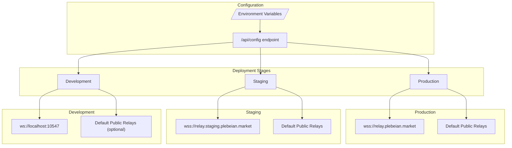
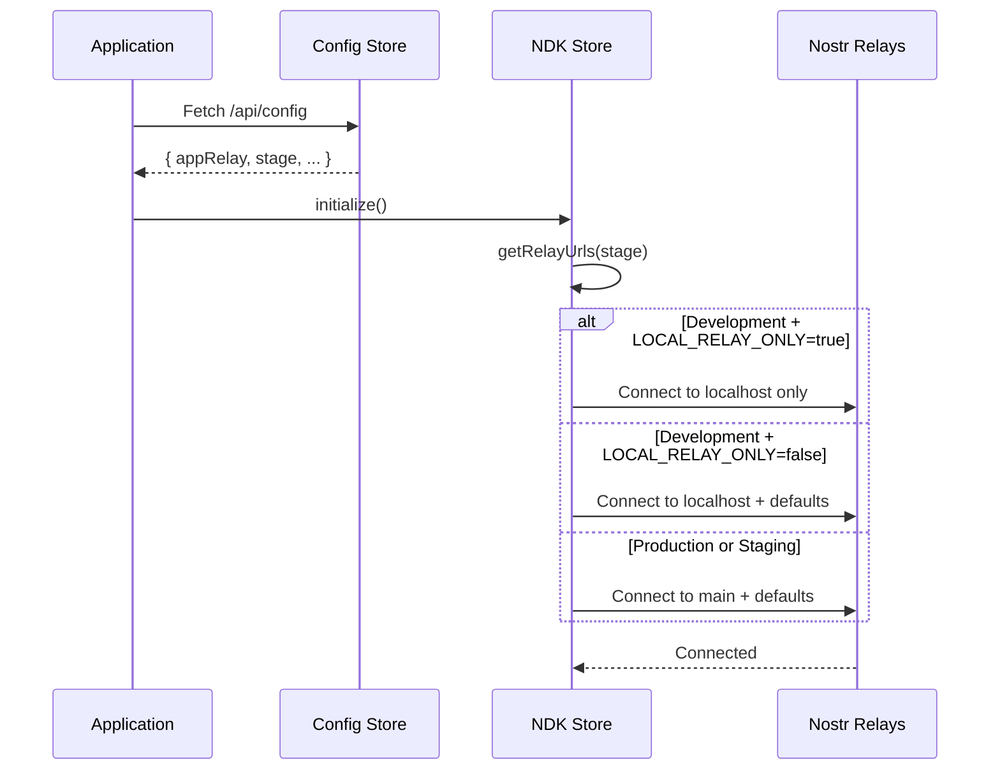
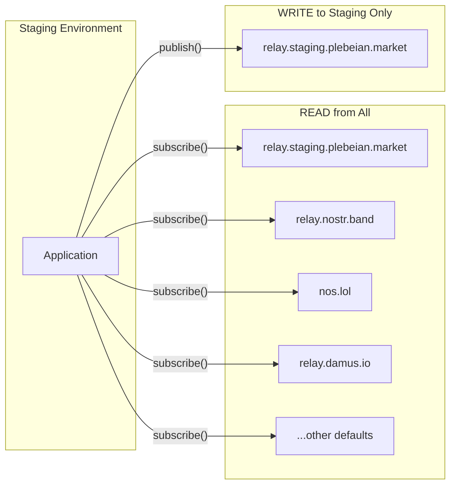
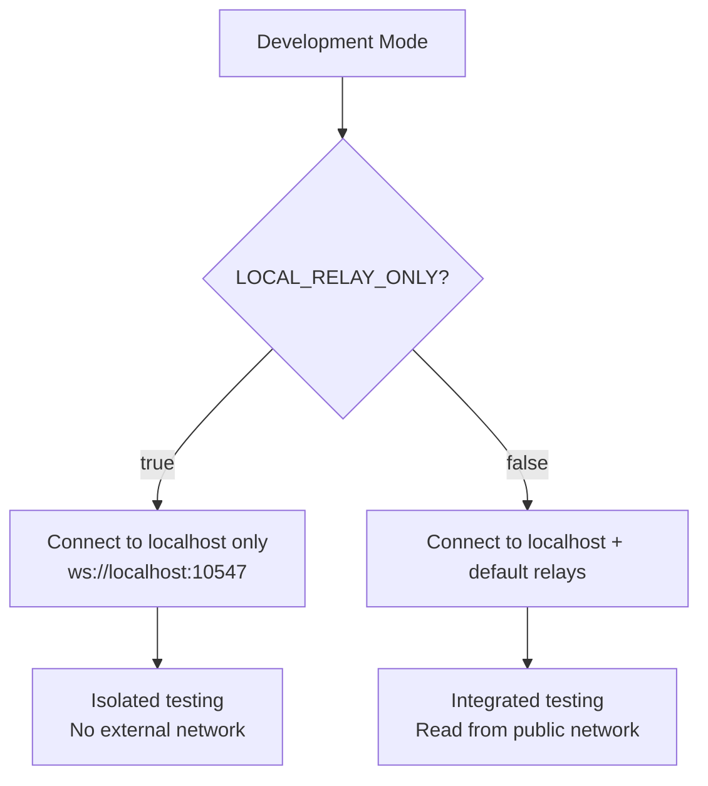

# Relay Configuration

This document describes how the Plebeian Market application connects to Nostr relays based on the deployment environment.

## Overview

The application supports three deployment stages, each with different relay behavior:

| Stage | Main Relay | Default Relays | Behavior |
|-------|-----------|----------------|----------|
| **Production** | `wss://relay.plebeian.market` | ✅ | Read & write to all |
| **Staging** | `wss://relay.staging.plebeian.market` | ✅ | Read all, **write only to staging** |
| **Development** | `ws://localhost:10547` | Configurable | See below |

## Architecture



## Relay Connection Flow



## Staging Write Restriction

Staging has special behavior: it reads from all connected relays but **only writes to the staging relay**. This prevents staging data from polluting production relays.



## Development Mode

Development mode supports two configurations via the `LOCAL_RELAY_ONLY` environment variable:



### When to use each mode

| Mode | Use Case |
|------|----------|
| `LOCAL_RELAY_ONLY=true` | Isolated testing, no internet, fast iteration |
| `LOCAL_RELAY_ONLY=false` | Testing with real data, integration testing |

## Configuration Files

### Environment Variables

```bash
# .env.dev (local development)
NODE_ENV=development
APP_RELAY_URL=ws://localhost:10547
LOCAL_RELAY_ONLY=true  # Set to 'false' to include default relays

# Production
NODE_ENV=production
APP_RELAY_URL=wss://relay.plebeian.market

# Staging
NODE_ENV=production
APP_RELAY_URL=wss://relay.staging.plebeian.market
```

## Default Public Relays

These relays are used in addition to the main relay (unless `LOCAL_RELAY_ONLY=true` in development):

- `wss://relay.nostr.band`
- `wss://nos.lol`
- `wss://relay.nostr.net`
- `wss://relay.damus.io`
- `wss://relay.minibits.cash`

## Code References

- **Stage Type & Constants**: [constants.ts](file:///Users/schlaus/workspace/market/src/lib/constants.ts)
- **NDK Store & Relay Logic**: [ndk.ts](file:///Users/schlaus/workspace/market/src/lib/stores/ndk.ts)
- **Config Store**: [config.ts](file:///Users/schlaus/workspace/market/src/lib/stores/config.ts)
- **Server Config API**: [index.tsx](file:///Users/schlaus/workspace/market/src/index.tsx)
