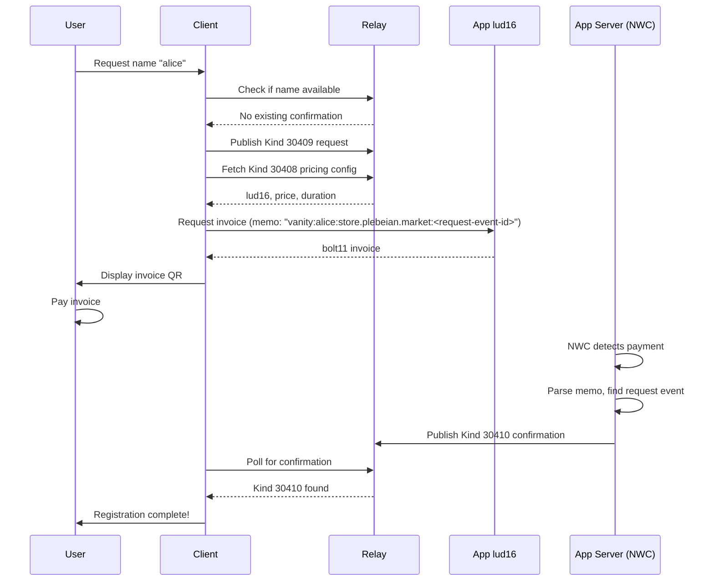

# Vanity URLs

Paid vanity URLs allow users to have a custom short URL like `store.plebeian.market/alice` that redirects to their profile page.

## Overview

The system uses Nostr events to create verifiable name registrations with third-party payment verification:

1. User publishes a registration request
2. Client fetches invoice from app's lud16 and user pays
3. App server detects payment via NWC wallet monitoring
4. App server publishes confirmation event binding name to user

The confirmation event is signed by the app operator, providing third-party verification that payment was actually received. This prevents fake registrations with fabricated payment proofs.

## Server Requirements

The app server must:

1. **Monitor an NWC wallet** for incoming payments with specific memo format
2. **Hold a signing key** to publish confirmation events
3. **Match payments to pending requests** and publish confirmations

This is necessary because self-attested payment proofs (preimage + hash) can be faked - only the payment recipient can verify funds were actually received.

## Pricing

- **Registration**: ~2000 sats per year
- **Renewal**: Same price, new request + confirmation before expiration

## Event Structure

### Kind 30408: Vanity Config (App Operator)

Published by the app operator. Configures pricing and payment details.

```json
{
	"kind": 30408,
	"pubkey": "<app-operator-pubkey>",
	"created_at": 1234567890,
	"tags": [
		["d", "store.plebeian.market"],
		["lud16", "vanity@plebeian.market"],
		["price", "2000"],
		["duration", "31536000"]
	],
	"content": ""
}
```

| Tag        | Description                                       |
| ---------- | ------------------------------------------------- |
| `d`        | The domain this config applies to                 |
| `lud16`    | Lightning address to pay for registrations        |
| `price`    | Price in sats per registration period             |
| `duration` | Registration duration in seconds (1 year default) |

### Kind 30409: Vanity Request (User)

Published by the user to request a name. This is **not** the binding - just a request.

```json
{
	"kind": 30409,
	"pubkey": "<user-pubkey>",
	"created_at": 1234567890,
	"tags": [
		["d", "alice:store.plebeian.market"],
		["name", "alice"],
		["domain", "store.plebeian.market"]
	],
	"content": ""
}
```

| Tag      | Description                            |
| -------- | -------------------------------------- |
| `d`      | Unique identifier: `<name>:<domain>`   |
| `name`   | The requested vanity name              |
| `domain` | The app domain this request applies to |

### Kind 30410: Vanity Confirmation (App Server)

Published by the app server after verifying payment. This is the **authoritative binding**.

```json
{
	"kind": 30410,
	"pubkey": "<app-server-pubkey>",
	"created_at": 1234567890,
	"tags": [
		["d", "alice:store.plebeian.market"],
		["p", "<user-pubkey>"],
		["e", "<request-event-id>", "<relay-url>"],
		["name", "alice"],
		["domain", "store.plebeian.market"],
		["valid_until", "1767225600"],
		["payment_hash", "<invoice-payment-hash>"]
	],
	"content": ""
}
```

| Tag            | Description                                  |
| -------------- | -------------------------------------------- |
| `d`            | Unique identifier: `<name>:<domain>`         |
| `p`            | The user's pubkey who owns this registration |
| `e`            | Reference to the Kind 30409 request event    |
| `name`         | The vanity name                              |
| `domain`       | The app domain                               |
| `valid_until`  | Registration expiry (1 year from payment)    |
| `payment_hash` | The payment hash for audit/reference         |

## Registration Flow



## Client-Side Resolution

Only Kind 30410 confirmations (signed by app server) are authoritative:

```typescript
const APP_DOMAIN = 'store.plebeian.market'
const APP_SERVER_PUBKEY = import.meta.env.VITE_APP_SERVER_PUBKEY

interface VanityRegistration {
	name: string
	domain: string
	pubkey: string
	validUntil: number
}

async function resolveVanityUrl(name: string): Promise<VanityRegistration | null> {
	const dTag = `${name.toLowerCase()}:${APP_DOMAIN}`

	// Only trust confirmations from the app server
	const confirmations = await ndk.fetchEvents({
		kinds: [30410],
		authors: [APP_SERVER_PUBKEY],
		'#d': [dTag],
	})

	// Find valid, non-expired confirmation with latest expiry
	const now = Math.floor(Date.now() / 1000)
	let best: VanityRegistration | null = null
	let latestExpiry = 0

	for (const conf of confirmations) {
		const validUntil = parseInt(conf.tags.find((t) => t[0] === 'valid_until')?.[1] || '0')
		const userPubkey = conf.tags.find((t) => t[0] === 'p')?.[1]

		if (validUntil > now && validUntil > latestExpiry && userPubkey) {
			best = {
				name,
				domain: APP_DOMAIN,
				pubkey: userPubkey,
				validUntil,
			}
			latestExpiry = validUntil
		}
	}

	return best
}
```

## Client Registration Flow

```typescript
async function registerVanityName(name: string): Promise<void> {
	const domain = 'store.plebeian.market'
	const dTag = `${name}:${domain}`

	// 1. Check availability
	const existing = await ndk.fetchEvent({
		kinds: [30410],
		authors: [APP_SERVER_PUBKEY],
		'#d': [dTag],
	})
	if (existing) {
		const validUntil = parseInt(existing.tags.find((t) => t[0] === 'valid_until')?.[1] || '0')
		if (validUntil > Date.now() / 1000) {
			throw new Error('Name already registered')
		}
	}

	// 2. Publish request event
	const request = new NDKEvent(ndk)
	request.kind = 30409
	request.tags = [
		['d', dTag],
		['name', name],
		['domain', domain],
	]
	await request.publish()

	// 3. Fetch pricing config
	const config = await ndk.fetchEvent({
		kinds: [30408],
		'#d': [domain],
	})
	if (!config) throw new Error('No pricing config for this domain')

	const lud16 = config.tags.find((t) => t[0] === 'lud16')?.[1]
	const price = parseInt(config.tags.find((t) => t[0] === 'price')?.[1] || '2000')

	// 4. Request invoice with memo containing request event ID
	const memo = `vanity:${name}:${domain}:${request.id}`
	const invoice = await requestInvoice(lud16, price, memo)

	// 5. User pays invoice
	await payInvoice(invoice.bolt11)

	// 6. Poll for confirmation from app server
	await waitForConfirmation(dTag)
}

async function waitForConfirmation(dTag: string, timeout = 60000): Promise<NDKEvent> {
	const start = Date.now()
	while (Date.now() - start < timeout) {
		const confirmation = await ndk.fetchEvent({
			kinds: [30410],
			authors: [APP_SERVER_PUBKEY],
			'#d': [dTag],
		})
		if (confirmation) return confirmation
		await new Promise((r) => setTimeout(r, 2000))
	}
	throw new Error('Timeout waiting for confirmation')
}
```

## App Server Implementation

The app server must monitor its NWC wallet and publish confirmations:

```typescript
import { nwc } from '@getalby/sdk'

const nwcClient = new nwc.NWCClient({ nostrWalletConnectUrl: NWC_URL })
const serverSigner = new NDKPrivateKeySigner(SERVER_PRIVATE_KEY)

async function monitorPayments(): Promise<void> {
	// Subscribe to payment notifications via NWC
	// Implementation depends on NWC provider capabilities

	// For each incoming payment:
	async function handlePayment(payment: Payment): Promise<void> {
		// 1. Parse memo: "vanity:<name>:<domain>:<request-event-id>"
		const memo = payment.description || ''
		const match = memo.match(/^vanity:([^:]+):([^:]+):([a-f0-9]{64})$/)
		if (!match) return // Not a vanity payment

		const [, name, domain, requestEventId] = match

		// 2. Verify request event exists
		const request = await ndk.fetchEvent({ ids: [requestEventId] })
		if (!request || request.kind !== 30409) return

		// 3. Verify request matches payment memo
		const reqName = request.tags.find((t) => t[0] === 'name')?.[1]
		const reqDomain = request.tags.find((t) => t[0] === 'domain')?.[1]
		if (reqName !== name || reqDomain !== domain) return

		// 4. Verify payment amount matches config
		const config = await ndk.fetchEvent({
			kinds: [30408],
			authors: [serverSigner.pubkey],
			'#d': [domain],
		})
		const expectedPrice = parseInt(config?.tags.find((t) => t[0] === 'price')?.[1] || '2000')
		if (payment.amount < expectedPrice) return // Underpaid

		// 5. Publish confirmation
		const duration = parseInt(config?.tags.find((t) => t[0] === 'duration')?.[1] || '31536000')
		const confirmation = new NDKEvent(ndk)
		confirmation.kind = 30410
		confirmation.tags = [
			['d', `${name}:${domain}`],
			['p', request.pubkey],
			['e', requestEventId],
			['name', name],
			['domain', domain],
			['valid_until', String(Math.floor(Date.now() / 1000) + duration)],
			['payment_hash', payment.payment_hash],
		]
		await confirmation.sign(serverSigner)
		await confirmation.publish()

		console.log(`Confirmed vanity registration: ${name} -> ${request.pubkey}`)
	}
}
```

## Revocation

App operators can revoke by publishing a new confirmation with a `revoked` tag:

```typescript
async function revokeRegistration(name: string, domain: string): Promise<void> {
	const dTag = `${name}:${domain}`

	const revocation = new NDKEvent(ndk)
	revocation.kind = 30410
	revocation.tags = [
		['d', dTag],
		['name', name],
		['domain', domain],
		['revoked', String(Math.floor(Date.now() / 1000))],
	]
	await revocation.sign(serverSigner)
	await revocation.publish()
}
```

Client resolution checks for revocation:

```typescript
// In resolveVanityUrl, check for revoked tag:
if (conf.tags.some((t) => t[0] === 'revoked')) {
	continue // Skip revoked registrations
}
```

## Reserved Names

Apps should reject requests for reserved names:

```typescript
const RESERVED_NAMES = ['admin', 'api', 'help', 'support', 'status', 'docs', 'blog', 'settings', 'dashboard', 'login', 'logout', 'signup']

function isReserved(name: string): boolean {
	return RESERVED_NAMES.includes(name.toLowerCase())
}
```

## Renewal Flow

1. User publishes new Kind 30409 request (same name)
2. User pays new invoice
3. App server publishes new Kind 30410 with updated `valid_until`

The latest non-revoked confirmation with `valid_until > now` is authoritative.

## Security Considerations

- **Third-party verification**: Only app server can publish confirmations, preventing fake registrations
- **NWC monitoring**: App server must reliably monitor wallet for payments
- **Memo parsing**: Strict memo format prevents payment reuse attacks
- **Request event reference**: Confirmation links to specific request, proving user intent
- **Signing key security**: App server's signing key must be protected

## Example Queries

**Check if name is available:**

```
["REQ", "check", {"kinds": [30410], "authors": ["<app-server-pubkey>"], "#d": ["alice:store.plebeian.market"]}]
```

**Get pricing config:**

```
["REQ", "config", {"kinds": [30408], "#d": ["store.plebeian.market"]}]
```

**Get all registrations for a domain:**

```
["REQ", "all", {"kinds": [30410], "authors": ["<app-server-pubkey>"], "#domain": ["store.plebeian.market"]}]
```

**Get registrations owned by a user:**

```
["REQ", "user", {"kinds": [30410], "#p": ["<user-pubkey>"]}]
```
