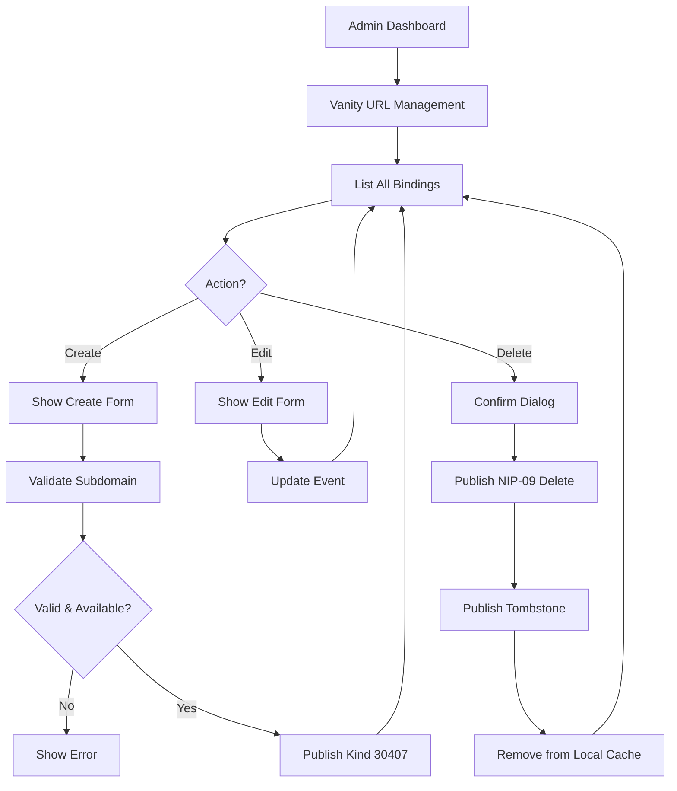

# Vanity URLs

Paid vanity URLs allow users to have a custom subdomain like `alice.plebeian.market` that redirects to their profile page.

## Overview

The system uses Nostr events to store subdomain-to-pubkey mappings. When a user visits `alice.plebeian.market`, the client:

1. Detects it's running on a subdomain
2. Queries for a vanity binding event matching that subdomain
3. Renders the corresponding user's profile page

This approach keeps all data on Nostr relays with no special server-side routing beyond wildcard DNS configuration.

## DNS Configuration

Configure a wildcard DNS record:

```
*.plebeian.market -> [server IP]
```

The same application serves all subdomains. Resolution happens client-side via Nostr events.

## Event Structure

### Kind 30407: Vanity URL Binding

An addressable/replaceable event published by the registry admin.

```json
{
	"kind": 30407,
	"pubkey": "<registry-admin-pubkey>",
	"created_at": 1234567890,
	"tags": [
		["d", "alice"],
		["p", "<target-user-pubkey>"],
		["expires", "1735689600"]
	],
	"content": "",
	"id": "...",
	"sig": "..."
}
```

| Tag       | Description                                            |
| --------- | ------------------------------------------------------ |
| `d`       | The subdomain name (lowercase, alphanumeric + hyphens) |
| `p`       | The pubkey of the user who owns this vanity URL        |
| `expires` | Optional Unix timestamp for subscription expiration    |

### Why Admin-Published?

- Single source of truth (admin's pubkey)
- No complex on-chain payment verification
- Easy dispute resolution
- Simple revocation (delete the event)
- Payment happens off-chain; admin publishes after confirmation

## Client-Side Resolution

```typescript
const REGISTRY_PUBKEY = import.meta.env.VITE_VANITY_REGISTRY_PUBKEY

function getSubdomain(): string | null {
	const hostname = window.location.hostname
	const parts = hostname.split('.')

	// Handle: alice.plebeian.market or alice.staging.plebeian.market
	if (parts.length >= 3) {
		const subdomain = parts[0]
		// Ignore www and other reserved subdomains
		if (!['www', 'staging', 'api'].includes(subdomain)) {
			return subdomain
		}
	}
	return null
}

async function resolveVanityUrl(subdomain: string): Promise<string | null> {
	const event = await ndk.fetchEvent({
		kinds: [30407],
		authors: [REGISTRY_PUBKEY],
		'#d': [subdomain.toLowerCase()],
	})

	if (!event) return null

	// Check expiration
	const expires = event.tags.find((t) => t[0] === 'expires')?.[1]
	if (expires && parseInt(expires) < Date.now() / 1000) {
		return null // Expired
	}

	return event.tags.find((t) => t[0] === 'p')?.[1] || null
}
```

### Integration Point

In the app's root layout or router initialization:

```typescript
const subdomain = getSubdomain()
if (subdomain) {
	const targetPubkey = await resolveVanityUrl(subdomain)
	if (targetPubkey) {
		// Render profile page for targetPubkey
		// Equivalent to navigating to /user/<npub>
	} else {
		// Show "vanity URL not found" or redirect to main site
	}
}
```

## Admin UI Requirements

The admin dashboard needs a vanity URL management interface.

### List View

Display all active vanity bindings:

| Subdomain | User                         | Expires    | Actions       |
| --------- | ---------------------------- | ---------- | ------------- |
| alice     | npub1abc... (Alice's Shop)   | 2025-12-31 | Edit / Delete |
| bob       | npub1xyz... (Bob's Emporium) | Never      | Edit / Delete |

Query: `kind:30407 author:<admin-pubkey>`

### Create/Edit Form

Fields:

- **Subdomain**: Text input with validation (lowercase, alphanumeric, hyphens, 3-32 chars)
- **User**: Pubkey input (npub or hex) with profile preview
- **Expires**: Optional date picker (or "Never")

Validation rules:

- Subdomain must be unique (check for existing `d` tag)
- Subdomain must not be reserved (`www`, `api`, `staging`, `admin`, etc.)
- Pubkey must be valid

### Delete Functionality

**Critical**: Deletion must work reliably even if the relay doesn't properly support NIP-09 delete events.

#### Deletion Strategy

1. **Primary: Publish NIP-09 Delete Event**

```typescript
async function deleteVanityBinding(subdomain: string) {
	// Find the existing event
	const existing = await ndk.fetchEvent({
		kinds: [30407],
		authors: [adminPubkey],
		'#d': [subdomain],
	})

	if (!existing) return

	// Publish delete request (NIP-09)
	const deleteEvent = new NDKEvent(ndk)
	deleteEvent.kind = 5
	deleteEvent.tags = [
		['e', existing.id],
		['a', `30407:${adminPubkey}:${subdomain}`],
	]
	await deleteEvent.publish()
}
```

2. **Fallback: Publish Tombstone Event**

Since some relays ignore NIP-09, also publish a "tombstone" - a replacement event that marks the binding as deleted:

```typescript
async function deleteVanityBindingWithTombstone(subdomain: string) {
	// First, try NIP-09 delete
	await deleteVanityBinding(subdomain)

	// Then publish tombstone (replaceable event with same d-tag)
	const tombstone = new NDKEvent(ndk)
	tombstone.kind = 30407
	tombstone.tags = [
		['d', subdomain],
		['deleted', Math.floor(Date.now() / 1000).toString()],
	]
	tombstone.content = ''
	// No 'p' tag = no valid binding
	await tombstone.publish()
}
```

3. **Client-Side Handling**

The resolution logic must recognize tombstones:

```typescript
async function resolveVanityUrl(subdomain: string): Promise<string | null> {
	const event = await ndk.fetchEvent({
		kinds: [30407],
		authors: [REGISTRY_PUBKEY],
		'#d': [subdomain.toLowerCase()],
	})

	if (!event) return null

	// Check if this is a tombstone (deleted)
	if (event.tags.some((t) => t[0] === 'deleted')) {
		return null
	}

	// Check expiration
	const expires = event.tags.find((t) => t[0] === 'expires')?.[1]
	if (expires && parseInt(expires) < Date.now() / 1000) {
		return null
	}

	return event.tags.find((t) => t[0] === 'p')?.[1] || null
}
```

### Admin UI Flow


```mermaid
graph TD
    A[Admin Dashboard] --> B[Vanity URL Management]
    B --> C[List All Bindings]
    C --> D{Action?}

    D -->|Create| E[Show Create Form]
    E --> F[Validate Subdomain]
    F --> G{Valid & Available?}
    G -->|No| H[Show Error]
    G -->|Yes| I[Publish Kind 30407]
    I --> C

    D -->|Edit| J[Show Edit Form]
    J --> K[Update Event]
    K --> C

    D -->|Delete| L[Confirm Dialog]
    L --> M[Publish NIP-09 Delete]
    M --> N[Publish Tombstone]
    N --> O[Remove from Local Cache]
    O --> C
```

### Reserved Subdomains

Maintain a blocklist of reserved subdomains:

```typescript
const RESERVED_SUBDOMAINS = [
	'www',
	'api',
	'admin',
	'staging',
	'dev',
	'test',
	'mail',
	'smtp',
	'ftp',
	'ssh',
	'git',
	'app',
	'dashboard',
	'help',
	'support',
	'status',
	'docs',
	'blog',
]
```

## Local Cache Considerations

For better UX, the client can cache vanity bindings in IndexedDB:

```typescript
interface CachedVanityBinding {
	subdomain: string
	pubkey: string | null // null = tombstone/deleted
	expires: number | null
	eventId: string
	cachedAt: number
}
```

Cache invalidation:

- On app load, fetch fresh data for the current subdomain
- Background refresh every 24 hours
- Immediate invalidation on admin actions

## Payment Flow (Out of Scope)

The payment and purchase flow is handled separately from the event system:

1. User requests vanity URL via form/chat/email
2. Admin sends Lightning invoice or other payment method
3. User pays
4. Admin verifies payment
5. Admin publishes Kind 30407 event

Future enhancement: Automate with zap receipts or NWC.

## Security Considerations

- Only the registry admin pubkey can create valid bindings
- Client must verify event signature and author
- Subdomains should be sanitized (lowercase, strip special chars)
- Rate limit admin UI actions
- Audit log of all vanity URL changes

## Example Queries

**Get all active vanity bindings:**

```
["REQ", "vanity-all", {"kinds": [30407], "authors": ["<admin-pubkey>"]}]
```

**Get specific subdomain binding:**

```
["REQ", "vanity-lookup", {"kinds": [30407], "authors": ["<admin-pubkey>"], "#d": ["alice"]}]
```

**Get all bindings for a user:**

```
["REQ", "vanity-user", {"kinds": [30407], "authors": ["<admin-pubkey>"], "#p": ["<user-pubkey>"]}]
```
