# E2E Testing Architecture

## Table of Contents

- [Problems With the Old Suite](#problems-with-the-old-suite)
- [Design Principles](#design-principles)
- [Architecture Overview](#architecture-overview)
- [Infrastructure Layer](#1-infrastructure-layer)
- [Data Layer](#2-data-layer)
- [Auth Layer](#3-auth-layer)
- [Locator Strategy](#4-locator-strategy)
- [Waiting Strategy](#5-waiting-strategy)
- [Relay Monitoring](#6-relay-monitoring)
- [Test Organization](#7-test-organization)
- [File Structure](#file-structure)
- [Example Test](#example-test-products-feature)
- [Running Tests](#running-tests)

---

## Problems With the Old Suite

| Problem                                                            | Impact                                                     |
| ------------------------------------------------------------------ | ---------------------------------------------------------- |
| Tests numbered `01-10`, run sequentially, each depends on previous | Cannot run a single test in isolation                      |
| Heavy use of `data-testid` selectors                               | Unintuitive; doesn't match how users interact with the app |
| Hardcoded `page.waitForTimeout(500/1000/2000)` everywhere          | Flaky tests; slow when app is fast, fails when app is slow |
| Single relay shared across all tests with no cleanup               | State leaks between tests                                  |
| Setup step baked into test sequence (`02-setup.spec.ts`)           | Must run full suite to test any feature                    |
| Page objects tightly coupled to DOM structure                      | Brittle; breaks when UI refactors happen                   |

---

## Design Principles

1. **Each test is independent** - Any test file can run on its own
2. **Selectors match user perception** - Use text, roles, labels first; `data-testid` as last resort
3. **No hardcoded waits** - Rely on Playwright's auto-waiting and web-first assertions
4. **Data is declared, not accumulated** - Each test group declares what data scenario it needs
5. **Relay is the source of truth** - Verify behavior by checking what arrives on the relay

---

## Architecture Overview


---

## 1. Infrastructure Layer

Managed entirely by `playwright.config.ts`. Tests never need to think about starting servers.

### Critical: Execution Order

The dev server **caches `appSettings` at startup** by fetching Kind 31990 from the relay. This means app settings must exist on the relay **before** the dev server starts. Playwright's execution order is:

1. Config parsed (constants evaluated)
2. `webServer` entries started **in order**
3. `globalSetup` runs
4. Tests run

This is why we use `seed-relay.ts` as part of the webServer command (step 2) rather than publishing in globalSetup (step 3, too late).


### Shared Config: `test-config.ts`

All constants live in a single file imported by both the Playwright config and seed scripts. This prevents key mismatches (e.g., global setup using a different key than the dev server).

```ts
import { getPublicKey } from 'nostr-tools/pure'
import { hexToBytes } from '@noble/hashes/utils'

export const TEST_APP_PRIVATE_KEY = 'e2e0000000000000000000000000000000000000000000000000000000000001'
export const TEST_APP_PUBLIC_KEY = getPublicKey(hexToBytes(TEST_APP_PRIVATE_KEY))
export const RELAY_URL = 'ws://localhost:10547'
// Use a dedicated port (3333) to prevent reusing a production-connected dev server.
// Without this, reuseExistingServer would silently use an existing :3000 server
// that may be connected to public relays, leaking test data to production.
export const TEST_PORT = 3333
export const BASE_URL = `http://localhost:${TEST_PORT}`
```

### Config: `playwright.config.ts`

```ts
import path from 'node:path'
import { fileURLToPath } from 'node:url'
import { TEST_APP_PRIVATE_KEY, RELAY_URL, BASE_URL, TEST_PORT } from './test-config'

const PROJECT_ROOT = path.resolve(path.dirname(fileURLToPath(import.meta.url)), '..')

export default defineConfig({
	testDir: './tests',
	fullyParallel: false,
	workers: 1,
	retries: process.env.CI ? 2 : 0,
	reporter: process.env.CI ? 'github' : 'list',

	use: {
		baseURL: BASE_URL,
		trace: 'on-first-retry',
		screenshot: 'only-on-failure',
		video: 'retain-on-failure',
	},

	projects: [{ name: 'chromium', use: { ...devices['Desktop Chrome'] } }],

	webServer: [
		{
			command: 'nak serve --hostname 0.0.0.0',
			port: 10547,
			reuseExistingServer: !process.env.CI,
			stdout: 'pipe',
			stderr: 'pipe',
		},
		{
			// Seed relay FIRST, then start dev server.
			// Dev server caches appSettings at startup, so events must
			// exist on the relay before it initializes.
			command: 'bun e2e-new/seed-relay.ts && NODE_ENV=test bun dev',
			cwd: PROJECT_ROOT,
			port: TEST_PORT,
			reuseExistingServer: !process.env.CI,
			stdout: 'pipe',
			stderr: 'pipe',
			env: {
				NODE_ENV: 'test',
				PORT: String(TEST_PORT),
				APP_RELAY_URL: RELAY_URL,
				APP_PRIVATE_KEY: TEST_APP_PRIVATE_KEY,
				LOCAL_RELAY_ONLY: 'true',
			},
		},
	],

	globalSetup: './global-setup.ts',
	globalTeardown: './global-teardown.ts',
	timeout: 30_000,
	expect: { timeout: 5_000 },
})
```

### Seed Relay: `seed-relay.ts`

Standalone script that publishes app settings events to the relay. Runs via Bun (which has native WebSocket) before the dev server starts.

Publishes three events:

- **Kind 31990** (App settings) - marketplace name, description, picture/banner URLs, relay list
- **Kind 30000** (Admin list) - the test app public key as admin
- **Kind 10002** (Relay list) - the test relay URL

> **Pitfall**: The `AppSettingsSchema` validates `picture` and `banner` as `z.string().url()`, so empty strings are rejected. Use placeholder URLs like `https://placehold.co/200x200`.

### Global Setup: `global-setup.ts`

Minimal - just logs the app pubkey for debugging. All real setup happens in `seed-relay.ts`.

```ts
async function globalSetup(config: FullConfig) {
	console.log('\n--- E2E Global Setup ---')
	console.log(`  App pubkey: ${TEST_APP_PUBLIC_KEY.slice(0, 16)}...`)
	console.log('--- Global Setup Complete ---\n')
}
```

---

## 2. Data Layer

### The Problem

Tests need data on the relay (users, products, shipping options, etc.) but:

- Seeding everything before every test is too slow
- Sharing state between tests creates coupling
- Different features need different data shapes

### The Solution: Scenarios

A **scenario** is a named data configuration that gets seeded onto the relay. Scenarios are cumulative, idempotent, and cached per worker process.

```mermaid
graph LR
    subgraph "Scenarios"
        NONE["none<br/>─────<br/>No seeding"]
        BASE["base<br/>─────<br/>User profiles"]
        MERCHANT["merchant<br/>─────<br/>base +<br/>Products<br/>Shipping<br/>Payments<br/>V4V shares"]
        MARKETPLACE["marketplace<br/>─────<br/>merchant +<br/>Second merchant<br/>More products"]
    end

    NONE
    BASE --> MERCHANT
    MERCHANT --> MARKETPLACE
```



### Scenario Definition

Uses `nostr-tools` (not NDK) for relay communication. NDK's WebSocket connections keep the Node.js event loop alive, causing Playwright to hang. `nostr-tools` has explicit `relay.close()` for clean lifecycle.

```ts
// e2e-new/scenarios/index.ts
import { Relay, useWebSocketImplementation } from 'nostr-tools/relay'
import WebSocket from 'ws'

// Node.js (Playwright workers) lacks native WebSocket
useWebSocketImplementation(WebSocket)

export type ScenarioName = 'none' | 'base' | 'merchant' | 'marketplace'

const seededScenarios = new Set<ScenarioName>()

export async function ensureScenario(scenario: ScenarioName): Promise<void> {
	if (scenario === 'none' || seededScenarios.has(scenario)) return

	const relay = await Relay.connect(RELAY_URL)
	try {
		switch (scenario) {
			case 'base':
				await seedBase(relay) // User profiles (Kind 0)
				break
			case 'merchant':
				await ensureScenario('base')
				await seedMerchant(relay) // Shipping, payments, V4V, products
				break
			case 'marketplace':
				await ensureScenario('merchant')
				await seedMarketplace(relay) // Second merchant with products
				break
		}
		seededScenarios.add(scenario)
	} finally {
		relay.close() // Critical: prevents hanging
	}
}
```

### What Gets Seeded

The `merchant` scenario seeds everything needed for a working merchant:

| Event Kind      | Purpose          | Notes                                         |
| --------------- | ---------------- | --------------------------------------------- |
| 0               | User profiles    | Both devUser1 (merchant) and devUser2 (buyer) |
| 30406           | Shipping options | "Worldwide Standard" and "Digital Delivery"   |
| 30078 (payment) | Payment details  | Lightning Network via lud16                   |
| 30078 (v4v)     | V4V shares       | Empty array = user keeps 100%                 |
| 30402           | Products         | "Bitcoin Hardware Wallet" and "Nostr T-Shirt" |

> **Pitfall: V4V shares are required.** Without seeded V4V shares, the product form shows a "Setup V4V First" button instead of "Publish Product". The test must either handle the V4V dialog or pre-seed V4V shares (we do both).

### Using Scenarios in Tests

Tests declare their required scenario via a Playwright fixture:

```ts
// In a test file
import { test } from '../fixtures'

test.use({ scenario: 'merchant' })

test('can edit a product', async ({ merchantPage }) => {
	// Data is already seeded, user is logged in
})
```

### Important: Relay Lifecycle

Since `nak serve` stores data in memory, the relay starts empty on each Playwright run. `seed-relay.ts` publishes app settings first, then scenarios seed test data per fixture. Within a single run, seeded data persists across tests (the relay isn't restarted between tests).

For CI, the relay always starts fresh. For local dev, `reuseExistingServer: true` means the relay might have stale data from previous runs - this is generally fine since events are idempotent (replaceable events with same `d` tag get overwritten).

---

## 3. Auth Layer

Authentication is the most critical fixture. Every test that interacts with the app beyond viewing public pages needs an authenticated user.

### How Auth Works in the App


### Test Auth Fixture

Instead of going through the login UI every time, we use a two-layer approach:

1. **`context.exposeFunction()`** - Exposes a Node.js signing bridge to the browser. This runs in Node.js where `nostr-tools` is available.
2. **`page.addInitScript()`** - Injects a `window.nostr` mock that calls the exposed bridge function. Also pre-accepts Terms & Conditions.

This split is necessary because `addInitScript` runs in the browser (no access to `nostr-tools`), while `exposeFunction` runs in Node.js (can sign events).

```ts
// e2e-new/fixtures/auth.ts (simplified)

// 1. Node.js bridge for event signing
await context.exposeFunction('__nostrSign', async (eventJSON: string) => {
	const event = JSON.parse(eventJSON)
	const signed = finalizeEvent(event, hexToBytes(user.sk))
	return JSON.stringify(signed)
})

// 2. Browser-side window.nostr mock + T&C pre-acceptance
await page.addInitScript(
	({ publicKey }) => {
		// Pre-accept Terms & Conditions to prevent modal blocking tests
		localStorage.setItem('plebeian_terms_accepted', 'true')

		window.nostr = {
			getPublicKey: async () => publicKey,
			signEvent: async (event) => {
				const result = await (window as any).__nostrSign(JSON.stringify(event))
				return JSON.parse(result)
			},
			// nip04 encrypt/decrypt also provided
		}
	},
	{ publicKey: user.pk },
)
```

> **Pitfall: Terms & Conditions dialog.** The app shows a modal T&C dialog on first dashboard access. Without pre-accepting via `localStorage.setItem('plebeian_terms_accepted', 'true')`, all dashboard tests fail because the dialog blocks interaction.

### Auth Fixtures

```ts
// Available as test fixtures:

// Page with devUser1 logged in (merchant/owner)
test('...', async ({ merchantPage }) => {})

// Page with devUser2 logged in (buyer)
test('...', async ({ buyerPage }) => {})

// Page with no auth (anonymous browsing)
test('...', async ({ page }) => {})
```

---

## 4. Locator Strategy

This is the biggest shift from the old suite. Instead of `data-testid` everywhere, we use locators that match how users perceive the UI.

### Priority Order


### Examples: Old vs New

```ts
// ========== NAVIGATION ==========

// OLD: Emoji-dependent text selectors
await page.click('a:has-text("👤 Profile")')
await page.click('a:has-text("📦 Products")')

// NEW: Role-based, resilient to emoji changes
await page.getByRole('link', { name: /profile/i }).click()
await page.getByRole('link', { name: /products/i }).click()

// ========== BUTTONS ==========

// OLD: data-testid
await page.click('[data-testid="add-product-button"]')
await page.click('[data-testid="profile-save-button"]')

// NEW: Role + visible text
await page.getByRole('button', { name: /add product/i }).click()
await page.getByRole('button', { name: /save/i }).click()

// ========== FORM FIELDS ==========

// OLD: CSS attribute selectors
await page.fill('input[name="name"]', 'My Product')
await page.fill('input[name="displayName"]', 'Display Name')
await page.fill('textarea[name="about"]', 'About text')

// NEW: Label-based (requires accessible labels in the UI)
await page.getByLabel(/^name$/i).fill('My Product')
await page.getByLabel(/display name/i).fill('Display Name')
await page.getByLabel(/about/i).fill('About text')

// Or placeholder-based for unlabeled inputs:
await page.getByPlaceholder('Enter product name').fill('My Product')

// ========== LINKS & CONTENT ==========

// OLD: Complex CSS selectors
await page.click('span.text-sm.font-medium.text-gray-800')

// NEW: Content-based
await page.getByText('Summer Collection').click()

// ========== COMPLEX ELEMENTS ==========

// OLD: Brittle compound selector
await page.click('[data-testid="collection-option-summer-collection"]')

// NEW: Filter within a list
await page.getByRole('option', { name: /summer collection/i }).click()
// or
await page.getByRole('listitem').filter({ hasText: 'Summer Collection' }).click()
```

### When `data-testid` Is Acceptable

- Slider controls (`[role="slider"]` is fine, but specific sliders may need IDs)
- Canvas or SVG elements with no text
- Dynamically generated lists where role-based selection is ambiguous
- Elements that genuinely have no user-facing text or ARIA role

### What This Requires From the UI

For `getByLabel()` and `getByRole()` to work well, form inputs need proper `<label>` associations. If the UI currently lacks these, we should add them - this improves accessibility AND testability simultaneously.

Common patterns to add:

```html
<!-- Explicit label association -->
<label htmlFor="product-name">Product Name</label>
<input id="product-name" name="name" />

<!-- aria-label for icon-only buttons -->
<button aria-label="Delete product"><TrashIcon /></button>

<!-- aria-label for inputs without visible labels -->
<input aria-label="Search products" placeholder="Search..." />
```

---

## 5. Waiting Strategy

### The Rule: Never Use `waitForTimeout()`

Every `waitForTimeout()` in the old suite is a bug waiting to happen. Replace with Playwright's built-in auto-waiting.


### Pattern Replacements

```ts
// ========== WAITING FOR NAVIGATION ==========

// OLD
await page.click('[data-testid="save-button"]')
await page.waitForTimeout(2000)
await expect(page).toHaveURL('/dashboard/products')

// NEW - toHaveURL auto-waits
await page.getByRole('button', { name: /save/i }).click()
await expect(page).toHaveURL(/\/dashboard\/products/)

// ========== WAITING FOR ELEMENT APPEARANCE ==========

// OLD
await page.waitForTimeout(1000)
await expect(page.locator('.toast-success')).toBeVisible()

// NEW - toBeVisible auto-waits
await expect(page.getByText(/product created/i)).toBeVisible()

// ========== WAITING FOR ELEMENT DISAPPEARANCE ==========

// OLD
await page.waitForTimeout(500)
await expect(page.locator('.loading')).not.toBeVisible()

// NEW - auto-waits for condition
await expect(page.getByText(/loading/i)).toBeHidden()

// ========== WAITING FOR DATA FROM RELAY ==========

// OLD
await page.waitForTimeout(3000) // hope relay responds in time

// NEW - wait for specific network response
await Promise.all([
	page.waitForResponse((r) => r.url().includes('relay') && r.status() === 101),
	page.getByRole('button', { name: /publish/i }).click(),
])

// Or use the relay monitor (see next section)
await expect(async () => {
	const events = relayMonitor.findEventsByKind(30402)
	expect(events.length).toBeGreaterThan(0)
}).toPass({ timeout: 10_000 })

// ========== WAITING FOR FORM TO BE READY ==========

// OLD
await page.goto('/dashboard/products/new')
await page.waitForTimeout(1000) // wait for form to load

// NEW - wait for a specific form element
await page.goto('/dashboard/products/new')
await expect(page.getByLabel(/product name/i)).toBeVisible()
```

### `expect.toPass()` for Polling

For situations where you need to poll (like waiting for relay data), use `expect.toPass()`:

```ts
// Retries the assertion block until it passes or times out
await expect(async () => {
	const products = relayMonitor.findEventsByKind(30402)
	expect(products).toHaveLength(1)
	const content = JSON.parse(products[0].data.payload[2].content)
	expect(content.name).toBe('Test Product')
}).toPass({ timeout: 10_000, intervals: [500, 1000, 2000] })
```

---

## 6. Relay Monitoring

The existing `RelayMonitor` is a good foundation but needs refinement. The new version should:

1. **Filter by event kind** (not just "profile" or "setup")
2. **Support generic waiting** (wait for any kind with optional content filter)
3. **Skip HMR/noise** (already done, keep it)
4. **Provide typed event access** (parse Nostr event payloads properly)

### Improved Relay Monitor


### Key API

```ts
class RelayMonitor {
	// Start capturing WebSocket frames
	async start(): Promise<void>

	// Find events by Nostr kind number
	findEventsByKind(kind: number): CapturedNostrEvent[]

	// Find sent events (what the app published)
	findSentEventsByKind(kind: number): CapturedNostrEvent[]

	// Wait for a specific event to appear
	async waitForEvent(opts: {
		kind: number
		direction?: 'sent' | 'received'
		filter?: (event: NostrEvent) => boolean
		timeout?: number
	}): Promise<CapturedNostrEvent>

	// Get all captured events (for debugging)
	getAllEvents(): CapturedNostrEvent[]

	// Print summary to console (for debugging)
	printSummary(): void
}

interface CapturedNostrEvent {
	timestamp: number
	direction: 'sent' | 'received'
	relayUrl: string
	nostrEvent: NostrEvent // Parsed Nostr event with id, kind, content, tags, etc.
	raw: any // Raw WebSocket frame payload
}
```

### Usage in Tests

```ts
test('publishing a product sends Kind 30402 to relay', async ({ merchantPage, relayMonitor }) => {
	// Fill and submit product form...
	await merchantPage.getByRole('button', { name: /publish/i }).click()

	// Wait for the event to be sent to the relay
	const event = await relayMonitor.waitForEvent({
		kind: 30402,
		direction: 'sent',
		filter: (e) => {
			const title = e.tags.find((t) => t[0] === 'title')?.[1]
			return title === 'My New Product'
		},
		timeout: 10_000,
	})

	// Verify the event content
	expect(event.nostrEvent.kind).toBe(30402)
	expect(event.nostrEvent.tags.find((t) => t[0] === 'price')?.[1]).toBe('10000')
})
```

---

## 7. Test Organization

### Feature-Based, Not Sequence-Based


### Test File Conventions

Each test file:

1. Declares its required **scenario** at the top
2. Groups related tests in a `test.describe()` block
3. Uses descriptive names that read like user stories

```ts
// e2e-new/tests/products.spec.ts
import { test, expect } from '../fixtures'

test.use({ scenario: 'merchant' })

test.describe('Product Management', () => {
	test('merchant can create a new product', async ({ merchantPage }) => {
		// ...
	})

	test('merchant can edit product price', async ({ merchantPage }) => {
		// ...
	})

	test('merchant can delete a product', async ({ merchantPage }) => {
		// ...
	})

	test('product appears in the public marketplace', async ({ page, merchantPage }) => {
		// ...
	})
})
```

### Scenario-Based Execution Order

Even though tests can run independently, when running the full suite we want an efficient order that avoids re-seeding. The config orders test files so that tests sharing the same scenario run together:

```
1. setup.spec.ts         (no scenario - tests the setup flow itself)
2. navigation.spec.ts    (base scenario)
3. profile.spec.ts       (base scenario)
4. products.spec.ts      (merchant scenario)
5. collections.spec.ts   (merchant scenario)
6. shipping.spec.ts      (merchant scenario)
7. payments.spec.ts      (merchant scenario)
8. v4v.spec.ts           (merchant scenario)
9. orders.spec.ts        (marketplace scenario)
10. checkout.spec.ts     (marketplace scenario)
```

---

## File Structure

```
e2e-new/
  ARCHITECTURE.md            # This document
  test-config.ts             # Shared constants (keys, URLs)
  seed-relay.ts              # Pre-server relay seeding (app settings)
  playwright.config.ts       # Test runner configuration
  global-setup.ts            # Minimal setup (logging only)
  global-teardown.ts         # Cleanup

  fixtures/
    index.ts                 # Main fixture exports (test.extend)
    auth.ts                  # NIP-07 mock injection + T&C pre-acceptance
    relay-monitor.ts         # WebSocket traffic monitor

  scenarios/
    index.ts                 # Cumulative scenario seeding (nostr-tools + ws)

  tests/
    navigation.spec.ts       # Dashboard navigation (scenario: base)
    products.spec.ts         # Product CRUD + marketplace (scenario: merchant)
    # Future:
    # collections.spec.ts    # Collection CRUD (scenario: merchant)
    # shipping.spec.ts       # Shipping management (scenario: merchant)
    # orders.spec.ts         # Order flow (scenario: marketplace)
    # checkout.spec.ts       # Purchase flow (scenario: marketplace)
```

---

## Example Test: Products Feature

This shows how the actual product creation test works, including handling of V4V dialogs, image requirements, and multi-tab forms.

```ts
// e2e-new/tests/products.spec.ts
import { test, expect } from '../fixtures'

test.use({ scenario: 'merchant' })

test.describe('Product Management', () => {
	test('can create a new product', async ({ merchantPage }) => {
		await merchantPage.goto('/dashboard/products/products/new')

		// --- Name Tab ---
		const titleInput = merchantPage.getByTestId('product-name-input')
		await expect(titleInput).toBeVisible({ timeout: 10_000 })
		await titleInput.fill('E2E New Test Product')
		await merchantPage.getByTestId('product-description-input').fill('A product created by the e2e test suite')
		await merchantPage.getByTestId('product-next-button').click()

		// --- Detail Tab ---
		const priceInput = merchantPage.getByTestId('product-price-input').or(merchantPage.getByLabel(/price/i).first())
		await priceInput.fill('10000')
		await merchantPage
			.getByTestId('product-quantity-input')
			.or(merchantPage.getByLabel(/quantity/i))
			.fill('5')

		// Set status to "On Sale"
		await merchantPage.getByTestId('product-status-select').click()
		await merchantPage.getByTestId('status-option-on-sale').click()
		await merchantPage.getByTestId('product-next-button').click()

		// --- Spec Tab (skip) ---
		await merchantPage.getByTestId('product-next-button').click()

		// --- Category Tab ---
		await merchantPage.getByTestId('product-main-category-select').click()
		await merchantPage.getByTestId('main-category-bitcoin').click()
		await merchantPage.getByTestId('product-next-button').click()

		// --- Images Tab (required!) ---
		const imageInput = merchantPage.getByTestId('image-url-input')
		await imageInput.fill('https://placehold.co/600x600')
		await merchantPage.getByTestId('image-save-button').click()
		await merchantPage.getByTestId('product-next-button').click()

		// --- Shipping Tab ---
		const addButton = merchantPage.getByRole('button', { name: /^add$/i }).first()
		if (await addButton.isVisible().catch(() => false)) {
			await addButton.click()
		}

		// --- Publish (handles V4V dialog) ---
		const v4vButton = merchantPage.getByTestId('product-setup-v4v-button')
		const publishButton = merchantPage.getByTestId('product-publish-button')

		if (await v4vButton.isVisible({ timeout: 3_000 }).catch(() => false)) {
			await v4vButton.click()
			// V4V dialog: confirm defaults (0% = user keeps 100%)
			// This triggers product publish via callback
			await merchantPage.getByTestId('confirm-v4v-setup-button').click({ timeout: 5_000 })
		} else {
			await publishButton.click()
		}

		// Verify: app redirects to product page after publish
		await expect(merchantPage.getByRole('heading', { name: 'E2E New Test Product', level: 1 })).toBeVisible({ timeout: 15_000 })
	})

	test('seeded products appear in public marketplace', async ({ page }) => {
		await page.goto('/products')
		await expect(page.locator('main')).toBeVisible()

		// Verify content loaded from relay
		await expect(async () => {
			const content = await page.locator('main').textContent()
			expect(content?.length).toBeGreaterThan(100)
		}).toPass({ timeout: 10_000 })
	})
})
```

### Locator Strategy Notes

The product form uses `data-testid` selectors heavily because:

- Form inputs lack proper `<label>` associations in many cases
- Custom select components (status, category) don't expose standard ARIA roles
- The multi-tab wizard structure makes generic selectors ambiguous

This is acceptable per our locator priority - `data-testid` is the fallback when semantic selectors aren't viable. Improving the app's accessibility would enable better selectors.

---

## Fixture Composition

### Core Fixtures (`fixtures/index.ts`)

The fixture creates a new browser context per authenticated page, injects the NIP-07 mock, seeds scenario data, and then navigates to verify the app is ready.

```ts
import { test as base, expect } from '@playwright/test'
import { createAuthenticatedPage } from './auth'
import { RelayMonitor } from './relay-monitor'
import { ensureScenario, type ScenarioName } from '../scenarios'
import { devUser1, devUser2 } from '../../src/lib/fixtures'

type Fixtures = {
	scenario: ScenarioName
	merchantPage: Page
	buyerPage: Page
	relayMonitor: RelayMonitor
}

export const test = base.extend<Fixtures>({
	scenario: ['none', { option: true }],

	merchantPage: async ({ browser, scenario }, use) => {
		await ensureScenario(scenario)
		const { context, page } = await createAuthenticatedPage(browser, devUser1)
		await use(page)
		await context.close()
	},

	buyerPage: async ({ browser, scenario }, use) => {
		await ensureScenario(scenario)
		const { context, page } = await createAuthenticatedPage(browser, devUser2)
		await use(page)
		await context.close()
	},

	relayMonitor: async ({ page }, use) => {
		const monitor = new RelayMonitor(page)
		await monitor.start()
		await use(monitor)
	},
})

export { expect }
```

Key points:

- `scenario` defaults to `'none'` - tests override with `test.use({ scenario: 'merchant' })`
- `createAuthenticatedPage` handles context creation, NIP-07 mock injection, T&C pre-acceptance, and initial navigation
- Each authenticated page gets its own browser context (isolated cookies/storage)
- `ensureScenario` is idempotent - calling it multiple times for the same scenario is a no-op

---

## Running Tests

```bash
# Run all e2e tests (new suite)
bun test:e2e-new

# Run with visible browser
bun test:e2e-new:headed

# Run with Playwright UI mode (interactive debugging)
bun test:e2e-new:ui

# Debug a specific test
bun test:e2e-new:debug

# Run a specific feature
bun test:e2e-new -- --grep "Product Management"

# Run a specific test file
bun test:e2e-new -- e2e-new/tests/products.spec.ts
```

> **Note**: The `bun test:e2e-new` scripts include `NODE_OPTIONS='--dns-result-order=ipv4first'` to work around macOS IPv4/IPv6 resolution issues (see Pitfalls section).

### Local Development Workflow

For faster iteration, start the relay and dev server manually:

```bash
# Terminal 1: Start relay (bind to all interfaces)
nak serve --hostname 0.0.0.0

# Terminal 2: Seed and start dev server on test port
bun e2e-new/seed-relay.ts && NODE_ENV=test PORT=3333 LOCAL_RELAY_ONLY=true APP_RELAY_URL=ws://localhost:10547 APP_PRIVATE_KEY=e2e0000000000000000000000000000000000000000000000000000000000001 bun dev

# Terminal 3: Run tests (reuses existing servers)
bun test:e2e-new
```

With `reuseExistingServer: true` (the default for non-CI), Playwright will use the already-running servers instead of starting new ones.

> **Critical**: Always start the dev server on port 3333 (not 3000). If you start it on port 3000, `reuseExistingServer` may silently reuse your production-connected dev server instead.

---

## Pitfalls & Lessons Learned

### NDK vs nostr-tools in Node.js

NDK (Nostr Development Kit) keeps WebSocket connections alive in the background, which prevents Node.js from exiting. This caused Playwright's global setup and scenario seeding to hang indefinitely. **Solution**: Use `nostr-tools/relay` with explicit `relay.close()` for all Node.js-side relay communication.

### WebSocket Polyfill

Playwright workers run in Node.js, which doesn't have a native `WebSocket` global. The `ws` package + `useWebSocketImplementation(WebSocket)` from `nostr-tools/relay` provides the polyfill. Note: Bun (used by `seed-relay.ts`) has native WebSocket and doesn't need this.

### Dev Server Caches App Settings

The Bun dev server fetches `appSettings` (Kind 31990) at startup and caches the result. If the event doesn't exist yet, the app enters "needs setup" mode and redirects to `/setup`. Events published later (e.g., in globalSetup) won't update the cached state. **Solution**: Chain `seed-relay.ts && bun dev` in the webServer command.

### Strict Mode Violations

Playwright's strict mode throws when a locator resolves to multiple elements:

- `getByText('SALES')` matched 5 elements (sidebar, header, etc.) → Use `getByRole('heading', { name: 'SALES' })`
- `getByRole('link', { name: /Products/i }).first()` matched header link → Scope: `locator('nav').getByRole('link', { name: /Products/i })`
- `.or()` can match both alternatives → Remove `.or()` if one side is sufficient

### Product Form Requirements

The product publish button validates multiple required fields:

1. **Images** - At least one image URL is required. Use the URL input (`image-url-input`) + save button (`image-save-button`)
2. **V4V shares** - Without V4V setup, the form shows "Setup V4V First" instead of "Publish". Pre-seed V4V shares (Kind 30078, `l=v4v_share`) and handle the V4V dialog in tests
3. **Status** - Must be set to "on-sale" for the product to be published

### Terms & Conditions Modal

A modal T&C dialog blocks all dashboard interaction until accepted. It checks `localStorage.getItem('plebeian_terms_accepted')`. Pre-set this in the auth fixture's `addInitScript` to prevent it from appearing.

### Production Data Leak via `reuseExistingServer`

**This is the most critical pitfall.** Playwright's `reuseExistingServer: true` silently reuses any server already running on the target port. If a developer has a normal dev server running on port 3000 (connected to production relays), Playwright will use it instead of starting the isolated test server. Test data (products, profiles) gets published to production relays.

**Solution**: Use a dedicated test port (3333) that no normal dev workflow uses. The test server is configured with `PORT: String(TEST_PORT)` in the webServer env. This ensures `reuseExistingServer` only reuses a server that was started with test configuration.

### IPv4/IPv6 Mismatch on macOS

`nak serve` binds to IPv4 `127.0.0.1` by default. Node.js (used by Playwright) resolves `localhost` to `::1` (IPv6) on macOS, causing connection failures. Playwright's webServer health check times out after 60 seconds with no useful error message.

**Solution**: Two-part fix:

1. `nak serve --hostname 0.0.0.0` — binds to all interfaces (both IPv4 and IPv6)
2. `NODE_OPTIONS='--dns-result-order=ipv4first'` in package.json scripts — forces Node.js to prefer IPv4

> **Note**: Using `url: 'http://127.0.0.1:10547'` instead of `port: 10547` doesn't work because `nak serve` returns HTTP 404 on GET requests, which Playwright rejects (it only accepts 2xx/3xx/400-403).

### Playwright webServer `cwd`

Playwright runs webServer commands from the **config file's directory** (e.g., `e2e-new/`), not the project root. The command `bun e2e-new/seed-relay.ts` would resolve to `e2e-new/e2e-new/seed-relay.ts`. **Solution**: Set `cwd: PROJECT_ROOT` on the webServer entry.

### ESM Module Compatibility

Playwright loads the config as an ES module where `__dirname` is not available. Use `import.meta.url` with `fileURLToPath` instead:

```ts
const PROJECT_ROOT = path.resolve(path.dirname(fileURLToPath(import.meta.url)), '..')
```

### Reporter Choice

Playwright's `html` reporter produces no terminal output during the test run, making it look like the process is hanging. Use `list` reporter for local development and `github` for CI.

### NDK Outbox Model in Tests

The NDK outbox model discovers and connects to additional relays beyond the explicit list, which would leak test data to public relays. The app disables outbox when `stage !== 'development'` (see `src/lib/stores/ndk.ts`). Since `NODE_ENV='test'` maps to the `'development'` stage via `determineStage()` in `src/index.tsx`, outbox is automatically disabled for test runs. The `LOCAL_RELAY_ONLY=true` env provides an additional safety layer.

---

## Summary of Changes From Old Suite

| Aspect                 | Old Suite                             | New Suite                                |
| ---------------------- | ------------------------------------- | ---------------------------------------- |
| **Organization**       | Numbered files, sequential chain      | Feature-based, independent files         |
| **Data setup**         | Accumulated through test sequence     | Declared scenarios per feature           |
| **Setup step**         | Part of test sequence (`02-setup`)    | Pre-server seeding via `seed-relay.ts`   |
| **Auth**               | UI login flow in `beforeEach`         | `window.nostr` mock via fixture          |
| **Selectors**          | `data-testid` + CSS selectors         | `getByRole` > `getByLabel` > `getByText` |
| **Waiting**            | `waitForTimeout(N)`                   | Auto-waiting + web-first assertions      |
| **Relay verification** | Basic event existence check           | Typed event matching with `waitForEvent` |
| **Page objects**       | Class-based with hard-coded selectors | Lightweight helpers + direct locators    |
| **Isolation**          | None - tests depend on previous       | Each file declares its scenario          |
